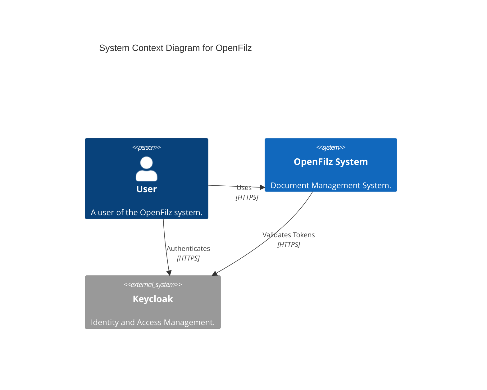
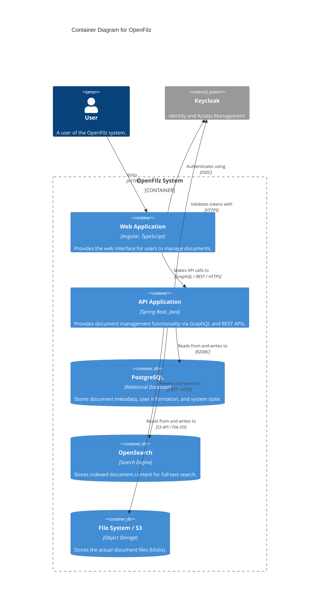

# OpenFilz C4 Model

This document describes the architecture of the OpenFilz system using the C4 model.

## Level 1: System Context Diagram

The System Context diagram shows the software system in the context of the people and other software systems it interacts with.

## Level 2: Container Diagram

The Container diagram shows the high-level technical building blocks.

## Component Details

### openfilz-api

- **Technology**: Spring Boot, Java
- **Responsibilities**:
  - Exposes GraphQL and REST endpoints.
  - Enforces security and authorization.
  - Manages document metadata in PostgreSQL.
  - Indexes document content in OpenSearch.
  - Manages file storage in S3 or Local File System.
  - Extracts text from documents (using Apache Tika).

### PostgreSQL

- **Technology**: PostgreSQL
- **Responsibilities**:
  - Persists structured data (Metadata, Folder structure, etc.).

### openfilz-web (optional)

- **Technology**: Angular 20+, TypeScript
- **Responsibilities**:
  - Renders the user interface.
  - Handles user authentication via OIDC (Keycloak).
  - Communicates with the API via GraphQL (Apollo) and REST.

### OpenSearch (optional)

- **Technology**: OpenSearch
- **Responsibilities**:
  - Provides full-text search capabilities.

### File System / S3 (optional)

- **Technology**: Local File System or MinIO/S3
- **Responsibilities**:
  - Stores binary file content.
