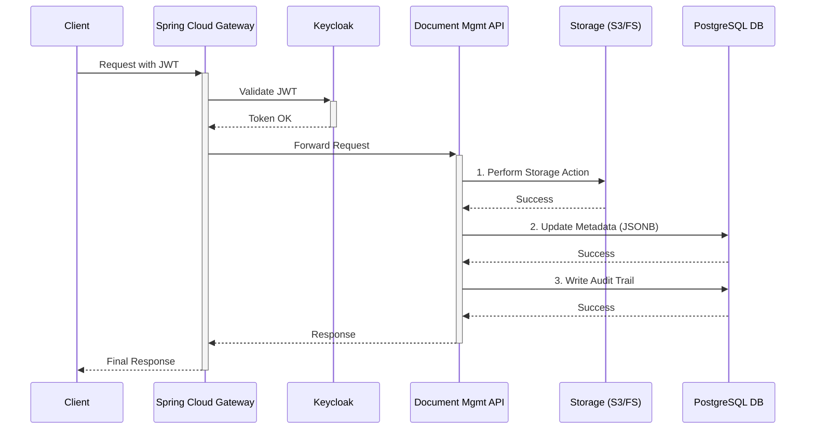

# 🚀 **_OpenFilz_** Document Management API: Modern, Reactive, and Secure 🚀

Welcome to the next generation of document management. This isn't just another file storage API; it's a meticulously crafted, high-performance system designed for scalability, security, and a stellar developer experience. It provides a robust, centralized solution to handle all your application's document needs.

> Our philosophy is simple: **abstract complexity, empower developers.** We handle the intricate details of storage, security, and performance so you can focus on building amazing features.

---

## 📚 Related Components 

- [Document Management Gateway](./openfilz-gateway/README.md): Learn about the API gateway, security, and how to access the system's Swagger UI.

---

## ✨ Key Features at a Glance ✨

### 1. Intuitive & Powerful File System Operations

Manage your digital assets with the ease of a local file system but with the power of a distributed, cloud-native application.

*   📂 **Hierarchical Folder Management:** Create an infinite folder structure to perfectly organize your data. Simply provide a `parentId` to nest folders, or omit it to create them at the root level.
*   💨 **Atomic Bulk Operations:** Why make a thousand calls when one will do? Move, copy, or delete entire sets of files and folders in a **single, efficient API call**. The API handles the complexity of processing these operations reliably.
*   🔄 **Recursive Actions:** When you move or copy a folder, its entire contents—including all subfolders and files—are moved or copied with it, maintaining the integrity of your hierarchy.
*   ✏️ **Seamless Renaming:** Rename any file or folder instantly with a simple `PUT` request. Thanks to our intelligent storage design, renaming a folder with thousands of files is a near-instant metadata update, not a costly storage operation.

### 2. The Power of Smart, Flexible Metadata

Unleash the true potential of your documents by enriching them with meaningful data. Our metadata engine is built for flexibility and powerful querying.

*   🗂️ **Dynamic Metadata on Upload:** Attach any custom metadata as a simple JSON object during single or multiple file uploads.
*   🔧 **Granular Metadata Control:**
    *   **Update:** Add or modify specific key-value pairs without touching the rest of the metadata.
    *   **Replace:** Completely swap out a document's old metadata for a new set.
    *   **Delete:** Precisely remove specific metadata keys you no longer need.
*   🔍 **Advanced Metadata Search:** This is the API's superpower!
    *   **Find Documents by Content:** Retrieve a list of all document IDs that match a specific set of metadata criteria (e.g., `{"customerId": "123", "status": "approved"}`).
    *   **Query Specific Keys:** Fetch only the metadata fields you need for a given document, minimizing payload size and improving performance.

### 3. Efficient & Convenient Data Transfer

Getting data in and out of the system is designed to be as smooth as possible.

*   📤 **Bulk Uploads:** Upload hundreds of files in a single `multipart/form-data` request, each with its own optional metadata and target folder.
*   📥 **ZIP Downloads:** Retrieve multiple documents at once as a single, conveniently packaged `.zip` archive. Just provide an array of document IDs, and the API does the rest.

---

## 🛠️ Under the Hood: An Architecture Built for the Future 🛠️

The "cool" features on the surface are powered by a modern, robust, and thoughtfully designed architecture.

### A Fully Reactive Core
The entire system is built on a non-blocking, reactive stack using **Spring WebFlux** and **R2DBC**.

*   **What this means for you:**
    *   **Blazing-Fast Performance:** Handles massive concurrency with a small number of threads, leading to lower memory consumption and higher throughput.
    *   **Extreme Scalability:** Perfectly suited for microservices architectures and scales horizontally with ease.
    *   **End-to-End Reactivity:** From the API endpoint to the database call, the entire request lifecycle is asynchronous, ensuring your application remains responsive under heavy load.

### Intelligent Storage Abstraction
We separate the logical hierarchy from the physical storage, which provides immense flexibility.

*   **Virtual Folders:** Folders exist only as metadata in the **PostgreSQL database**. On the storage layer (**Local Filesystem or S3**), we only store files.
*   **The Benefit:** Operations like moving a file or renaming a folder are simply fast metadata updates in the database. There's no need for slow, costly file system moves or re-writes.
*   **Pluggable Backend:** The storage layer is an interface, allowing you to switch between a local filesystem for development and a **MinIO/S3** backend for production without changing a single line of your application code.

### A Dream for Developers
We believe a great API should be a joy to use.

*   📝 **Modern Java:** We leverage **Java Records** for clean, immutable, and boilerplate-free Data Transfer Objects (DTOs), further streamlined with **Lombok** annotations.
*   📖 **Self-Documenting:** All endpoints are fully documented using OpenAPI (Swagger), providing a clear, interactive contract for developers to work with.
*   ✅ **Tested & Reliable:** A comprehensive suite of **JUnit** tests ensures the codebase is stable, reliable, and behaves as expected.

---

## 🛡️ Ironclad Security & Comprehensive Auditing 🛡️

Security isn't an afterthought; it's a core principle of the API's design.

### Centralized, Gateway-Powered Security
The **Spring Cloud Gateway** acts as a fortified front door for the entire system.

1.  **Single Point of Entry:** Clients interact only with the gateway, never directly with the API.
2.  **Authentication & Authorization:** The gateway integrates with **Keycloak** to enforce authentication. It validates the JWT token on every incoming request.
3.  **Secure Routing:** Only valid, authenticated requests are routed to the Document Management API.
4.  **Defense in Depth:** The API itself re-validates the JWT token, ensuring that it cannot be accessed without proper credentials, even within the internal network.

### Every Action is Accounted For
A complete, immutable **audit trail** is generated for every write operation and stored securely in the database.

*   **Who:** The user's principal is extracted from the JWT token.
*   **What:** The action performed (e.g., `FILE_UPLOAD`, `FOLDER_DELETE`).
*   **When:** A precise timestamp for the event.
*   **Where:** Traces all writes to both the storage layer (S3/filesystem) and the database.

This provides complete visibility and accountability for every change made in the system.

### Request Flow at a Glance

---

## Building and Running 

See [BUILD_AND_TEST.md](BUILD_AND_TEST.md) for detailed instructions on how to build, configure, and run the application locally, including how to run integration tests with Testcontainers.