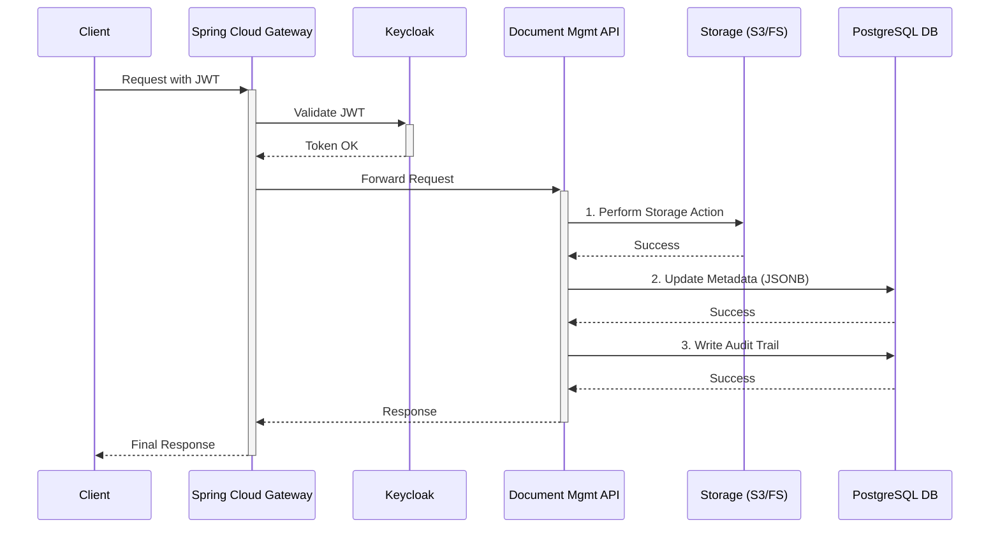

# OpenFilz Document Management System

[](https://github.com/openfilz/openfilz-core/actions/workflows/build-backend.yml)


OpenFilz is a modern, reactive document management API designed for scalability, security, and performance. Built on **Spring Boot 3.5+ / WebFlux**, it provides a centralized solution for handling document and folder-related operations through comprehensive REST and GraphQL APIs.

---

## Related Components

- [API Gateway](./openfilz-gateway/README.md) - Spring Cloud Gateway handling JWT authentication, rate limiting, and request routing.
- [OpenFilz Web](https://github.com/openfilz/openfilz-web) - Angular web interface for managing documents through a Google Drive-like GUI.

---

## Tech Stack

| Component | Technology |
|-----------|------------|
| Language | Java 25 |
| Framework | Spring Boot 3.5.8, Spring WebFlux |
| Database | PostgreSQL (R2DBC, non-blocking) |
| Migrations | Flyway |
| Storage | Local filesystem or S3/MinIO (pluggable) |
| Authentication | OIDC / JWT (Keycloak) |
| APIs | REST (OpenAPI/Swagger) + GraphQL (GraphiQL) |
| Build | Maven, Jib (Docker images) |
| Testing | JUnit 5, Testcontainers |

---

## Features

### Document & Folder Management

- **Virtual Folder Hierarchy** - Organize files in a nested folder structure. Folders exist as metadata in PostgreSQL, making move/rename operations instant regardless of folder size.
- **Bulk Operations** - Move, copy, or delete multiple files and folders in a single API call. Recursive operations on folders apply to all contents.
- **Renaming** - Fast metadata-only operation via `PUT` request.
- **Favorites** - Mark frequently used documents and folders for quick access. Per-user favorites with dedicated API endpoints and GraphQL queries.
- **Recycle Bin** - Soft-delete with recovery. Deleted documents move to a recycle bin instead of being permanently destroyed. Restore or permanently purge via API.

### File Upload & Download

- **Resumable Uploads (TUS Protocol)** - Upload files of any size with automatic resume on interruption. Chunked uploads work reliably over unreliable networks and bypass upload size limits (e.g., Cloudflare's 100MB limit).
  - `POST /api/v1/tus` - Create upload
  - `PATCH /api/v1/tus/{uploadId}` - Upload chunk
  - `POST /api/v1/tus/{uploadId}/finalize` - Complete upload
  - Conditionally enabled via `openfilz.tus.enabled`
- **Bulk Uploads** - Upload multiple files in a single `multipart/form-data` request, with optional metadata and target folder.
- **ZIP Downloads** - Download multiple documents or entire folder hierarchies as a single `.zip` archive.

### Metadata Management

- **Dynamic Metadata** - Attach custom JSON metadata to files during upload.
- **Granular Control** - Update (add/modify key-value pairs), replace (overwrite entire metadata), or delete (remove specific keys).
- **Search** - Query documents by metadata content. Retrieve specific metadata fields to reduce payload size.
- **Document Suggestions** - Smart document suggestions based on context and user activity.

### Document Experience

- **Thumbnail Generation** - Automatic server-side thumbnail generation for images, PDFs, and Office documents. Served via dedicated REST endpoints.
- **OnlyOffice Integration** - Open and edit Word, Excel, and PowerPoint files in the browser with real-time collaboration support.
- **Dashboard & Statistics** - Real-time dashboard API providing storage usage, document counts by type, file distribution, and system health metrics.

### Security

- **OIDC Resource Server** - Validates JWT tokens for every request. Native Keycloak integration with pre-built configurations.
- **Role-Based Authorization** - Built-in roles: `READER`, `CONTRIBUTOR`, `CLEANER`, `AUDITOR`. Roles extracted from JWT claims.
- **Pluggable Authorization** - Default role-based model with support for fully custom authorization implementations.
- **Defense in Depth** - Gateway validates JWT first, then the API re-validates, ensuring security even within the internal network.
- **Security Toggle** - Disable security for development and testing via `openfilz.security.no-auth`.

### Compliance & Auditing

- **SHA-256 Checksums** - Optional automatic SHA-256 calculation on upload. Stored as metadata for integrity verification.
- **WORM Mode** - Write Once Read Many ensures documents cannot be modified or deleted. Meets SEC 17a-4, FINRA, and similar retention requirements.
- **Immutable Audit Trail** - Every operation recorded with who (user email from JWT), what (action type), when (timestamp), and which document.

### GraphQL API

Flexible GraphQL endpoint at `/graphql/v1` with interactive GraphiQL explorer:

```graphql
type Query {
  listFolder(request: ListFolderRequest!): [FolderElementInfo]
  documentById(id: UUID!): DocumentInfo
  count(request: ListFolderRequest): Long
  listFavorites(request: FavoriteRequest!): [FolderElementInfo]
  countFavorites(request: FavoriteRequest): Long
}
```

- **FolderElementInfo** includes: id, type, contentType, name, metadata (JSONB), size, timestamps, createdBy/updatedBy, favorite status, thumbnailUrl.
- **Filtering** - By name, type, content type, metadata, date ranges, size, and creator.
- **Pagination & Sorting** - Via `PageInfo` input with configurable page size, sort field, and order.

### REST API

15 controllers providing 40+ endpoints:

| Controller | Purpose |
|------------|---------|
| `DocumentController` | Core CRUD operations, upload, download |
| `FileController` | File-specific operations (move, copy, delete) |
| `FolderController` | Folder management (create, list, move, copy) |
| `TusController` | Resumable uploads (TUS protocol, 9 endpoints) |
| `FavoriteController` | Favorites management |
| `RecycleBinController` | Soft-delete and recovery |
| `DashboardController` | Statistics and metrics |
| `ThumbnailController` | Thumbnail generation and serving |
| `AuditController` | Audit trail queries |
| `OnlyOfficeController` | OnlyOffice editor integration |
| `DocumentSuggestionController` | Document suggestions |
| `SettingsController` | User settings |

Full OpenAPI documentation available at `/swagger-ui.html`.

---

## Architecture

### Reactive Core

Built on a non-blocking, reactive stack using **Spring WebFlux** and **R2DBC** for high concurrency and scalability. The application remains responsive under heavy load with efficient resource utilization.

### Storage Abstraction

OpenFilz separates the logical folder hierarchy from physical file storage:

- **Virtual Folders** - Represented as metadata in PostgreSQL. Only files are stored in the physical storage backend.
- **Efficient Operations** - Moving or renaming a folder is a fast metadata update, avoiding costly filesystem operations.
- **Pluggable Backends** - Switch between local filesystem (`storage.type=local`) and MinIO/S3 (`storage.type=minio`) without code changes.

### Request Flow



---

## Deployment

### Docker

```bash
# Build Docker image
docker build -t ghcr.io/openfilz/openfilz-api:latest openfilz-api/

# Or using Jib (no Docker daemon required)
mvn clean install -Pkube -pl openfilz-api -am
```

### Docker Compose

Multiple compose files for different configurations:

| File | Purpose |
|------|---------|
| `docker-compose.yml` | Core services (API + PostgreSQL) |
| `docker-compose.auth.yml` | Keycloak authentication |
| `docker-compose.minio.yml` | MinIO S3 storage |
| `docker-compose.onlyoffice.yml` | OnlyOffice document editing |
| `docker-compose.fulltext.yml` | OpenSearch full-text search |
| `docker-compose-thumbnails.yml` | Thumbnail generation service |
| `docker-compose-gotenberg-dev.yml` | Gotenberg PDF conversion |

### Kubernetes / Helm

Helm charts available for `openfilz-api` and `openfilz-web` with templates for:
- Deployment, Service, Ingress, Secrets, PV/PVC
- OpenShift Route support

### Dokploy

Single `dokploy/compose.yaml` for Dokploy platform deployment.

---

## Building and Running

See [BUILD_AND_TEST.md](BUILD_AND_TEST.md) for detailed instructions on how to build, configure, and run the application, including integration tests with Testcontainers.

### Quick Start

```bash
# Prerequisites: Java 25, Maven 3.x, Docker

# Build all modules
mvn clean install

# Build only API module
mvn clean install -pl openfilz-api -am

# Run API (port 8081)
cd openfilz-api && mvn spring-boot:run

# Run Gateway (port 8888, optional)
cd openfilz-gateway && mvn spring-boot:run
```

---

## Project Structure

```
openfilz-core/
├── openfilz-api/              # Core DMS service (REST + GraphQL)
│   ├── src/main/java/org/openfilz/dms/
│   │   ├── controller/        # REST & GraphQL controllers
│   │   ├── service/           # Business logic
│   │   ├── repository/        # R2DBC repositories
│   │   ├── entity/            # Database entities
│   │   ├── dto/               # Request/Response DTOs
│   │   └── config/            # Spring configurations
│   └── src/main/resources/
│       └── graphql/           # GraphQL schema
├── openfilz-gateway/          # Spring Cloud Gateway
├── docker/                    # Docker Compose files
├── helm/                      # Kubernetes Helm charts
└── dokploy/                   # Dokploy deployment
```

---

## License

Apache License 2.0 - See [LICENSE](LICENSE) for details.
