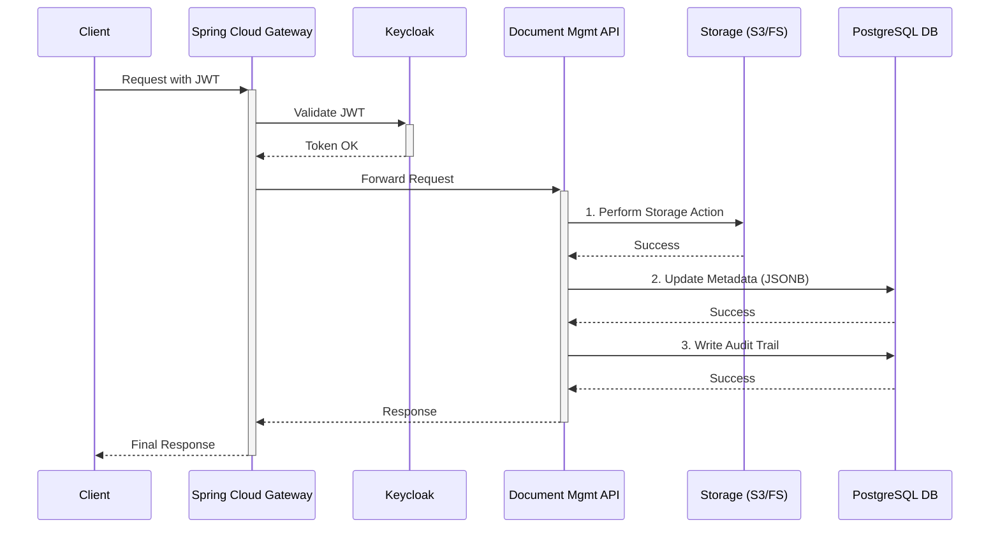

# OpenFilz Document Management System

OpenFilz is a document management API designed for scalability, security, and performance. It provides a centralized solution for handling document and folder-related operations within your application.

---

## Related Components

- [Document Management Gateway](./openfilz-gateway/README.md): Describes the API gateway, security configuration, and how to access the Swagger UI.

---

## Web Interface

A web-based graphical user interface (GUI), similar to Google Drive, is currently under development in the `openfilz-web` module. This interface will provide a user-friendly way to perform all file and folder operations provided by the API.

---

## Features

### File System Operations

- **Hierarchical Folder Management:** Organize files within a nested folder structure. Create folders at the root level or within other folders by specifying a `parentId`.
- **Bulk Operations:** Move, copy, or delete multiple files and folders in a single API call for efficiency.
- **Recursive Actions:** Operations on folders (move, copy, delete) are applied recursively to all their contents.
- **Renaming:** Files and folders can be renamed via a `PUT` request. This is a fast metadata-only operation.

### Metadata Management

- **Dynamic Metadata:** Attach custom JSON metadata to files during upload.
- **Granular Metadata Control:**
    - **Update:** Add or modify specific key-value pairs in a document's metadata.
    - **Replace:** Overwrite a document's existing metadata with a new JSON object.
    - **Delete:** Remove specific keys from a document's metadata.
- **Metadata-based Search:**
    - **Query by Content:** Find documents matching specific metadata criteria.
    - **Retrieve Specific Fields:** Fetch only the required metadata fields for a document to reduce payload size.

### Data Transfer

- **Bulk Uploads:** Upload multiple files in a single `multipart/form-data` request, with optional metadata and a target folder for each.
- **ZIP Downloads:** Download multiple documents as a single `.zip` archive by providing a list of document IDs.

### Security Management

- **OIDC Resource Server:** When enabled, the API acts as an OIDC resource server, validating JWT tokens for every request.
- **Pluggable Authorization:** Supports a default role-based authorization model using roles from the JWT, and allows for a fully custom authorization model to be implemented for advanced scenarios.
- **Security Toggle:** Security can be disabled for development and testing environments.

---

## Architecture

### Reactive Core

The system is built on a non-blocking, reactive stack using **Spring WebFlux** and **R2DBC** for high concurrency and scalability. This ensures that the application remains responsive under heavy load.

### Storage Abstraction

OpenFilz separates the logical folder hierarchy from the physical file storage.

- **Virtual Folders:** Folders are represented as metadata in a **PostgreSQL** database. Only files are stored in the physical storage backend (e.g., Local Filesystem or S3-compatible object storage).
- **Efficient Operations:** As a result, operations like moving or renaming a folder are fast metadata updates in the database, avoiding costly file system operations.
- **Pluggable Storage Backend:** The storage layer is designed as an interface, allowing you to switch between a local filesystem for development and a **MinIO/S3** backend for production without application code changes.

### Developer Experience

- **Modern Java:** Uses **Java Records** for immutable Data Transfer Objects (DTOs) and **Lombok** to reduce boilerplate code.
- **API Documentation:** Endpoints are documented using OpenAPI (Swagger) for a clear and interactive API contract.
- **Testing:** The project includes a comprehensive suite of **JUnit** tests.

---

## Security and Auditing

### Centralized Security

Security is handled by the **Spring Cloud Gateway**, which acts as the single point of entry.

1.  **Authentication:** The gateway integrates with **Keycloak** to validate JWT tokens for every incoming request.
2.  **Secure Routing:** Only authenticated and authorized requests are forwarded to the Document Management API.
3.  **Defense in Depth:** The API re-validates the JWT, ensuring security even within the internal network.

### Audit Trail

Every operation is recorded in an immutable audit trail. The audit log captures:

- **Who:** The email of the user from the JWT token (the user `email` has to be mapped to a claim in the token)
- **What:** The action performed (e.g., `CREATE_FOLDER`, `UPLOAD_DOCUMENT`, `DOWNLOAD_DOCUMENT`...).
- **When:** A precise timestamp of the event.
- **Where:** The document concerned by this action.

### Request Flow

---

## Building and Running

See [BUILD_AND_TEST.md](BUILD_AND_TEST.md) for detailed instructions on how to build, configure, and run the application, including how to execute integration tests with Testcontainers.
