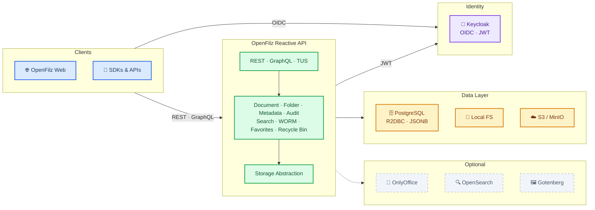
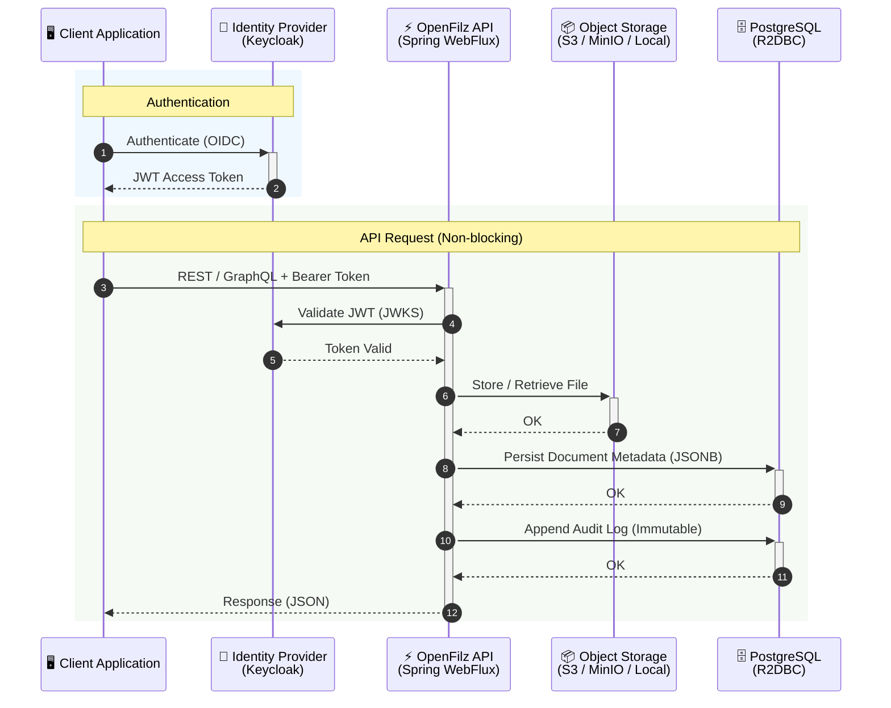

<p align="center">
  
</p>

# OpenFilz Document Management System

[](https://github.com/openfilz/openfilz-core/actions/workflows/build-backend.yml)


OpenFilz is a modern, reactive document management API designed for scalability, security, and performance. Built on **Spring Boot 3.5+ / WebFlux**, it provides a centralized solution for handling document and folder-related operations through comprehensive REST and GraphQL APIs.

**[Try the live demo](https://app.openfilz.org/)** | **[Swagger API Documentation](https://api.openfilz.org/swagger-ui/index.html)**

**Quick links:** [Features](#features) | [SDKs](#sdks--integrate-in-minutes) | [Architecture](#architecture) | [Deployment](#deployment) | [Building](#building-and-running)

---

## Documentation

Pick the guide that matches your role:

| I want to... | Guide |
|--------------|-------|
| **Use** OpenFilz (browse folders, upload files, search, favorites, etc.) | [User Guide](docs/user-guide.md) |
| **Install & configure** OpenFilz (Docker, Helm, Keycloak, storage, feature toggles) | [Installation & Administration Guide](docs/admin-guide.md) |
| **Integrate** with the REST / GraphQL API or use an SDK | [Developer Guide](docs/developer-guide.md) |
| **Contribute** to the open-source codebase | [Contributor Guide](docs/contributor-guide.md) |

---

## Related Components

- [OpenFilz Web](https://github.com/openfilz/openfilz-web) - Angular web interface for managing documents through a Google Drive-like GUI.

---

## Tech Stack

| Component | Technology |
|-----------|------------|
| Language | Java 25 |
| Framework | Spring Boot 3.5.8, Spring WebFlux |
| Database | PostgreSQL (R2DBC, non-blocking) |
| Migrations | Flyway |
| Storage | Local filesystem or S3/MinIO (pluggable) |
| Authentication | OIDC / JWT (Keycloak) |
| APIs | REST (OpenAPI/Swagger) + GraphQL (GraphiQL) |
| Build | Maven, Jib (Docker images) |
| Testing | JUnit 5, Testcontainers |

---

## Features

### Document & Folder Management

- **Virtual Folder Hierarchy** - Organize files in a nested folder structure. Folders exist as metadata in PostgreSQL, making move/rename operations instant regardless of folder size.
- **Bulk Operations** - Move, copy, or delete multiple files and folders in a single API call. Recursive operations on folders apply to all contents.
- **Renaming** - Fast metadata-only operation via `PUT` request.
- **Favorites** - Mark frequently used documents and folders for quick access. Per-user favorites with dedicated API endpoints and GraphQL queries.
- **Recycle Bin** - Soft-delete with recovery. Deleted documents move to a recycle bin instead of being permanently destroyed. Restore or permanently purge via API.

### File Upload & Download

- **Resumable Uploads (TUS Protocol)** - Upload files of any size with automatic resume on interruption. Chunked uploads work reliably over unreliable networks and bypass upload size limits (e.g., Cloudflare's 100MB limit).
  - `POST /api/v1/tus` - Create upload
  - `PATCH /api/v1/tus/{uploadId}` - Upload chunk
  - `POST /api/v1/tus/{uploadId}/finalize` - Complete upload
  - Conditionally enabled via `openfilz.tus.enabled`
- **Bulk Uploads** - Upload multiple files in a single `multipart/form-data` request, with optional metadata and target folder.
- **ZIP Downloads** - Download multiple documents or entire folder hierarchies as a single `.zip` archive.

### Metadata Management

- **Dynamic Metadata** - Attach custom JSON metadata to files during upload.
- **Granular Control** - Update (add/modify key-value pairs), replace (overwrite entire metadata), or delete (remove specific keys).
- **Search** - Query documents by metadata content. Retrieve specific metadata fields to reduce payload size.
- **Document Suggestions** - Smart document suggestions based on context and user activity.

### Document Experience

- **Thumbnail Generation** - Automatic server-side thumbnail generation for images, PDFs, and Office documents. Served via dedicated REST endpoints.
- **OnlyOffice Integration** - Open and edit Word, Excel, and PowerPoint files in the browser with real-time collaboration support.
- **Dashboard & Statistics** - Real-time dashboard API providing storage usage, document counts by type, file distribution, and system health metrics.

### Security

- **OIDC Resource Server** - Validates JWT tokens for every request. Native Keycloak integration with pre-built configurations.
- **Role-Based Authorization** - Built-in roles: `READER`, `CONTRIBUTOR`, `CLEANER`, `AUDITOR`. Roles extracted from JWT claims.
- **Pluggable Authorization** - Default role-based model with support for fully custom authorization implementations.
- **Defense in Depth** - Multiple security layers ensure protection even within the internal network.
- **Security Toggle** - Disable security for development and testing via `openfilz.security.no-auth`.

### Compliance & Auditing

- **SHA-256 Checksums** - Optional automatic SHA-256 calculation on upload. Stored as metadata for integrity verification.
- **WORM Mode** - Write Once Read Many ensures documents cannot be modified or deleted. Meets SEC 17a-4, FINRA, and similar retention requirements.
- **Immutable Chained Audit Trail** - Every operation recorded with who (user email from JWT), what (action type), when (timestamp), and which document.

### GraphQL API

Flexible GraphQL endpoint at `/graphql/v1` with interactive GraphiQL explorer:

```graphql
type Query {
  listFolder(request: ListFolderRequest!): [FolderElementInfo]
  documentById(id: UUID!): DocumentInfo
  count(request: ListFolderRequest): Long
  listFavorites(request: FavoriteRequest!): [FolderElementInfo]
  countFavorites(request: FavoriteRequest): Long
}
```

- **FolderElementInfo** includes: id, type, contentType, name, metadata (JSONB), size, timestamps, createdBy/updatedBy, favorite status, thumbnailUrl.
- **Filtering** - By name, type, content type, metadata, date ranges, size, and creator.
- **Pagination & Sorting** - Via `PageInfo` input with configurable page size, sort field, and order.

### REST API

15 controllers providing 40+ endpoints:

| Controller | Purpose |
|------------|---------|
| `DocumentController` | Core CRUD operations, upload, download |
| `FileController` | File-specific operations (move, copy, delete) |
| `FolderController` | Folder management (create, list, move, copy) |
| `TusController` | Resumable uploads (TUS protocol, 9 endpoints) |
| `FavoriteController` | Favorites management |
| `RecycleBinController` | Soft-delete and recovery |
| `DashboardController` | Statistics and metrics |
| `ThumbnailController` | Thumbnail generation and serving |
| `AuditController` | Audit trail queries |
| `OnlyOfficeController` | OnlyOffice editor integration |
| `DocumentSuggestionController` | Document suggestions |
| `SettingsController` | User settings |

Full OpenAPI documentation available at `/swagger-ui.html`.

---

## SDKs — Integrate in Minutes

OpenFilz provides **5 official SDKs** auto-generated from the OpenAPI specification, so every SDK stays in sync with the API. Pick your language and start building immediately. See the [SDK overview](openfilz-sdk/README.md) for build, publishing, and CI details.

<table>
<tr>
<td align="center" width="20%">

**[Java](openfilz-sdk/openfilz-sdk-java/README.md)**<br/>
<sub>Blocking</sub>

</td>
<td align="center" width="20%">

**[Java Reactive](openfilz-sdk/openfilz-sdk-java-reactive/README.md)**<br/>
<sub>Non-blocking</sub>

</td>
<td align="center" width="20%">

**[TypeScript](openfilz-sdk/openfilz-sdk-typescript/README.md)**<br/>
<sub>Promise-based</sub>

</td>
<td align="center" width="20%">

**[Python](openfilz-sdk/openfilz-sdk-python/README.md)**<br/>
<sub>Synchronous</sub>

</td>
<td align="center" width="20%">

**[C# / .NET](openfilz-sdk/openfilz-sdk-csharp/README.md)**<br/>
<sub>Async + DI</sub>

</td>
</tr>
<tr>
<td align="center"><sub>OkHttp + Gson</sub></td>
<td align="center"><sub>WebClient + Reactor</sub></td>
<td align="center"><sub>Axios</sub></td>
<td align="center"><sub>urllib3 + Pydantic</sub></td>
<td align="center"><sub>HttpClient + Generic Host</sub></td>
</tr>
<tr>
<td align="center"><sub>Java 25+</sub></td>
<td align="center"><sub>Java 25+ / Spring 3+</sub></td>
<td align="center"><sub>Node.js 18+</sub></td>
<td align="center"><sub>Python 3.9+</sub></td>
<td align="center"><sub>.NET 8.0+</sub></td>
</tr>
<tr>
<td align="center"><a href="https://central.sonatype.com/artifact/org.openfilz/openfilz-sdk-java"></a></td>
<td align="center"><a href="https://central.sonatype.com/artifact/org.openfilz/openfilz-sdk-java-reactive"></a></td>
<td align="center"><a href="https://www.npmjs.com/package/@openfilz-sdk/typescript"></a></td>
<td align="center"><a href="https://pypi.org/project/openfilz-sdk-python/"></a></td>
<td align="center"><a href="https://www.nuget.org/packages/OpenFilz.Sdk"></a></td>
</tr>
</table>

### Why use the SDKs?

- **Zero boilerplate** — Pre-built, strongly-typed API clients. No manual HTTP calls or JSON parsing.
- **Always in sync** — Auto-generated from the same OpenAPI spec that powers the server. Every endpoint, every parameter, every model.
- **GraphQL included** — All SDKs bundle the GraphQL schema files so you can combine REST and GraphQL in the same project.
- **Full API coverage** — Documents, Folders, Files, Favorites, Recycle Bin, Dashboard, Audit Trail, Thumbnails, TUS uploads — all accessible from day one.
- **Battle-tested** — Integration tests run against a live OpenFilz API for both Java SDKs via Testcontainers.
- **Idiomatic patterns** — Each SDK follows the conventions of its ecosystem: `Mono`/`Flux` for Reactive Java, `async`/`await` for C# and TypeScript, context managers for Python.

### Quick Start Examples

<details>
<summary><b>Java (Blocking)</b></summary>

```java
var client = new ApiClient().setBasePath("https://api.example.com");
client.setAccessToken("your-jwt-token");

var api = new DocumentControllerApi(client);
var response = api.uploadDocument(file, parentId, null);
```

</details>

<details>
<summary><b>Java (Reactive)</b></summary>

```java
var client = new ApiClient().setBasePath("https://api.example.com");
client.setBearerToken("your-jwt-token");

var api = new DocumentControllerApi(client);
api.uploadDocument(file, parentId, null)
   .flatMap(uploaded -> api.getDocumentInfo(uploaded.getId()))
   .subscribe(doc -> System.out.println(doc.getName()));
```

</details>

<details>
<summary><b>TypeScript</b></summary>

```typescript
import { Configuration, DocumentControllerApi } from '@openfilz-sdk/typescript';

const config = new Configuration({
  basePath: 'https://api.example.com',
  accessToken: 'your-jwt-token',
});

const api = new DocumentControllerApi(config);
const response = await api.uploadDocument(file, parentId);
```

</details>

<details>
<summary><b>Python</b></summary>

```python
from openfilz_sdk import Configuration, ApiClient, DocumentControllerApi

config = Configuration(host="https://api.example.com",
                       access_token="your-jwt-token")

with ApiClient(config) as client:
    api = DocumentControllerApi(client)
    response = api.upload_document(file=file, parent_id=parent_id)
```

</details>

<details>
<summary><b>C# / .NET</b></summary>

```csharp
var host = Host.CreateDefaultBuilder()
    .ConfigureApi((ctx, services, options) =>
    {
        options.AddTokens(new BearerToken("your-jwt-token"));
        options.AddApiHttpClients(c =>
            c.BaseAddress = new Uri("https://api.example.com"));
    })
    .Build();

var api = host.Services.GetRequiredService<IDocumentControllerApi>();
var response = await api.UploadDocument1Async(file, parentId);
var uploaded = response.Ok()!;
```

</details>

---

## Architecture

### System Architecture


```mermaid
graph LR
    subgraph Clients["Clients"]
        WEB["🌐 OpenFilz Web"]
        SDK["🔌 SDKs & APIs"]
    end

    subgraph Auth["Identity"]
        KC["🔐 Keycloak\nOIDC · JWT"]
    end

    subgraph Core["OpenFilz Reactive API"]
        direction TB
        ENDPOINTS["REST · GraphQL · TUS"]
        SERVICES["Document · Folder · Metadata · Audit\nSearch · WORM · Favorites · Recycle Bin"]
        ABSTRACTION["Storage Abstraction"]
        ENDPOINTS --> SERVICES --> ABSTRACTION
    end

    subgraph Data["Data Layer"]
        direction TB
        PG["🗄️ PostgreSQL\nR2DBC · JSONB"]
        FS["📁 Local FS"]
        S3["☁️ S3 / MinIO"]
    end

    subgraph Plugins["Optional"]
        direction TB
        OO["📝 OnlyOffice"]
        OS["🔍 OpenSearch"]
        GOT["🖼️ Gotenberg"]
    end

    Clients -->|"OIDC"| Auth
    Clients -->|"REST · GraphQL"| Core
    Core -->|"JWT"| Auth
    Core --> Data
    Core -.-> Plugins

    classDef clientBox fill:#dbeafe,stroke:#2563eb,stroke-width:2px,color:#1e3a5f
    classDef authBox fill:#ede9fe,stroke:#7c3aed,stroke-width:2px,color:#4c1d95
    classDef coreBox fill:#dcfce7,stroke:#16a34a,stroke-width:2px,color:#14532d
    classDef dataBox fill:#fef3c7,stroke:#d97706,stroke-width:2px,color:#78350f
    classDef pluginBox fill:#f1f5f9,stroke:#94a3b8,stroke-width:1px,stroke-dasharray:5 5,color:#475569

    class WEB,SDK clientBox
    class KC authBox
    class ENDPOINTS,SERVICES,ABSTRACTION coreBox
    class PG,FS,S3 dataBox
    class OO,OS,GOT pluginBox
```

### Key Design Decisions

- **Reactive Core** — Built on **Spring WebFlux** and **R2DBC** for non-blocking, high-concurrency performance. The API remains responsive under heavy load with efficient resource utilization.
- **Virtual Folders** — Folders exist as metadata in PostgreSQL, not as physical directories. Moving or renaming a folder with 100K files is an instant metadata update.
- **Pluggable Storage** — Switch between local filesystem (`storage.type=local`) and MinIO/S3 (`storage.type=minio`) via configuration, without code changes.
- **Immutable Audit Chain** — Every operation is recorded with SHA-256 cryptographic chaining for tamper detection.

### Request Flow


```mermaid
sequenceDiagram
    autonumber
    participant Client as 🖥️ Client Application
    participant Gateway as 🔐 Identity Provider<br/>(Keycloak)
    participant API as ⚡ OpenFilz API<br/>(Spring WebFlux)
    participant Storage as 📦 Object Storage<br/>(S3 / MinIO / Local)
    participant DB as 🗄️ PostgreSQL<br/>(R2DBC)

    rect rgb(240, 248, 255)
        Note over Client, Gateway: Authentication
        Client->>+Gateway: Authenticate (OIDC)
        Gateway-->>-Client: JWT Access Token
    end

    rect rgb(245, 250, 245)
        Note over Client, DB: API Request (Non-blocking)
        Client->>+API: REST / GraphQL + Bearer Token
        API->>Gateway: Validate JWT (JWKS)
        Gateway-->>API: Token Valid

        API->>+Storage: Store / Retrieve File
        Storage-->>-API: OK

        API->>+DB: Persist Document Metadata (JSONB)
        DB-->>-API: OK

        API->>+DB: Append Audit Log (Immutable)
        DB-->>-API: OK

        API-->>-Client: Response (JSON)
    end
```

---

## Deployment

All deployment configurations are located in the [`deploy/`](deploy/) directory. See the [deployment README](deploy/README.md) for architecture diagrams and details.

### Docker

```bash
# Build Docker image
docker build -t ghcr.io/openfilz/openfilz-api:latest openfilz-api/

# Or using Jib (no Docker daemon required)
mvn clean install -Pkube -pl openfilz-api -am
```

### Docker Compose

Located in [`deploy/docker-compose/`](deploy/docker-compose/). A Makefile automates service composition and frontend config generation.

```bash
cd deploy/docker-compose
cp .env.example .env

make up              # Base services (PostgreSQL, API, Web)
make up-auth         # + Keycloak authentication
make up-minio        # + MinIO S3 storage
make up-onlyoffice   # + OnlyOffice document editing
make up-fulltext     # + OpenSearch full-text search
make up-demo         # All CE features (no auth) for demo
make up-full         # All services (auth, MinIO, OnlyOffice, OpenSearch, thumbnails)
```

Multiple compose overlay files for different configurations:

| File | Purpose |
|------|---------|
| `docker-compose.yml` | Core services (PostgreSQL, API, Web) |
| `docker-compose.auth.yml` | Keycloak authentication |
| `docker-compose.minio.yml` | MinIO S3 storage |
| `docker-compose.onlyoffice.yml` | OnlyOffice document editing |
| `docker-compose.fulltext.yml` | OpenSearch full-text search |
| `docker-compose-thumbnails.yml` | Gotenberg thumbnail generation (PDF, Office documents) |
| `docker-compose-gotenberg-dev.yml` | Gotenberg standalone for local development |

See the [Docker Compose README](deploy/docker-compose/README.md) for full documentation on environment variables, combinations, and troubleshooting.

### Kubernetes / Helm

Helm charts available in [`deploy/helm/`](deploy/helm/) for `openfilz-api` and `openfilz-web` with templates for:
- Deployment, Service, Ingress, Secrets, PV/PVC
- OpenShift Route support

### Dokploy

Single compose file in [`deploy/docker-compose/dokploy/`](deploy/docker-compose/dokploy/) for Dokploy platform deployment.

---

## Building and Running

See the [Installation & Administration Guide](docs/admin-guide.md) for full deployment instructions or the [Contributor Guide](docs/contributor-guide.md) for development setup with Testcontainers.

### Quick Start

```bash
# Prerequisites: Java 25, Maven 3.x, Docker

# Build all modules
mvn clean install

# Build only API module
mvn clean install -pl openfilz-api -am

# Run API (port 8081)
cd openfilz-api && mvn spring-boot:run
```

---

## Project Structure

```
openfilz-core/
├── openfilz-api/                  # Core DMS service (REST + GraphQL)
│   ├── src/main/java/org/openfilz/dms/
│   │   ├── controller/            # REST & GraphQL controllers
│   │   ├── service/               # Business logic
│   │   ├── repository/            # R2DBC repositories
│   │   ├── entity/                # Database entities
│   │   ├── dto/                   # Request/Response DTOs
│   │   └── config/                # Spring configurations
│   └── src/main/resources/
│       └── graphql/               # GraphQL schema
├── openfilz-sdk/                  # Official SDKs (auto-generated from OpenAPI)
│   ├── openfilz-sdk-java/         # Java SDK (blocking, OkHttp)
│   ├── openfilz-sdk-java-reactive/# Java Reactive SDK (WebClient, Mono/Flux)
│   ├── openfilz-sdk-typescript/   # TypeScript SDK (Axios, Promise-based)
│   ├── openfilz-sdk-python/       # Python SDK (urllib3, Pydantic)
│   ├── openfilz-sdk-csharp/       # C# SDK (.NET 8+, async + DI)
│   └── openfilz-sdk-samples-test/ # SDK integration tests
└── deploy/
    ├── docker-compose/            # Docker Compose files & Makefile
    │   └── dokploy/               # Dokploy deployment
    └── helm/                      # Kubernetes Helm charts
```

---

## License

OpenFilz Community Edition is dual-licensed:

- **AGPL-3.0** (GNU Affero General Public License v3) - See [LICENSE](LICENSE) for the full text. This is a copyleft license: if you modify OpenFilz and make it available over a network, you must release your modifications under the same license.

- **Commercial License** - For businesses that cannot comply with the AGPL-3.0 copyleft requirements (e.g., SaaS providers, proprietary integrations, or organizations that cannot disclose source code), a commercial license is available. Contact [license@openfilz.com](mailto:license@openfilz.com) or visit [openfilz.com/enterprise](https://openfilz.com/enterprise) for details.
