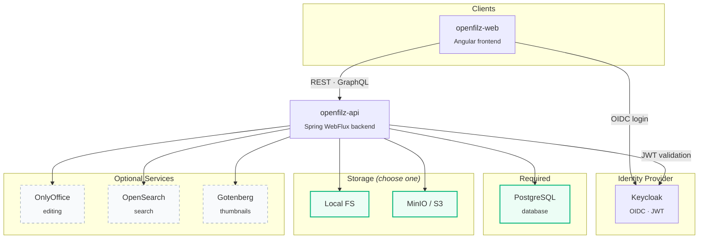

# OpenFilz Deployment

This directory contains all deployment configurations for OpenFilz.

## Deployment Methods

| Method | Directory | Use Case |
|--------|-----------|----------|
| [Docker Compose](docker-compose/) | `docker-compose/` | Local development and testing |
| [Dokploy](docker-compose/dokploy/) | `docker-compose/dokploy/` | Production deployment with Dokploy |
| [Helm](helm/) | `helm/` | Kubernetes deployment |

## Architecture

## Environment Variables

All configuration is done via environment variables. See the `.env.example` files in each deployment directory for the full list of available variables.

### Core Variables

| Variable | Description |
|----------|-------------|
| `DB_NAME` | PostgreSQL database name |
| `DB_USER` | PostgreSQL username |
| `DB_PASSWORD` | PostgreSQL password |
| `KEYCLOAK_DB_USER` | Keycloak database user (auto-created) |
| `KEYCLOAK_DB_PASSWORD` | Keycloak database password |
| `KEYCLOAK_DB_NAME` | Keycloak database name |
| `KEYCLOAK_IMAGE` | Custom Keycloak Docker image |
| `KEYCLOAK_ADMIN` | Keycloak admin username |
| `KEYCLOAK_ADMIN_PASSWORD` | Keycloak admin password |
| `OPENFILZ_API_IMAGE` | OpenFilz API Docker image |
| `OPENFILZ_WEB_IMAGE` | OpenFilz Web Docker image |
| `CORS_ALLOWED_ORIGINS` | Comma-separated allowed CORS origins |
| `ONLYOFFICE_JWT_SECRET` | JWT secret for OnlyOffice |

## Custom Keycloak Image

OpenFilz uses a custom Keycloak image (`ghcr.io/openfilz/keycloak:<version>`) that includes:
- Pre-imported OpenFilz realm configuration
- Custom OpenFilz login and email themes
- Pre-built Keycloak optimizations (`kc.sh build` already executed)

The image is built automatically via GitHub Actions when files in `docker-compose/dokploy/keycloak/` change on the `main` branch.

## Keycloak Database Initialization

PostgreSQL automatically creates the Keycloak database and user on first startup using the `init-keycloak-db.sh` script mounted into `/docker-entrypoint-initdb.d/`. The script reads `KEYCLOAK_DB_USER`, `KEYCLOAK_DB_PASSWORD`, and `KEYCLOAK_DB_NAME` from environment variables.
