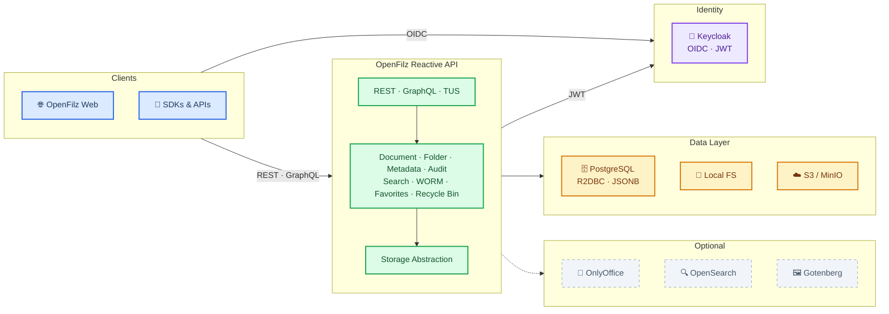

# OpenFilz Installation & Administration Guide

This guide is intended for DevOps engineers and system administrators who install, configure, and maintain OpenFilz.

---

## Table of Contents

- [Prerequisites](#prerequisites)
- [Architecture Overview](#architecture-overview)
- [Deployment Methods](#deployment-methods)
  - [Docker Compose (Recommended)](#docker-compose-recommended)
  - [Kubernetes / Helm](#kubernetes--helm)
  - [Dokploy](#dokploy)
  - [Manual (JAR)](#manual-jar)
- [Configuration Reference](#configuration-reference)
  - [Database](#database)
  - [Storage](#storage)
  - [Authentication (Keycloak)](#authentication-keycloak)
  - [Roles and Authorization](#roles-and-authorization)
  - [Full-Text Search (OpenSearch)](#full-text-search-opensearch)
  - [Document Editing (OnlyOffice)](#document-editing-onlyoffice)
  - [Thumbnails (Gotenberg)](#thumbnails-gotenberg)
  - [Resumable Uploads (TUS)](#resumable-uploads-tus)
  - [Quotas](#quotas)
  - [Audit and Compliance](#audit-and-compliance)
  - [Soft Delete and Recycle Bin](#soft-delete-and-recycle-bin)
  - [CORS](#cors)
- [Feature Toggles](#feature-toggles)
- [Keycloak Administration](#keycloak-administration)
- [Monitoring and Health Checks](#monitoring-and-health-checks)
- [Backup and Recovery](#backup-and-recovery)
- [Troubleshooting](#troubleshooting)

---

## Prerequisites

| Component | Minimum Version | Notes |
|-----------|----------------|-------|
| Java | 25+ | Only for manual JAR deployment |
| Docker | 20+ | For Docker Compose deployment |
| Docker Compose | 2.x | V2 recommended |
| PostgreSQL | 15+ | Provided by Docker or external |
| Keycloak | 26+ | Optional, provided by Docker or external |

### Hardware Recommendations

| Deployment | CPU | RAM | Disk |
|-----------|-----|-----|------|
| Small (< 100K docs) | 2 cores | 2 GB | 50 GB |
| Medium (100K–1M docs) | 4 cores | 4 GB | 500 GB |
| Large (> 1M docs) | 8+ cores | 8+ GB | As needed |

---

## Architecture Overview



**Services:**

| Service | Purpose | Required |
|---------|---------|----------|
| **openfilz-api** | REST + GraphQL API backend | Yes |
| **openfilz-web** | Angular web frontend | Yes (or custom frontend) |
| **PostgreSQL** | Document metadata, audit logs, folder structure | Yes |
| **File Storage** | Document binary storage (local FS or S3/MinIO) | Yes |
| **Keycloak** | OIDC authentication and user management | Recommended |
| **OpenSearch** | Full-text search inside documents | Optional |
| **OnlyOffice** | In-browser Office document editing | Optional |
| **Gotenberg** | Thumbnail generation for PDFs and Office files | Optional |

---

## Deployment Methods

### Docker Compose (Recommended)

The simplest deployment method. All configurations are in `deploy/docker-compose/`.

#### Step 1: Clone and configure

```bash
cd deploy/docker-compose
cp .env.example .env
# Edit .env with your values (see Configuration Reference below)
vi .env
```

#### Step 2: Choose a deployment profile

A `Makefile` automates service composition:

```bash
# Base services only (PostgreSQL, API, Web — no auth)
make up

# With Keycloak authentication
make up-auth

# With MinIO S3 storage
make up-minio

# With authentication + MinIO
make up-auth-minio

# With OnlyOffice document editing
make up-onlyoffice

# With OpenSearch full-text search
make up-fulltext

# Demo mode (all CE features, no auth)
make up-demo

# Full production stack (auth, MinIO, OnlyOffice, OpenSearch, thumbnails)
make up-full
```

#### Step 3: Verify

```bash
# Check running containers
make ps

# Check API health
curl http://localhost:8081/actuator/health

# View logs
make logs
```

#### Service URLs (default ports)

| Service | URL |
|---------|-----|
| Web UI | http://localhost:4200 |
| REST API | http://localhost:8081 |
| Swagger UI | http://localhost:8081/swagger-ui.html |
| GraphQL | http://localhost:8081/graphql/v1 |
| Keycloak admin | http://localhost:8180 |
| MinIO console | http://localhost:9001 |
| OpenSearch Dashboards | http://localhost:5601 |

#### Compose Files Reference

| File | Description |
|------|-------------|
| `docker-compose.yml` | Core: PostgreSQL, API, Web |
| `docker-compose.auth.yml` | Keycloak authentication |
| `docker-compose.minio.yml` | MinIO S3 storage |
| `docker-compose.onlyoffice.yml` | OnlyOffice document server |
| `docker-compose.fulltext.yml` | OpenSearch full-text search |
| `docker-compose-thumbnails.yml` | Gotenberg thumbnail generation |
| `docker-compose-gotenberg-dev.yml` | Gotenberg standalone for local dev |

#### Manual Compose (without Make)

```bash
# Example: base + auth + MinIO
docker-compose -f docker-compose.yml \
  -f docker-compose.auth.yml \
  -f docker-compose.minio.yml up -d
```

When not using Make, you must manually generate the frontend config (`ngx-env.js`):

```bash
export NG_APP_API_URL="http://localhost:8081/api/v1"
export NG_APP_GRAPHQL_URL="http://localhost:8081/graphql/v1"
export NG_APP_AUTHENTICATION_ENABLED="true"
export NG_APP_AUTHENTICATION_AUTHORITY="http://localhost:8180/realms/openfilz"
export NG_APP_AUTHENTICATION_CLIENT_ID="openfilz-web"
export NG_APP_ONLYOFFICE_ENABLED="false"
envsubst < ngx-env.template.js > ngx-env.js
```

### Kubernetes / Helm

Helm charts are available in `deploy/helm/` for `openfilz-api` and `openfilz-web`:

- Deployment, Service, Ingress, Secrets, PV/PVC templates
- OpenShift Route support

```bash
helm install openfilz-api deploy/helm/openfilz-api/ \
  --set image.tag=latest \
  --set database.url=r2dbc:postgresql://postgres:5432/dms_db
```

### Dokploy

A single compose file in `deploy/docker-compose/dokploy/` for Dokploy platform deployment.

### Manual (JAR)

For environments where Docker is not available:

```bash
# Prerequisites: Java 25+, PostgreSQL running, Maven 3.x
mvn clean install -pl openfilz-api -am

java -jar openfilz-api/target/openfilz-api-*.jar \
  --spring.r2dbc.url=r2dbc:postgresql://localhost:5432/dms_db \
  --spring.r2dbc.username=dms_user \
  --spring.r2dbc.password=dms_password \
  --server.port=8081
```

> **Note on `-DskipTests`:** If you build the full project (not just `openfilz-api`), do **not** use `mvn clean install -DskipTests`. The SDK modules depend on an OpenAPI spec artifact generated during the test phase. Skipping tests prevents the spec from being produced, causing the SDK builds to fail. To skip tests while still generating the spec, use: `mvn clean install -DskipTests -Popenapi-spec`. When building only the API module (`-pl openfilz-api -am`), `-DskipTests` is safe.

---

## Configuration Reference

All configuration is managed via environment variables (Docker) or `application.yml` (JAR deployment).

### Database

| Property / Env Variable | Default | Description |
|--------------------------|---------|-------------|
| `spring.r2dbc.url` | `r2dbc:postgresql://localhost:5432/dms_db` | R2DBC connection URL |
| `spring.r2dbc.username` / `DB_USER` | `dms_user` | Database username |
| `spring.r2dbc.password` / `DB_PASSWORD` | `dms_password` | Database password |
| `spring.r2dbc.pool.initial-size` | `5` | Initial connection pool size |
| `spring.r2dbc.pool.max-size` | `10` | Maximum connection pool size |
| `spring.flyway.url` | `jdbc:postgresql://...` | JDBC URL for Flyway migrations |
| `spring.flyway.baseline-on-migrate` | `true` | Baseline existing DB on first migration |

Database schema is managed automatically by **Flyway**. Migrations run on startup.

### Storage

| Property / Env Variable | Default | Description |
|--------------------------|---------|-------------|
| `storage.type` / `STORAGE_TYPE` | `local` | Storage backend: `local` or `minio` |
| `storage.local.base-path` | `/tmp/dms-storage` | Base directory for local storage |
| `storage.minio.endpoint` / `MINIO_ENDPOINT` | `http://localhost:9000` | MinIO/S3 endpoint |
| `storage.minio.access-key` / `MINIO_ACCESS_KEY` | `minioadmin` | S3 access key |
| `storage.minio.secret-key` / `MINIO_SECRET_KEY` | `minioadmin` | S3 secret key |
| `storage.minio.bucket-name` / `MINIO_BUCKET_NAME` | `dms-bucket` | S3 bucket name |
| `storage.minio.versioning-enabled` | `false` | Enable S3 bucket versioning (preserves old versions on replace) |

**Choosing a storage backend:**

- **Local filesystem** (`local`): Simplest setup. Files stored at `{base-path}/{UUID}#{filename}`. Suitable for single-node deployments.
- **MinIO/S3** (`minio`): Recommended for production. Supports multi-node, replication, and bucket versioning.

### Authentication (Keycloak)

| Property / Env Variable | Default | Description |
|--------------------------|---------|-------------|
| `openfilz.security.no-auth` / `OPENFILZ_SECURITY_NO_AUTH` | `true` | `true` = auth disabled (dev only); `false` = auth required |
| `spring.security.oauth2.resourceserver.jwt.jwk-set-uri` | — | Keycloak JWK Set URI for JWT validation |
| `KEYCLOAK_PORT` | `8180` | Keycloak exposed port |
| `KEYCLOAK_ADMIN` | `admin` | Keycloak admin username |
| `KEYCLOAK_ADMIN_PASSWORD` | `admin` | Keycloak admin password |
| `KEYCLOAK_REALM_URL` | `http://keycloak:8080/realms/openfilz` | Internal realm URL (API-to-Keycloak) |
| `KEYCLOAK_PUBLIC_URL` | `http://localhost:8180` | Public Keycloak URL (browser-to-Keycloak) |

**Important:** The API uses the internal Docker DNS (`keycloak:8080`) to validate JWTs, while the browser uses the public URL (`localhost:8180`). These must not be swapped.

#### SMTP (Email)

For Keycloak emails (password reset, verification):

| Variable | Default | Description |
|----------|---------|-------------|
| `SMTP_HOST` | *(empty)* | SMTP hostname (empty = disabled) |
| `SMTP_PORT` | `587` | SMTP port |
| `SMTP_FROM` | *(empty)* | Sender email address |
| `SMTP_SSL` | `false` | Enable SSL |
| `SMTP_STARTTLS` | `true` | Enable STARTTLS |
| `SMTP_AUTH` | `true` | Enable authentication |
| `SMTP_USER` | *(empty)* | SMTP username |
| `SMTP_PASSWORD` | *(empty)* | SMTP password |

#### Social Login (Identity Providers)

Leave empty to disable a provider:

| Variable | Description |
|----------|-------------|
| `GOOGLE_CLIENT_ID` / `GOOGLE_CLIENT_SECRET` | Google OAuth2 |
| `GITHUB_CLIENT_ID` / `GITHUB_CLIENT_SECRET` | GitHub OAuth2 |
| `MICROSOFT_CLIENT_ID` / `MICROSOFT_CLIENT_SECRET` | Microsoft OAuth2 |

### Roles and Authorization

| Property | Default | Description |
|----------|---------|-------------|
| `openfilz.security.role-token-lookup` | `REALM_ACCESS` | Where to find roles in JWT: `REALM_ACCESS` (realm roles) or `GROUPS` (Keycloak groups) |
| `openfilz.security.root-group` | `OPENFILZ` | Root group name when using `GROUPS` lookup (e.g., `/OPENFILZ/READER`) |
| `openfilz.security.custom-roles` | `false` | Enable custom security implementation |
| `openfilz.security.worm-mode` | `false` | Enable WORM (read-only) mode |

#### Built-in Roles

| Role | HTTP Methods | Allowed Operations |
|------|--------------|--------------------|
| `READER` | GET, GraphQL queries | View, download, search, list |
| `CONTRIBUTOR` | POST, PUT, PATCH | Upload, create, rename, move, copy, update metadata |
| `CLEANER` | DELETE | Delete files, folders, empty recycle bin |
| `AUDITOR` | GET /audit/* | View audit trail, verify audit chain |

#### Default Roles for New Users (Docker Compose)

Up to 4 default roles and groups can be assigned to new Keycloak users:

```bash
KEYCLOAK_DEFAULT_ROLE_1=CONTRIBUTOR
KEYCLOAK_DEFAULT_ROLE_2=CLEANER
KEYCLOAK_DEFAULT_ROLE_3=READER
KEYCLOAK_DEFAULT_ROLE_4=AUDITOR
KEYCLOAK_DEFAULT_GROUP_1=/OPENFILZ/CONTRIBUTOR
KEYCLOAK_DEFAULT_GROUP_2=/OPENFILZ/CLEANER
KEYCLOAK_DEFAULT_GROUP_3=/OPENFILZ/READER
KEYCLOAK_DEFAULT_GROUP_4=/OPENFILZ/AUDITOR
```

If you need fewer than 4, duplicate an existing value — Keycloak ignores duplicates.

### Full-Text Search (OpenSearch)

| Property / Env Variable | Default | Description |
|--------------------------|---------|-------------|
| `openfilz.full-text.active` / `OPENFILZ_FULLTEXT_ACTIVE` | `false` | Enable full-text indexing |
| `openfilz.full-text.default-index` | `openfilz` | OpenSearch index name |
| `openfilz.full-text.indexation-mode` | `local` | Indexation mode: `local`, `redis`, `kafka`, `nats` |
| `openfilz.full-text.opensearch.host` | `localhost` | OpenSearch host |
| `openfilz.full-text.opensearch.port` | `9200` | OpenSearch port |
| `openfilz.full-text.opensearch.scheme` | `https` | HTTP scheme |
| `openfilz.full-text.opensearch.username` | `admin` | OpenSearch username |
| `openfilz.full-text.opensearch.password` | — | OpenSearch password |

### Document Editing (OnlyOffice)

| Property / Env Variable | Default | Description |
|--------------------------|---------|-------------|
| `onlyoffice.enabled` / `ONLYOFFICE_ENABLED` | `false` | Enable OnlyOffice integration |
| `onlyoffice.document-server.url` / `ONLYOFFICE_URL` | `http://localhost` | OnlyOffice Document Server URL |
| `onlyoffice.document-server.api-path` | `/web-apps/apps/api/documents/api.js` | JS API path |
| `onlyoffice.jwt.enabled` | `true` | Enable JWT between API and OnlyOffice |
| `onlyoffice.jwt.secret` / `ONLYOFFICE_JWT_SECRET` | `openfilz-onlyoffice-jwt-secret-2024` | Shared JWT secret |
| `onlyoffice.supported-extensions` | `docx,doc,xlsx,xls,pptx,ppt,odt,ods,odp,pdf` | Editable file extensions |

### Thumbnails (Gotenberg)

| Property / Env Variable | Default | Description |
|--------------------------|---------|-------------|
| `openfilz.thumbnail.active` / `OPENFILZ_THUMBNAIL_ACTIVE` | `false` | Enable thumbnail generation |
| `openfilz.thumbnail.gotenberg.url` / `GOTENBERG_URL` | `http://localhost:8083` | Gotenberg URL |
| `openfilz.thumbnail.gotenberg.timeout-seconds` | `60` | Conversion timeout |
| `openfilz.thumbnail.dimensions.width` | `100` | Thumbnail width (px) |
| `openfilz.thumbnail.dimensions.height` | `100` | Thumbnail height (px) |
| `openfilz.thumbnail.storage.use-main-storage` | `true` | `true` = same backend type as document storage |
| `openfilz.thumbnail.storage.local.base-path` | `/tmp/dms-thumbnails` | Local thumbnail path |
| `openfilz.thumbnail.storage.minio.bucket-name` | `dms-thumbnails` | MinIO thumbnail bucket |

### Resumable Uploads (TUS)

| Property | Default | Description |
|----------|---------|-------------|
| `openfilz.tus.enabled` | `true` | Enable TUS resumable uploads |
| `openfilz.tus.temp-storage-path` | `/tmp/tus-uploads` | Temporary chunk storage |
| `openfilz.tus.max-upload-size` | `10737418240` (10 GB) | Maximum upload size |
| `openfilz.tus.chunk-size` | `52428800` (50 MB) | Chunk size |
| `openfilz.tus.upload-expiration-period` | `86400000` (24h) | Abandoned upload TTL |
| `openfilz.tus.cleanup-interval` | `3600000` (1h) | Cleanup sweep interval |

### Quotas

| Property | Default | Description |
|----------|---------|-------------|
| `openfilz.quota.file-upload` | `0` | Max file size per upload (MB), `0` = unlimited |
| `openfilz.quota.user` | `0` | Max total storage per user (MB), `0` = unlimited |

### Audit and Compliance

| Property | Default | Description |
|----------|---------|-------------|
| `openfilz.audit.excluded-actions` | `[]` | Actions to exclude from audit logging |
| `openfilz.audit.chain.enabled` | `true` | Enable cryptographic hash chain |
| `openfilz.audit.chain.algorithm` | `SHA-256` | Hash algorithm |
| `openfilz.audit.chain.verification-enabled` | `true` | Enable automatic chain verification |
| `openfilz.audit.chain.verification-cron` | `0 0 3 * * ?` | Verification schedule (daily at 3 AM) |
| `openfilz.calculate-checksum` / `OPENFILZ_CALCULATECHECKSUM` | `false` | Calculate SHA-256 checksum on upload |

### Soft Delete and Recycle Bin

| Property | Default | Description |
|----------|---------|-------------|
| `openfilz.soft-delete.active` / `OPENFILZ_SOFTDELETE_ACTIVE` | `false` | Enable soft delete (recycle bin) |
| `openfilz.soft-delete.recycle-bin.enabled` | `true` | Enable recycle bin API |
| `openfilz.soft-delete.recycle-bin.auto-cleanup-interval` | `30 days` | Auto-purge interval (`0` = never) |
| `openfilz.soft-delete.recycle-bin.cleanup-cron` | `0 0 2 * * ?` | Cleanup schedule (daily at 2 AM) |

### CORS

| Property / Env Variable | Default | Description |
|--------------------------|---------|-------------|
| `openfilz.security.cors-allowed-origins` / `CORS_ALLOWED_ORIGINS` | `http://localhost:4200` | Comma-separated allowed origins |

### API URLs

| Property / Env Variable | Default | Description |
|--------------------------|---------|-------------|
| `openfilz.common.api-internal-base-url` / `OPENFILZ_INTERNAL_API_BASE_URL` | `http://host.docker.internal:8081` | Internal API URL (inter-container) |
| `openfilz.common.api-public-base-url` / `OPENFILZ_PUBLIC_API_BASE_URL` | `http://localhost:8081` | Public API URL (browser-facing) |

### Frontend (Angular)

| Variable | Default | Description |
|----------|---------|-------------|
| `NG_APP_API_URL` | `http://localhost:8081/api/v1` | REST API base URL |
| `NG_APP_GRAPHQL_URL` | `http://localhost:8081/graphql/v1` | GraphQL endpoint |
| `NG_APP_AUTHENTICATION_ENABLED` | `false` | Enable/disable auth in frontend |
| `NG_APP_AUTHENTICATION_AUTHORITY` | `http://localhost:8180/realms/openfilz` | Keycloak realm URL (public) |
| `NG_APP_AUTHENTICATION_CLIENT_ID` | `openfilz-web` | Keycloak OIDC client ID |
| `NG_APP_ONLYOFFICE_ENABLED` | `false` | Enable OnlyOffice in frontend |
| `NG_APP_ONLYOFFICE_URL` | `http://localhost:8080` | OnlyOffice document server URL |

---

## Feature Toggles

Summary of all toggleable features:

| Feature | Property | Default | Notes |
|---------|----------|---------|-------|
| Authentication | `openfilz.security.no-auth` | `true` | Set to `false` for production |
| WORM mode | `openfilz.security.worm-mode` | `false` | Makes all documents read-only |
| Soft delete | `openfilz.soft-delete.active` | `false` | Enables recycle bin |
| Thumbnails | `openfilz.thumbnail.active` | `false` | Requires Gotenberg |
| Full-text search | `openfilz.full-text.active` | `false` | Requires OpenSearch |
| OnlyOffice | `onlyoffice.enabled` | `false` | Requires OnlyOffice Document Server |
| TUS uploads | `openfilz.tus.enabled` | `true` | Resumable large file uploads |
| Audit chain | `openfilz.audit.chain.enabled` | `true` | Cryptographic hash chain |
| Checksums | `openfilz.calculate-checksum` | `false` | SHA-256 on upload |

---

## Keycloak Administration

### Default Realm

OpenFilz ships with a pre-configured Keycloak realm (`openfilz`) imported on first startup from the realm export file.

### Accessing Keycloak Admin Console

Navigate to `http://localhost:8180` (default) and log in with the admin credentials (`admin`/`admin` by default).

### Managing Users

1. Go to the `openfilz` realm
2. Navigate to **Users** > **Add User**
3. Set username, email, and attributes
4. Go to **Role Mappings** and assign roles: `READER`, `CONTRIBUTOR`, `CLEANER`, `AUDITOR`

### Identity Providers

Social login providers (Google, GitHub, Microsoft) are pre-configured in the realm. To activate them, set the corresponding `CLIENT_ID` and `CLIENT_SECRET` environment variables. Users who sign in via a social provider are auto-created and auto-linked by email.

### Keycloak Database

The Keycloak database is auto-created on first PostgreSQL startup via `init-keycloak-db.sh`. If you already have a running database, create it manually:

```sql
CREATE USER keycloak WITH PASSWORD 'keycloak';
CREATE DATABASE keycloak_db OWNER keycloak;
```

---

## Monitoring and Health Checks

### Health Endpoint

```bash
curl http://localhost:8081/actuator/health
```

### Database Connectivity

```bash
docker exec openfilz-postgres pg_isready -U dms_user -d dms_db
```

### Logs

```bash
# All services
make logs

# Specific service
docker-compose logs -f openfilz-api
```

---

## Backup and Recovery

### What to Back Up

1. **PostgreSQL database** — contains all document metadata, folder structure, audit logs, and favorites
2. **Storage backend** — the actual file binaries:
   - Local FS: back up `storage.local.base-path`
   - MinIO: use MinIO's built-in replication or `mc mirror`
3. **Keycloak database** — user accounts and configuration

### PostgreSQL Backup

```bash
# Dump
docker exec openfilz-postgres pg_dump -U dms_user dms_db > backup.sql

# Restore
docker exec -i openfilz-postgres psql -U dms_user dms_db < backup.sql
```

### Audit Chain Integrity

The audit chain verification runs daily (default: 3 AM). You can trigger a manual check:

```bash
curl http://localhost:8081/api/v1/audit/verify
```

This verifies the SHA-256 hash chain has not been tampered with.

---

## Troubleshooting

### Common Issues

**API won't start — database connection error**
- Verify PostgreSQL is running and accessible
- Check `spring.r2dbc.url` points to the correct host/port
- In Docker, ensure the API container waits for PostgreSQL to be healthy

**Frontend shows "Authentication Error"**
- Verify `NG_APP_AUTHENTICATION_AUTHORITY` points to the **public** Keycloak URL (accessible from the browser)
- Verify `KEYCLOAK_REALM_URL` points to the **internal** Keycloak URL (Docker DNS)
- Check the Keycloak realm and client (`openfilz-web`) exist

**CORS errors in browser**
- Add the frontend URL to `CORS_ALLOWED_ORIGINS`

**MinIO "Bucket does not exist"**
- The API creates the bucket on startup if it doesn't exist
- Verify MinIO credentials and endpoint

**Frontend configuration not updating**
- Regenerate `ngx-env.js`: `make generate-config` or `make clean && make up-auth`

### Reset Everything

```bash
# Stop and remove all containers and volumes
make clean

# Start fresh
make up
```
