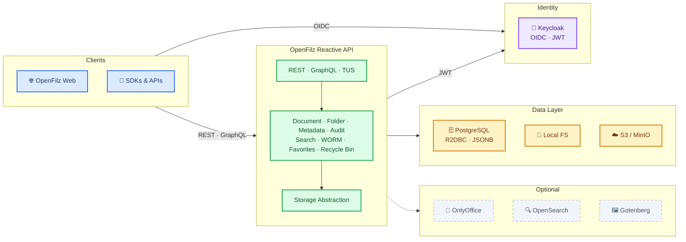

# OpenFilz Installation & Administration Guide

This guide is intended for DevOps engineers and system administrators who install, configure, and maintain OpenFilz.

---

## Table of Contents

- [Prerequisites](#prerequisites)
- [Architecture Overview](#architecture-overview)
- [Deployment Methods](#deployment-methods)
  - [Docker Compose (Recommended)](#docker-compose-recommended)
  - [Kubernetes / Helm](#kubernetes--helm)
  - [Dokploy](#dokploy)
  - [Manual (JAR)](#manual-jar)
- [Configuration Reference](#configuration-reference)
  - [Database](#database)
  - [Storage](#storage)
  - [Authentication (Keycloak)](#authentication-keycloak)
  - [Roles and Authorization](#roles-and-authorization)
  - [Full-Text Search (OpenSearch)](#full-text-search-opensearch)
  - [Document Editing (OnlyOffice)](#document-editing-onlyoffice)
  - [Thumbnails (Gotenberg)](#thumbnails-gotenberg)
  - [Resumable Uploads (TUS)](#resumable-uploads-tus)
  - [Quotas](#quotas)
  - [Audit and Compliance](#audit-and-compliance)
  - [Soft Delete and Recycle Bin](#soft-delete-and-recycle-bin)
  - [CORS](#cors)
  - [AI Document Chat](#ai-document-chat)
  - [MCP Server (External AI Agents)](#mcp-server-external-ai-agents)
  - [Electronic Signature (e-Sign)](#electronic-signature-e-sign)
- [Feature Toggles](#feature-toggles)
- [Keycloak Administration](#keycloak-administration)
- [Monitoring and Health Checks](#monitoring-and-health-checks)
- [Backup and Recovery](#backup-and-recovery)
- [Troubleshooting](#troubleshooting)

---

## Prerequisites

| Component | Minimum Version | Notes |
|-----------|----------------|-------|
| Java | 25+ | Only for manual JAR deployment |
| Docker | 20+ | For Docker Compose deployment |
| Docker Compose | 2.x | V2 recommended |
| PostgreSQL | 15+ | Provided by Docker or external |
| Keycloak | 26+ | Optional, provided by Docker or external |

### Hardware Recommendations

| Deployment | CPU | RAM | Disk |
|-----------|-----|-----|------|
| Small (< 100K docs) | 2 cores | 2 GB | 50 GB |
| Medium (100K–1M docs) | 4 cores | 4 GB | 500 GB |
| Large (> 1M docs) | 8+ cores | 8+ GB | As needed |

---

## Architecture Overview


```mermaid
graph LR
    subgraph Clients["Clients"]
        WEB["🌐 OpenFilz Web"]
        SDK["🔌 SDKs & APIs"]
    end

    subgraph Auth["Identity"]
        KC["🔐 Keycloak\nOIDC · JWT"]
    end

    subgraph Core["OpenFilz Reactive API"]
        direction TB
        ENDPOINTS["REST · GraphQL · TUS"]
        SERVICES["Document · Folder · Metadata · Audit\nSearch · WORM · Favorites · Recycle Bin"]
        ABSTRACTION["Storage Abstraction"]
        ENDPOINTS --> SERVICES --> ABSTRACTION
    end

    subgraph Data["Data Layer"]
        direction TB
        PG["🗄️ PostgreSQL\nR2DBC · JSONB"]
        FS["📁 Local FS"]
        S3["☁️ S3 / MinIO"]
    end

    subgraph Plugins["Optional"]
        direction TB
        OO["📝 OnlyOffice"]
        OS["🔍 OpenSearch"]
        GOT["🖼️ Gotenberg"]
    end

    Clients -->|"OIDC"| Auth
    Clients -->|"REST · GraphQL"| Core
    Core -->|"JWT"| Auth
    Core --> Data
    Core -.-> Plugins

    classDef clientBox fill:#dbeafe,stroke:#2563eb,stroke-width:2px,color:#1e3a5f
    classDef authBox fill:#ede9fe,stroke:#7c3aed,stroke-width:2px,color:#4c1d95
    classDef coreBox fill:#dcfce7,stroke:#16a34a,stroke-width:2px,color:#14532d
    classDef dataBox fill:#fef3c7,stroke:#d97706,stroke-width:2px,color:#78350f
    classDef pluginBox fill:#f1f5f9,stroke:#94a3b8,stroke-width:1px,stroke-dasharray:5 5,color:#475569

    class WEB,SDK clientBox
    class KC authBox
    class ENDPOINTS,SERVICES,ABSTRACTION coreBox
    class PG,FS,S3 dataBox
    class OO,OS,GOT pluginBox
```

**Services:**

| Service | Purpose | Required |
|---------|---------|----------|
| **openfilz-api** | REST + GraphQL API backend | Yes |
| **openfilz-web** | Angular web frontend | Yes (or custom frontend) |
| **PostgreSQL** | Document metadata, audit logs, folder structure | Yes |
| **File Storage** | Document binary storage (local FS or S3/MinIO) | Yes |
| **Keycloak** | OIDC authentication and user management | Recommended |
| **OpenSearch** | Full-text search inside documents | Optional |
| **OnlyOffice** | In-browser Office document editing | Optional |
| **Gotenberg** | Thumbnail generation for PDFs and Office files | Optional |
| **Ollama / OpenAI** | AI chat and document understanding (LLM provider) | Optional |

---

## Deployment Methods

### Docker Compose (Recommended)

The simplest deployment method. All configurations are in `deploy/docker-compose/`.

#### Step 1: Clone and configure

```bash
cd deploy/docker-compose
cp .env.example .env
# Edit .env with your values (see Configuration Reference below)
vi .env
```

#### Step 2: Choose a deployment profile

A `Makefile` automates service composition:

```bash
# Base services only (PostgreSQL, API, Web — no auth)
make up

# With Keycloak authentication
make up-auth

# With MinIO S3 storage
make up-minio

# With authentication + MinIO
make up-auth-minio

# With OnlyOffice document editing
make up-onlyoffice

# With OpenSearch full-text search
make up-fulltext

# With AI document chat (Ollama)
make up-ai

# Demo mode (all CE features, no auth)
make up-demo

# Full production stack (auth, MinIO, OnlyOffice, OpenSearch, thumbnails, AI)
make up-full
```

#### Step 3: Verify

```bash
# Check running containers
make ps

# Check API health
curl http://localhost:8081/actuator/health

# View logs
make logs
```

#### Service URLs (default ports)

| Service | URL |
|---------|-----|
| Web UI | http://localhost:4200 |
| REST API | http://localhost:8081 |
| Swagger UI | http://localhost:8081/swagger-ui.html |
| GraphQL | http://localhost:8081/graphql/v1 |
| Keycloak admin | http://localhost:8180 |
| MinIO console | http://localhost:9001 |
| OpenSearch Dashboards | http://localhost:5601 |

#### Compose Files Reference

| File | Description |
|------|-------------|
| `docker-compose.yml` | Core: PostgreSQL, API, Web |
| `docker-compose.auth.yml` | Keycloak authentication |
| `docker-compose.minio.yml` | MinIO S3 storage |
| `docker-compose.onlyoffice.yml` | OnlyOffice document server |
| `docker-compose.fulltext.yml` | OpenSearch full-text search |
| `docker-compose-thumbnails.yml` | Gotenberg thumbnail generation |
| `docker-compose.ai.yml` | AI document chat (Ollama LLM) |
| `docker-compose-gotenberg-dev.yml` | Gotenberg standalone for local dev |

#### Manual Compose (without Make)

```bash
# Example: base + auth + MinIO
docker-compose -f docker-compose.yml \
  -f docker-compose.auth.yml \
  -f docker-compose.minio.yml up -d
```

When not using Make, set the `NG_APP_*` variables in `.env` (see `.env.example`).
`docker-compose.yml` passes them to the `openfilz-web` container, which writes
`ngx-env.js` at startup. To override the auth/OnlyOffice toggles for one run:

```bash
NG_APP_AUTHENTICATION_ENABLED=true NG_APP_ONLYOFFICE_ENABLED=false \
  docker-compose -f docker-compose.yml -f docker-compose.auth.yml up -d
```

### Kubernetes / Helm

Helm charts are available in `deploy/helm/` for `openfilz-api` and `openfilz-web`:

- Deployment, Service, Ingress, Secrets, PV/PVC templates
- OpenShift Route support

```bash
helm install openfilz-api deploy/helm/openfilz-api/ \
  --set image.tag=latest \
  --set database.url=r2dbc:postgresql://postgres:5432/dms_db
```

### Dokploy

A single compose file in `deploy/docker-compose/dokploy/` for Dokploy platform deployment.

### Manual (JAR)

For environments where Docker is not available:

```bash
# Prerequisites: Java 25+, PostgreSQL running, Maven 3.x
mvn clean install -pl openfilz-api -am

java -jar openfilz-api/target/openfilz-api-*.jar \
  --spring.r2dbc.url=r2dbc:postgresql://localhost:5432/dms_db \
  --spring.r2dbc.username=dms_user \
  --spring.r2dbc.password=dms_password \
  --server.port=8081
```

> **Note on `-DskipTests`:** If you build the full project (not just `openfilz-api`), do **not** use `mvn clean install -DskipTests`. The SDK modules depend on an OpenAPI spec artifact generated during the test phase. Skipping tests prevents the spec from being produced, causing the SDK builds to fail. To skip tests while still generating the spec, use: `mvn clean install -DskipTests -Popenapi-spec`. When building only the API module (`-pl openfilz-api -am`), `-DskipTests` is safe.

---

## Configuration Reference

All configuration is managed via environment variables (Docker) or `application.yml` (JAR deployment).

### Database

| Property / Env Variable | Default | Description |
|--------------------------|---------|-------------|
| `spring.r2dbc.url` | `r2dbc:postgresql://localhost:5432/dms_db` | R2DBC connection URL |
| `spring.r2dbc.username` / `DB_USER` | `dms_user` | Database username |
| `spring.r2dbc.password` / `DB_PASSWORD` | `dms_password` | Database password |
| `spring.r2dbc.pool.initial-size` | `5` | Initial connection pool size |
| `spring.r2dbc.pool.max-size` | `10` | Maximum connection pool size |
| `spring.flyway.url` | `jdbc:postgresql://...` | JDBC URL for Flyway migrations |
| `spring.flyway.baseline-on-migrate` | `true` | Baseline existing DB on first migration |

Database schema is managed automatically by **Flyway**. Migrations run on startup.

### Storage

| Property / Env Variable | Default | Description |
|--------------------------|---------|-------------|
| `storage.type` / `STORAGE_TYPE` | `local` | Storage backend: `local` or `minio` |
| `storage.local.base-path` | `/tmp/dms-storage` | Base directory for local storage |
| `storage.minio.endpoint` / `MINIO_ENDPOINT` | `http://localhost:9000` | MinIO/S3 endpoint |
| `storage.minio.access-key` / `MINIO_ACCESS_KEY` | `minioadmin` | S3 access key |
| `storage.minio.secret-key` / `MINIO_SECRET_KEY` | `minioadmin` | S3 secret key |
| `storage.minio.bucket-name` / `MINIO_BUCKET_NAME` | `dms-bucket` | S3 bucket name |
| `storage.minio.versioning-enabled` / `STORAGE_MINIO_VERSIONING_ENABLED` | `false` | Enable S3 bucket versioning (preserves old versions on replace) and the document version endpoints (`GET .../versions`, `GET .../versions/{versionId}/download`, `POST .../versions/{versionId}/restore`). Pair with `NG_APP_STORAGE_MINIO_VERSIONING_ENABLED=true` on the frontend to show the version history UI. Restore is history-preserving (server-side copy creating a new latest version, single-copy limit 5 GiB). Versions accumulate in the bucket — consider MinIO lifecycle rules to cap version count/age. |

**Choosing a storage backend:**

- **Local filesystem** (`local`): Simplest setup. Files stored at `{base-path}/{UUID}#{filename}`. Suitable for single-node deployments.
- **MinIO/S3** (`minio`): Recommended for production. Supports multi-node, replication, and bucket versioning.

### Authentication (Keycloak)

| Property / Env Variable | Default | Description |
|--------------------------|---------|-------------|
| `openfilz.security.no-auth` / `OPENFILZ_SECURITY_NO_AUTH` | `true` | `true` = auth disabled (dev only); `false` = auth required |
| `spring.security.oauth2.resourceserver.jwt.jwk-set-uri` | — | Keycloak JWK Set URI for JWT validation |
| `KEYCLOAK_PORT` | `8180` | Keycloak exposed port |
| `KEYCLOAK_ADMIN` | `admin` | Keycloak admin username |
| `KEYCLOAK_ADMIN_PASSWORD` | `admin` | Keycloak admin password |
| `KEYCLOAK_REALM_URL` | `http://keycloak:8080/realms/openfilz` | Internal realm URL (API-to-Keycloak) |
| `KEYCLOAK_PUBLIC_URL` | `http://localhost:8180` | Public Keycloak URL (browser-to-Keycloak) |

**Important:** The API uses the internal Docker DNS (`keycloak:8080`) to validate JWTs, while the browser uses the public URL (`localhost:8180`). These must not be swapped.

#### SMTP (Email)

For Keycloak emails (password reset, verification):

| Variable | Default | Description |
|----------|---------|-------------|
| `SMTP_HOST` | *(empty)* | SMTP hostname (empty = disabled) |
| `SMTP_PORT` | `587` | SMTP port |
| `SMTP_FROM` | *(empty)* | Sender email address |
| `SMTP_SSL` | `false` | Enable SSL |
| `SMTP_STARTTLS` | `true` | Enable STARTTLS |
| `SMTP_AUTH` | `true` | Enable authentication |
| `SMTP_USER` | *(empty)* | SMTP username |
| `SMTP_PASSWORD` | *(empty)* | SMTP password |

#### Social Login (Identity Providers)

Leave empty to disable a provider:

| Variable | Description |
|----------|-------------|
| `GOOGLE_CLIENT_ID` / `GOOGLE_CLIENT_SECRET` | Google OAuth2 |
| `GITHUB_CLIENT_ID` / `GITHUB_CLIENT_SECRET` | GitHub OAuth2 |
| `MICROSOFT_CLIENT_ID` / `MICROSOFT_CLIENT_SECRET` | Microsoft OAuth2 |

### Roles and Authorization

| Property | Default | Description |
|----------|---------|-------------|
| `openfilz.security.role-token-lookup` | `REALM_ACCESS` | Where to find roles in JWT: `REALM_ACCESS` (realm roles) or `GROUPS` (Keycloak groups) |
| `openfilz.security.root-group` | `OPENFILZ` | Root group name when using `GROUPS` lookup (e.g., `/OPENFILZ/READER`) |
| `openfilz.security.custom-roles` | `false` | Enable custom security implementation |
| `openfilz.security.worm-mode` | `false` | Enable WORM (read-only) mode |

#### Built-in Roles

| Role | HTTP Methods | Allowed Operations |
|------|--------------|--------------------|
| `READER` | GET, GraphQL queries | View, download, search, list |
| `CONTRIBUTOR` | POST, PUT, PATCH | Upload, create, rename, move, copy, update metadata |
| `CLEANER` | DELETE | Delete files, folders, empty recycle bin |
| `AUDITOR` | GET /audit/* | View audit trail, verify audit chain |

#### Default Roles for New Users (Docker Compose)

Up to 4 default roles and groups can be assigned to new Keycloak users:

```bash
KEYCLOAK_DEFAULT_ROLE_1=CONTRIBUTOR
KEYCLOAK_DEFAULT_ROLE_2=CLEANER
KEYCLOAK_DEFAULT_ROLE_3=READER
KEYCLOAK_DEFAULT_ROLE_4=AUDITOR
KEYCLOAK_DEFAULT_GROUP_1=/OPENFILZ/CONTRIBUTOR
KEYCLOAK_DEFAULT_GROUP_2=/OPENFILZ/CLEANER
KEYCLOAK_DEFAULT_GROUP_3=/OPENFILZ/READER
KEYCLOAK_DEFAULT_GROUP_4=/OPENFILZ/AUDITOR
```

If you need fewer than 4, duplicate an existing value — Keycloak ignores duplicates.

### Full-Text Search (OpenSearch)

| Property / Env Variable | Default | Description |
|--------------------------|---------|-------------|
| `openfilz.full-text.active` / `OPENFILZ_FULLTEXT_ACTIVE` | `false` | Enable full-text indexing |
| `openfilz.full-text.default-index` | `openfilz` | OpenSearch index name |
| `openfilz.full-text.content-languages` | `fr,en` | Stemmer languages for content analysis (see below) |
| `openfilz.full-text.indexation-mode` | `local` | Indexation mode: `local`, `redis`, `kafka`, `nats` |
| `openfilz.full-text.opensearch.host` | `localhost` | OpenSearch host |
| `openfilz.full-text.opensearch.port` | `9200` | OpenSearch port |
| `openfilz.full-text.opensearch.scheme` | `https` | HTTP scheme |
| `openfilz.full-text.opensearch.username` | `admin` | OpenSearch username |
| `openfilz.full-text.opensearch.password` | — | OpenSearch password |

#### Content Language Stemmers

The `content-languages` property configures which language stemmers are applied to the full-text content analyzer. Stemmers reduce words to their root form, enabling searches like "système" to match "systèmes" (plural/singular), or "running" to match "run" (verb forms). An ASCII folding filter is also applied, allowing accent-insensitive searches (e.g. "systemes" matches "systèmes").

Supported language codes (OpenSearch built-in stemmers): `ar` (Arabic), `de` (German), `en` (English), `es` (Spanish), `fr` (French), `it` (Italian), `nl` (Dutch), `pt` (Portuguese), `ru` (Russian), `sv` (Swedish), and more — see the [OpenSearch documentation](https://opensearch.org/docs/latest/analyzers/token-filters/stemmer/) for the full list.

Example with additional languages:
```yaml
openfilz:
  full-text:
    content-languages: fr,en,de,es
```

> **Important:** Changing `content-languages` requires recreating the OpenSearch index. Delete the existing index and restart the API — it will be recreated automatically with the new analyzer. All documents must then be re-indexed.

### Document Editing (OnlyOffice)

| Property / Env Variable | Default | Description |
|--------------------------|---------|-------------|
| `onlyoffice.enabled` / `ONLYOFFICE_ENABLED` | `false` | Enable OnlyOffice integration |
| `onlyoffice.document-server.url` / `ONLYOFFICE_URL` | `http://localhost` | OnlyOffice Document Server URL |
| `onlyoffice.document-server.api-path` | `/web-apps/apps/api/documents/api.js` | JS API path |
| `onlyoffice.jwt.enabled` | `true` | Enable JWT between API and OnlyOffice |
| `onlyoffice.jwt.secret` / `ONLYOFFICE_JWT_SECRET` | `openfilz-onlyoffice-jwt-secret-2024` | Shared JWT secret |
| `onlyoffice.supported-extensions` | `docx,doc,xlsx,xls,pptx,ppt,odt,ods,odp,pdf` | Editable file extensions |

### Thumbnails (Gotenberg)

| Property / Env Variable | Default | Description |
|--------------------------|---------|-------------|
| `openfilz.thumbnail.active` / `OPENFILZ_THUMBNAIL_ACTIVE` | `false` | Enable thumbnail generation |
| `openfilz.thumbnail.gotenberg.url` / `GOTENBERG_URL` | `http://localhost:8083` | Gotenberg URL |
| `openfilz.thumbnail.gotenberg.timeout-seconds` | `60` | Conversion timeout |
| `openfilz.thumbnail.dimensions.width` | `100` | Thumbnail width (px) |
| `openfilz.thumbnail.dimensions.height` | `100` | Thumbnail height (px) |
| `openfilz.thumbnail.storage.use-main-storage` | `true` | `true` = same backend type as document storage |
| `openfilz.thumbnail.storage.local.base-path` | `/tmp/dms-thumbnails` | Local thumbnail path |
| `openfilz.thumbnail.storage.minio.bucket-name` | `dms-thumbnails` | MinIO thumbnail bucket |

### Resumable Uploads (TUS)

| Property | Default | Description |
|----------|---------|-------------|
| `openfilz.tus.enabled` | `true` | Enable TUS resumable uploads |
| `openfilz.tus.temp-storage-path` | `/tmp/tus-uploads` | Temporary chunk storage |
| `openfilz.tus.max-upload-size` | `10737418240` (10 GB) | Maximum upload size |
| `openfilz.tus.chunk-size` | `52428800` (50 MB) | Chunk size |
| `openfilz.tus.upload-expiration-period` | `86400000` (24h) | Abandoned upload TTL |
| `openfilz.tus.cleanup-interval` | `3600000` (1h) | Cleanup sweep interval |

### Quotas

| Property | Default | Description |
|----------|---------|-------------|
| `openfilz.quota.file-upload` | `0` | Max file size per upload (MB), `0` = unlimited |
| `openfilz.quota.user` | `0` | Max total storage per user (MB), `0` = unlimited |

### Audit and Compliance

| Property | Default | Description |
|----------|---------|-------------|
| `openfilz.audit.excluded-actions` | `[]` | Actions to exclude from audit logging |
| `openfilz.audit.chain.enabled` | `true` | Enable cryptographic hash chain |
| `openfilz.audit.chain.algorithm` | `SHA-256` | Hash algorithm |
| `openfilz.audit.chain.verification-enabled` | `true` | Enable automatic chain verification |
| `openfilz.audit.chain.verification-cron` | `0 0 3 * * ?` | Verification schedule (daily at 3 AM) |
| `openfilz.calculate-checksum` / `OPENFILZ_CALCULATECHECKSUM` | `false` | Calculate SHA-256 checksum on upload |

### Soft Delete and Recycle Bin

| Property | Default | Description |
|----------|---------|-------------|
| `openfilz.soft-delete.active` / `OPENFILZ_SOFTDELETE_ACTIVE` | `false` | Enable soft delete (recycle bin) |
| `openfilz.soft-delete.recycle-bin.enabled` | `true` | Enable recycle bin API |
| `openfilz.soft-delete.recycle-bin.auto-cleanup-interval` | `30 days` | Auto-purge interval (`0` = never) |
| `openfilz.soft-delete.recycle-bin.cleanup-cron` | `0 0 2 * * ?` | Cleanup schedule (daily at 2 AM) |

### AI Document Chat

OpenFilz includes an optional AI assistant that can answer questions about your documents, search and organize files, and summarize content using Retrieval-Augmented Generation (RAG). When enabled, uploaded documents are automatically chunked, embedded, and stored in a pgvector table for semantic similarity search.

> **Developer deep-dive:** [AI Architecture](ai.md) explains how the configuration is resolved at
> startup, the ingestion → indexing pipeline (full-text + vectors), the chat workflow, and BYOK —
> with architecture and sequence diagrams.

#### Prerequisites

- **PostgreSQL with pgvector extension**: The database must have the `vector` extension available. Use the `pgvector/pgvector` Docker image instead of plain `postgres` (provided automatically by `docker-compose.ai.yml`).
- **An LLM provider**: A local [Ollama](https://ollama.com) instance, OpenAI, Anthropic Claude, Google Gemini, or any OpenAI-compatible API (Azure OpenAI, OpenRouter, etc.). Anthropic and Gemini provide **chat models only** — embeddings always come from Ollama or OpenAI.

#### Feature Toggle

| Property / Env Variable | Default | Description |
|--------------------------|---------|-------------|
| `openfilz.ai.active` / `OPENFILZ_AI_ACTIVE` | `false` | Master switch — set to `true` to enable all AI features |

`openfilz.ai.active` is the **only** switch you need to flip. It gates the AI beans, the AI REST
endpoints, the embedding pipeline, the Flyway migration that creates the AI tables — and the chat
UI in openfilz-web, which reads the flag from the API's `/api/v1/settings` response rather than
from a frontend variable of its own. There is nothing to keep in sync.

When `openfilz.ai.active=false` (default), the AI feature is completely inert: no AI beans are created, no AI REST endpoints are exposed, no embedding processing occurs, no LLM provider is auto-configured, and the AI database tables (`ai_chat_conversations`, `ai_chat_messages`, `vector_store`) are **not created**. The Flyway migration for AI only runs when the feature is active.

#### LLM Provider Configuration

With the feature on and no provider switch set, OpenFilz uses **Ollama**, whose defaults target a
stock local install (`localhost:11434`, `qwen2.5` for chat, `nomic-embed-text` for embeddings) — so
`OPENFILZ_AI_ACTIVE=true` against a running Ollama is a complete configuration. Set the switches
below to choose otherwise; chat and embeddings resolve independently, so they can come from
different providers (e.g. Ollama for embeddings + OpenAI for chat).

> The `*.enabled` switches in the tables below are OpenFilz properties, not Spring AI ones. Spring
> AI 2.0 gates each provider on a single selector (`spring.ai.model.chat` /
> `spring.ai.model.embedding`, valued with the provider name or `none`); OpenFilz derives those
> selectors from `openfilz.ai.active` plus these booleans. When several chat providers are enabled
> at once, priority is **Ollama > Anthropic > Google > OpenAI**; embeddings are restricted to
> Ollama/OpenAI (Anthropic has no embeddings API, and the pgvector schema is pinned to 768-dim
> output). Set `spring.ai.model.*` yourself to bypass the mapping.

**Ollama (local, free, recommended for development):**

| Property / Env Variable | Default | Description |
|--------------------------|---------|-------------|
| `spring.ai.ollama.base-url` / `OLLAMA_BASE_URL` | `http://localhost:11434` | Ollama server URL |
| `openfilz.ai.ollama.chat.enabled` / `OLLAMA_CHAT_ENABLED` | `false` | Enable Ollama as the chat model provider |
| `spring.ai.ollama.chat.model` / `OLLAMA_CHAT_MODEL` | `llama3` | Ollama chat model name |
| `openfilz.ai.ollama.embedding.enabled` / `OLLAMA_EMBEDDING_ENABLED` | `false` | Enable Ollama as the embedding model provider |
| `spring.ai.ollama.embedding.model` / `OLLAMA_EMBEDDING_MODEL` | `nomic-embed-text` | Ollama embedding model name |

**OpenAI-compatible API (cloud, production-ready):**

| Property / Env Variable | Default | Description |
|--------------------------|---------|-------------|
| `spring.ai.openai.api-key` / `OPENAI_API_KEY` | *(empty)* | API key (required when using OpenAI) |
| `spring.ai.openai.base-url` / `OPENAI_BASE_URL` | `https://api.openai.com` | API base URL (change for Azure OpenAI or other providers) |
| `openfilz.ai.openai.chat.enabled` / `OPENAI_CHAT_ENABLED` | `false` | Enable OpenAI as the chat model provider |
| `spring.ai.openai.chat.model` / `OPENAI_CHAT_MODEL` | `gpt-4o` | Chat model name |
| `openfilz.ai.openai.embedding.enabled` / `OPENAI_EMBEDDING_ENABLED` | `false` | Enable OpenAI as the embedding model provider |
| `spring.ai.openai.embedding.model` / `OPENAI_EMBEDDING_MODEL` | `text-embedding-3-small` | Embedding model name |

**Anthropic Claude (cloud, chat only):**

| Property / Env Variable | Default | Description |
|--------------------------|---------|-------------|
| `spring.ai.anthropic.api-key` / `ANTHROPIC_API_KEY` | *(empty)* | API key (required when using Anthropic) |
| `openfilz.ai.anthropic.chat.enabled` / `ANTHROPIC_CHAT_ENABLED` | `false` | Enable Anthropic as the chat model provider |
| `spring.ai.anthropic.chat.model` / `ANTHROPIC_CHAT_MODEL` | `claude-opus-5` | Chat model name (`claude-haiku-4-5` for a cheaper option) |

Anthropic has no embeddings API — pair it with Ollama or OpenAI embeddings (e.g. `ANTHROPIC_CHAT_ENABLED=true` + `OLLAMA_EMBEDDING_ENABLED=true`).

**Google Gemini (cloud, chat only, free tier available):**

| Property / Env Variable | Default | Description |
|--------------------------|---------|-------------|
| `spring.ai.google.genai.api-key` / `GOOGLE_API_KEY` | *(empty)* | API key from Google AI Studio (required when using Gemini) |
| `openfilz.ai.google.chat.enabled` / `GOOGLE_CHAT_ENABLED` | `false` | Enable Gemini as the chat model provider |
| `spring.ai.google.genai.chat.model` / `GOOGLE_CHAT_MODEL` | `gemini-3.6-flash` | Chat model name |

Uses the Gemini Developer API (API-key auth, not Vertex AI). In OpenFilz, Gemini serves chat only — embeddings stay on Ollama/OpenAI so the pgvector schema keeps its 768 dimensions.

> **Model ids get retired.** Google withdraws older ids, after which *every* chat fails with
> `404 … This model models/<id> is no longer available to new users`. The fix is to update
> `GOOGLE_CHAT_MODEL` (the error message names the replacement). Configuring
> [model failover](#ai-model-failover-quota-and-availability) below keeps chat working while
> you do.

#### AI model failover (quota and availability)

Free tiers allow only a handful of requests per minute and per day. When the configured model
refuses — quota spent, model retired, provider down — OpenFilz can retry the same question on
another model instead of failing the user.

| Property / Env Variable | Default | Description |
|--------------------------|---------|-------------|
| `openfilz.ai.fallback.enabled` / `AI_FALLBACK_ENABLED` | `false` | Enable automatic failover to another chat model |
| `openfilz.ai.fallback.chain` / `AI_FALLBACK_CHAIN` | *(empty)* | Comma-separated `provider:model` entries, tried in order (`google`, `anthropic`, `openai`, `openai-compatible`) |
| `openfilz.ai.fallback.keys.<provider>` / `AI_FALLBACK_KEYS_GOOGLE`, `..._ANTHROPIC`, `..._OPENAI` | *(empty)* | Comma-separated pool of API keys for that provider, tried in order. Empty means "keep using the single key above" |
| `openfilz.ai.fallback.validation` / `AI_FALLBACK_VALIDATION` | `FAIL_FAST` | `FAIL_FAST` refuses to start when the chain names a provider with no API key; `WARN` starts anyway with a shorter chain |
| `openfilz.ai.fallback.quota-cooldown` / `AI_FALLBACK_QUOTA_COOLDOWN` | `5m` | How long a model is skipped after a spent quota or a provider outage |
| `openfilz.ai.fallback.unavailable-cooldown` / `AI_FALLBACK_UNAVAILABLE_COOLDOWN` | `6h` | How long a model is skipped after a `404` (retired / not enabled for the key) |

```
AI_FALLBACK_ENABLED=true
AI_FALLBACK_CHAIN=google:gemini-3.6-flash,anthropic:claude-haiku-4-5,openai:gpt-4o-mini
```

**You do not need `<PROVIDER>_CHAT_ENABLED` for providers in the chain.** A chain entry is enough
to use that provider, and when no switch is set the chain's **first entry becomes the primary chat
model — both its provider and its model** — so the two lines above are a complete chat
configuration, and reordering the chain changes which model answers first. An explicit
`<PROVIDER>_CHAT_MODEL` still wins if you set one. Switches still win if you
set them, so existing deployments are unchanged.

Every provider in the chain must have an API key. This is checked **at startup**: a keyless entry
refuses to boot with a message naming the variable to set, rather than failing silently on the day
your quota runs out. Set `AI_FALLBACK_VALIDATION=WARN` to start anyway with a shorter chain.

**Several keys per provider.** Quota is charged per API key, so a second key is a second
allowance — the cheapest way to widen a free tier:

```
AI_FALLBACK_KEYS_GOOGLE=AIza-first-project-key,AIza-second-project-key
```

A provider is exhausted completely before the next one is used: every chain model on the first
key, then every chain model on the second, and only then does the chain move to another provider
— which of course uses that provider's own keys. A single spent model does not cost you the key;
the provider's other models keep using it. Leave a provider's pool empty to keep its single key.

Keys never appear in logs: each is identified by a short fingerprint (`a1b2c3d4`), which is also
what keeps two BYOK users on the same model from sharing a cooldown.

Two things happen on a failure. The request itself is **retried** on the next model, so the user
still gets an answer. The failed model is then **benched** for its cooldown, so the requests that
follow skip it rather than each paying the same failing call first — which is what stops a spent
*daily* quota from slowing every request for the rest of the day. Cooldowns expire on their own;
nothing needs restarting.

Watch for these in the logs:

```
[AI] QUOTA_EXHAUSTED on google-genai (gemini-3.6-flash) — falling back to ANTHROPIC (claude-haiku-4-5)
[AI-FALLBACK] QUOTA_EXHAUSTED on google:gemini-3.6-flash — benching it for PT5M
```

> **Ollama is never failed over.** When the chat provider is a local Ollama model the chain is
> ignored entirely, and configuring both logs a warning at startup. This is about data residency,
> not speed: a local LLM is deployed so document content stays in-house, and the RAG context sent
> with every question *is* document text — failing over would send it to a third-party API. A
> local model going down is an outage to fix, not something to route around. (A BYOK user who
> chose a cloud provider themselves still gets failover.)

> **A bad API key never reroutes the model you chose.** When the provider refuses the credentials
> of the model actually in use — the server default, or a BYOK user's own — the error is returned
> as an error: quietly answering from somewhere else would hide a broken credential instead of
> surfacing it. Malformed requests are treated the same way.
>
> **A refused key from a *pool* is dropped instead.** `AI_FALLBACK_KEYS_<PROVIDER>` exists so that
> one key failing is survivable, so a key the provider rejects is removed from rotation for the
> rest of the process and the next key takes over. It is not silent: it is logged at ERROR with
> the key's fingerprint, and the key is not retried until you fix it and restart.
>
> ```
> [AI] GOOGLE rejected the fallback API key c59be430 — dropping it from the pool for the rest of
> this process; fix or remove it in AI_FALLBACK_KEYS_GOOGLE
> ```
>
> The fingerprint is a short hash of the key, never the key itself — it identifies *which* entry of
> the pool to fix without putting a secret in the logs.

> **Failover is abandoned mid-answer.** If the model already streamed part of a response, or a tool
> already moved/renamed/deleted something, the error propagates rather than retrying — the user
> would otherwise see a spliced answer or have the action repeated.

#### Getting an API key

The cloud providers all require an API key. In every case: treat the key like a password, and rotate it by creating a new key, updating OpenFilz, then revoking the old one in the provider console.

**OpenAI**
1. Create an account on the API platform at [platform.openai.com](https://platform.openai.com) — this is distinct from ChatGPT: **a ChatGPT subscription does not include API access**.
2. Add billing (Settings → Billing) — prepaid credits or a payment method.
3. Go to [platform.openai.com/api-keys](https://platform.openai.com/api-keys) → *Create new secret key*. Prefer a **project-scoped** key with minimal permissions.
4. The key (`sk-...`) is **shown once** — copy it immediately into `OPENAI_API_KEY`.
5. Recommended: set a monthly usage limit in the OpenAI dashboard.

**Anthropic (Claude)**
1. Create an account on the Claude Console at [platform.claude.com](https://platform.claude.com) — distinct from Claude.ai: **a Claude Pro/Max chat subscription does not include API access**.
2. Add billing / purchase credits (Settings → Billing).
3. Settings → **API keys** → *Create key* (optionally scoped to a workspace to isolate spend and rate limits).
4. The key (`sk-ant-...`) is **shown once** — copy it immediately into `ANTHROPIC_API_KEY`.
5. Recommended: set workspace spend limits in the Console.

**Google Gemini**
1. Go to **Google AI Studio** at [aistudio.google.com](https://aistudio.google.com) and sign in with a Google account.
2. Click **Get API key** → *Create API key* (bound to a Google Cloud project; AI Studio can create one for you).
3. A **free tier** is available with no billing setup (rate-limited) — the easiest way to try the feature. Enable billing on the Cloud project for production quotas.
4. Copy the key (`AIza...`) into `GOOGLE_API_KEY`. Optionally restrict it to the Generative Language API in the Cloud console.
5. Quota and spend guardrails live in the Google Cloud console.

#### Per-User AI Settings (BYOK)

Optionally, each user can override the chat LLM with **their own provider and API key** from the
personal settings page (*Settings → AI Assistant*): OpenAI, Anthropic Claude, Google Gemini, or any
OpenAI-compatible endpoint (OpenRouter, Mistral, a local vLLM…). The server default remains for
users who configure nothing. Only the **chat** model is user-selectable — embeddings (and therefore
RAG indexing) always use the server-configured embedding model.

| Property / Env Variable | Default | Description |
|--------------------------|---------|-------------|
| `openfilz.ai.user-settings.enabled` / `AI_USER_SETTINGS_ENABLED` | `false` | Enable per-user model overrides (BYOK) |
| `openfilz.ai.user-settings.encryption-key` / `AI_SETTINGS_ENCRYPTION_KEY` | *(empty)* | AES-256 key protecting stored user API keys — **required when BYOK is enabled** |

Generate the encryption key once per deployment:

```bash
openssl rand -base64 32
```

Notes:
- User keys are stored **AES-256-GCM encrypted** in the `user_ai_settings` table and are write-only through the API (only a `hasApiKey` flag and the last 4 characters are ever returned).
- The startup fails fast if BYOK is enabled without an encryption key.
- Changing `AI_SETTINGS_ENCRYPTION_KEY` invalidates all stored user keys — users must re-enter them.
- The settings page includes a **Test connection** button that sends a one-token probe with the submitted key, so users can validate their setup before saving.

#### RAG and Embedding Configuration

| Property / Env Variable | Default | Description |
|--------------------------|---------|-------------|
| `openfilz.ai.system-prompt` | *(built-in)* | System prompt defining the AI assistant's behavior |
| `openfilz.ai.embedding.chunk-size` | `1000` | Characters per text chunk when splitting documents |
| `openfilz.ai.embedding.chunk-overlap` | `200` | Overlapping characters between adjacent chunks |
| `openfilz.ai.embedding.top-k` | `5` | Number of most similar chunks to retrieve per query |
| `openfilz.ai.embedding.similarity-threshold` | `0.7` | Minimum cosine similarity score (0.0–1.0) for a chunk to be included |

#### Vector Store Configuration

| Property | Default | Description |
|----------|---------|-------------|
| `spring.ai.vectorstore.pgvector.index-type` | `hnsw` | Vector index type (HNSW for fast approximate search) |
| `spring.ai.vectorstore.pgvector.distance-type` | `cosine_distance` | Distance metric for similarity |
| `spring.ai.vectorstore.pgvector.dimensions` | `768` | Embedding vector dimensions (must match your embedding model) |
| `spring.ai.vectorstore.pgvector.initialize-schema` | `false` | Schema managed by Flyway — leave as `false` |

> **Note on dimensions:** The default `768` matches models like `nomic-embed-text` (Ollama) and `text-embedding-3-small` (OpenAI). If you use a model with different dimensions (e.g., `text-embedding-ada-002` at 1536), you must change this value **and** update the Flyway migration or re-create the `vector_store` table.

#### Quick Setup — Ollama (Local)

```bash
# 1. Install and start Ollama
curl -fsSL https://ollama.com/install.sh | sh
ollama pull llama3
ollama pull nomic-embed-text

# 2. Start OpenFilz with AI
cd deploy/docker-compose
make up-ai
```

#### Quick Setup — OpenAI (Cloud)

Set the following in your `.env`:

```bash
OPENFILZ_AI_ACTIVE=true
OPENAI_API_KEY=sk-your-key-here
OPENAI_CHAT_ENABLED=true
OPENAI_EMBEDDING_ENABLED=true
```

Then start normally (`make up`, `make up-auth`, etc.). No Ollama container is needed.

#### How It Works

1. **Document embedding**: When a file is uploaded, its text content is extracted (using Apache Tika — supports PDF, Office, text, and more), split into chunks, and stored as vector embeddings in PostgreSQL (pgvector).
2. **Chat with RAG**: When a user sends a message, the system searches for the most relevant document chunks via cosine similarity, includes them as context in the LLM prompt alongside the conversation history, and streams the response.
3. **Function calling**: The AI assistant can also invoke document management tools (list folders, search by name, create folders, move/rename documents) to take actions on behalf of the user.

#### Database Tables

The AI migrations (`V1_4__add_ai_support.sql`, `V1_5__add_embedding_registry.sql`, `V1_6__add_user_ai_settings.sql`) run **only when `openfilz.ai.active=true`** and create:

| Table | Purpose |
|-------|---------|
| `ai_chat_conversations` | Conversation metadata (title, creator, timestamps). Conversations are owned by their creator; rows created before ownership stamping (`created_by IS NULL`) stay visible to everyone |
| `ai_chat_messages` | Message history (user and assistant messages per conversation) |
| `vector_store` | Document embeddings for semantic search (768-dim vectors with HNSW index) |
| `ai_embedding_registry` | Records which embedding model produced the stored vectors (one-time deployment decision, enforced at startup) |
| `user_ai_settings` | Per-user BYOK chat-LLM overrides (provider, model, AES-256-GCM-encrypted API key) |

### Document insights & smart filing

Two optional layers on top of the AI feature (both need `OPENFILZ_AI_ACTIVE=true`):

**Document insights.** Every file's own metadata (title, author, dates, page count, language) is
captured at upload whenever full-text or AI runs Tika — no configuration, no model call. With
`OPENFILZ_AI_INSIGHTS_ACTIVE=true`, a model additionally labels each uploaded file: a category from a
closed list, a one-sentence summary, keywords, the language and a few entities (client, invoice
number, period…). Shown in the details panel, used by the AI assistant to organise folders, and
searchable (`category` facet).

| Variable | Default | Meaning |
|---|---|---|
| `OPENFILZ_AI_INSIGHTS_ACTIVE` | `false` | Turn the model enrichment on |
| `OPENFILZ_AI_INSIGHTS_MODEL` | *(chat model)* | `provider:model` for the enrichment, e.g. `anthropic:claude-haiku-4-5` — a cheap model is enough |
| `OPENFILZ_AI_INSIGHTS_MAX_CHARS` | `6000` | Characters of text sent per file |
| `OPENFILZ_AI_INSIGHTS_MAX_FILE_SIZE` | `50MB` | Larger files are not enriched |
| `OPENFILZ_AI_INSIGHTS_CONCURRENCY` | `2` | Parallel model calls |
| `OPENFILZ_AI_INSIGHTS_DAILY_LIMIT` | `2000` | Files enriched per day; the rest wait for a backfill |
| `OPENFILZ_AI_INSIGHTS_CATEGORIES` | invoice, quote, contract, report, letter, cv, presentation, spreadsheet, form, id-document, receipt, minutes, specification, manual, other | The closed category list — also what the details panel's kind editor offers |
| `OPENFILZ_AI_INSIGHTS_CLASSIFIER` | `llm` | Who names the category: `llm` (the chat model), `prototype` (embedding descriptions, no model), `learned` (the library's own labelled documents vote, descriptions as cold start, no model), `auto` (learned, then the model when unsure) |
| `OPENFILZ_AI_INSIGHTS_CLASSIFIER_MIN_CONFIDENCE` | `0.5` | In `auto` mode, a local verdict at or above this confidence is kept without asking the model |
| `OPENFILZ_AI_INSIGHTS_CLASSIFIER_LEARN_FROM` | `model,user` | Whose labels teach the learned classifier; add `prototype,learned` to let it feed itself |

Users correct a document's kind from the details panel (the category chip); the correction is
theirs for good — never overwritten by a non-forced backfill — and, in `learned` / `auto` mode, the
next documents of that kind take it. Measured on a real library (`docs/ai.md` §3c): the learned
classifier 84–88 %, the descriptions 47 %, a local `qwen2.5:1.5b` 53 % at 17 s a document — run
the benchmarks on your own documents before switching.

Existing documents: `POST /api/v1/ai/insights/backfill` (`{"folderId": …, "force": false}`, CONTRIBUTOR
role) enriches everything that has no current insight; `force: true` re-enriches all. Follow it with
`GET /api/v1/ai/insights/backfill/{jobId}`.

> **Privacy.** Like the RAG embeddings, the enrichment sends up to `max-chars` characters of each
> document's text to the configured model. Keep the model local (Ollama) when documents must not
> leave the deployment.

**Smart filing.** With `OPENFILZ_AI_AUTO_FILE_ACTIVE=true`, users get a switch in the upload area
("Let OpenFilz choose the folder"), remembered per user, and API clients can pass `autoFile=true` on
uploads. The upload completes as usual; seconds later the document is moved to the folder where its
closest documents live (one vector query), or to the folder the model picks among the scope's
folders — the folder it was dropped in is the scope, the root level means the whole library. Below
the confidence thresholds the document stays where it was. Every move is a normal audited move with
an undo, and the details panel shows "Filed by OpenFilz" with the reason.

| Variable | Default | Meaning |
|---|---|---|
| `OPENFILZ_AI_AUTO_FILE_ACTIVE` | `false` | Master switch |
| `OPENFILZ_AI_AUTO_FILE_DEFAULT` | `false` | Initial value of the per-user switch |
| `OPENFILZ_AI_AUTO_FILE_NEW_FOLDERS` | `true` | Whether filing may create folders (deployment ceiling) |
| `OPENFILZ_AI_AUTO_FILE_COHERENCE` | `category` | How the winning folder is judged a home for the document: by its files' categories, by their similarity to the document (`similarity`, no category needed), or `both` |
| `OPENFILZ_AI_AUTO_FILE_STAGE1` | `vote` | How the folder is picked among the neighbours' folders: the vote, or the `fit` (purity × closeness) |
| `OPENFILZ_AI_AUTO_FILE_RULE_FOLDERS` | `true` | The rule stage: a document of a known kind with no home goes to the scope's folder for that kind (`Invoices` / `Factures` / `Rechnungen`…), found by name in any language or created — no model |
| `OPENFILZ_AI_AUTO_FILE_DEFAULT_LANGUAGE` | `en` | Language of a rule-created folder when neither the existing folder names nor the document tell |

Reorganisation by kind — `POST /api/v1/ai/reorganization/by-kind {"rootFolderId": …}` or the
assistant's `proposeReorganizationByKind` tool — splits every mixed folder of a scope into one
sub-folder per kind from the same table, as an ordinary plan to review and apply; no model.

Thresholds (`openfilz.ai.auto-file.*` in `application.yml`: `neighbour-min-share` 0.6,
`neighbour-min-similarity` 0.5, `llm-min-confidence` 0.7, `new-folder-min-confidence` 0.85,
`new-folder-max-depth` 2, `max-per-batch` 200) are deliberately conservative; every filing record
carries its reason so they can be tuned from real outcomes.

### MCP Server (External AI Agents)

OpenFilz can expose its document tools over the
[Model Context Protocol](https://modelcontextprotocol.io) so that AI agents running **outside**
OpenFilz — Claude Code, Claude Desktop, n8n, LangChain, custom agents — can search, read and
organise documents on behalf of the signed-in user, at `POST /mcp`.

It serves **the same tools the built-in AI assistant uses**, so there is no second tool surface to
configure or keep in sync.

> **Full guide:** [MCP Server](mcp.md) — client setup snippets (Claude Code, `mcp.json`, n8n,
> Spring AI), the tool list, the security model and troubleshooting.

#### Feature Toggle

| Property / Env Variable | Default | Description |
|--------------------------|---------|-------------|
| `openfilz.mcp.active` / `OPENFILZ_MCP_ACTIVE` | `false` | Master switch for the MCP server |
| `openfilz.mcp.mode` / `OPENFILZ_MCP_MODE` | `READ_ONLY` | `READ_ONLY` exposes query/read tools only; `READ_WRITE` also exposes `writeFile`, `createFolder`, `moveDocuments`, `renameDocument` |
| `openfilz.mcp.authorization-server-url` / `KEYCLOAK_REALM_URL` | Keycloak realm URL | Advertised in the OAuth discovery metadata so remote hosts know where to log in. Defaults to the realm the API already validates tokens against — normally nothing to set. |

**Remote connectors (Claude Desktop, claude.ai, IDE connectors)** log in via OAuth rather than a
pasted token. This works out of the box: OpenFilz serves `/.well-known/oauth-protected-resource`
(pointing at your Keycloak realm) and the realm ships a pre-registered public PKCE client
`openfilz-mcp`. Loopback and the common IDE/claude.ai callbacks are already registered; to support
a hosted connector with a different fixed callback (e.g. ChatGPT, Gemini), add its URL to
Keycloak → Clients → `openfilz-mcp` → *Valid redirect URIs* (no restart, no code change). See the
[MCP guide](mcp.md#remote-connectors-that-log-in-for-themselves-oauth-21).

```bash
OPENFILZ_MCP_ACTIVE=true
OPENFILZ_MCP_MODE=READ_ONLY      # raise to READ_WRITE deliberately
```

#### This is independent of AI Document Chat

`openfilz.mcp.active` and `openfilz.ai.active` are **separate switches**. The MCP server needs no
LLM provider, no embeddings and no pgvector — the calling agent brings its own model. You can
therefore enable MCP on a deployment with AI chat entirely off. (The one exception is the
`describeImage` tool, which uses a local vision model and reports that it is unavailable when
there is none.)

#### Security

- `/mcp` is **never anonymous**: it sits on the normal OAuth2 resource-server chain, so a request
  without a valid bearer token gets `401` before reaching any tool.
- **The OpenFilz role model applies unchanged.** A READER may search and read; only a CONTRIBUTOR
  may write. An MCP call is authorised exactly as the equivalent REST call is, and a test fails the
  build if the two ever diverge. (`tools/list` is built per deployment, not per caller, so a READER
  still sees the write tools advertised and is refused when calling one.)
- The caller's identity comes from the **token**, never from tool arguments — an agent cannot ask
  to act as another user — and every document access is checked against the same policy the chat
  assistant uses. Roles and document scope are independent gates and both must pass. In the Enterprise edition that means agents are constrained by the real ownership
  and sharing rules, with nothing extra to configure.
- Mutations are recorded in the audit trail under the authentic user.
- **Read-only is the default deliberately**: an MCP client is an autonomous agent acting on a
  document management system, so write access is an explicit opt-in. In `READ_ONLY` the mutating
  tools are not advertised *and* are refused if called anyway.

> Give an agent a **dedicated user or service account** with only the roles it needs rather than
> reusing a person's credentials — see the developer guide's
> [Service Account Tokens](developer-guide.md#service-account-tokens-server-to-server).

---

### Electronic Signature (e-Sign)

OpenFilz can send a stored PDF to one or more recipients for electronic signature and file the
sealed result back into the DMS. The feature is **disabled by default**; while it is off, every
`/api/v1/signatures/**`, `/api/v1/signature-templates/**` and `/api/v1/public/signatures/**`
endpoint answers `404`, the expiry sweeper idles, and `GET /api/v1/settings` reports
`signatureActive: false` so the web UI hides the menu.

Minimum working configuration:

```yaml
openfilz:
  signature:
    active: true                                    # OPENFILZ_SIGNATURE_ACTIVE
  common:
    web-public-base-url: https://app.example.com/   # OPENFILZ_WEB_PUBLIC_BASE_URL
spring:
  mail:
    host: smtp.example.com                          # SMTP_HOST
    port: 587                                       # SMTP_PORT
    username: apikey                                # SMTP_USER
    password: ${SMTP_PASSWORD}
```

| Property | Default | Description |
|----------|---------|-------------|
| `openfilz.signature.active` | `false` | Master switch (endpoints, public chain, sweeper). Requires a restart. |
| `openfilz.signature.web-base-url` | *(empty)* | Base of the signing links; falls back to `openfilz.common.web-public-base-url` |
| `openfilz.signature.default-expiry-days` | `30` | Envelope lifetime when the request does not set one |
| `openfilz.signature.otp.length` | `6` | Digits in the email one-time code |
| `openfilz.signature.otp.valid-minutes` | `10` | Validity of a one-time code |
| `openfilz.signature.otp.max-attempts` | `5` | Failed verifications before the code is locked out |
| `openfilz.signature.seal.provider` | `self-signed-dev` | `self-signed-dev`, `pkcs12` or `openfilz-cloud` |
| `openfilz.signature.seal.keystore-path` | *(empty)* | PKCS#12 keystore holding the seal certificate |
| `openfilz.signature.mail.from` | `no-reply@openfilz.com` | Sender address of every e-Sign email |
| `openfilz.signature.sweep.cron` | `0 */5 * * * ?` | Expiry sweeper cadence |
| `openfilz.signature.quota.envelopes-per-month` | `0` | Envelopes one user may create per calendar month; `0` = unlimited. `429` beyond it. |

> **Without SMTP** (`spring.mail.host` empty) nothing is emailed: signing links and one-time
> codes are written to the application log instead. That is enough to try the flow locally, and
> unsuitable for real signers.

> **Seal certificate:** the default `self-signed-dev` certificate is regenerated at every
> startup, so Adobe Acrobat reports *"signature validity is unknown"*. For production, load your
> own certificate through `openfilz.signature.seal.keystore-path`.

> **Full reference:** [e-Sign Guide](esign.md) documents every property, the three seal
> providers, the security model, the REST API and the extension points.

### PDF Tools

Merge, split, rotate and reorganise the pages of PDFs already stored in OpenFilz, from the web app,
the REST API (`/api/v1/pdf/**`), the AI assistant and the MCP server. Results are regular documents
(a new document, or a new version of the source when versioning is on) with a `PDF_TRANSFORM` audit
entry recording the operation and its source documents. **Enabled by default**; while it is off, every
`/api/v1/pdf/**` endpoint answers `404` and `GET /api/v1/settings` reports `pdfToolsActive: false` so
the web UI hides the actions. No external service is needed (PDFBox in-process).

```yaml
openfilz:
  pdf-tools:
    active: true                    # OPENFILZ_PDF_TOOLS_ACTIVE
    max-input-bytes: 209715200      # OPENFILZ_PDF_TOOLS_MAX_INPUT_BYTES — all sources of one operation
    max-pages: 2000                 # OPENFILZ_PDF_TOOLS_MAX_PAGES — all pages of one operation
    max-outputs: 200                # OPENFILZ_PDF_TOOLS_MAX_OUTPUTS — documents one split may produce
    max-concurrent-operations: 2    # OPENFILZ_PDF_TOOLS_MAX_CONCURRENT — simultaneous compositions per instance
```

| Property | Default | Description |
|----------|---------|-------------|
| `openfilz.pdf-tools.active` | `true` | Master switch (endpoints, settings flag, AI/MCP tools). Read at runtime. |
| `openfilz.pdf-tools.max-input-bytes` | `209715200` | Total size of the source PDFs of one operation; `413` beyond it |
| `openfilz.pdf-tools.max-pages` | `2000` | Total pages one operation may touch; `422` beyond it |
| `openfilz.pdf-tools.max-outputs` | `200` | Documents one split may produce; `422` beyond it |
| `openfilz.pdf-tools.max-concurrent-operations` | `2` | Compositions running at once; further requests wait up to `slot-wait-seconds` (60) then answer `503` |

> Writes need the `CONTRIBUTOR` role, reads (`/info`) `READER` or `CONTRIBUTOR`. Under **WORM mode**
> only *new documents* can be produced (in-place edits answer `409`). Password-protected PDFs are
> refused (`422 PDF_ENCRYPTED`); digitally signed PDFs can only be edited in place with
> `acknowledgeSignatureLoss=true` (`409 PDF_SIGNED` otherwise), and never while an e-Sign envelope
> is active on them. See [PDF Tools](pdf-tools.md) for the API and design.

### CORS

| Property / Env Variable | Default | Description |
|--------------------------|---------|-------------|
| `openfilz.security.cors-allowed-origins` / `CORS_ALLOWED_ORIGINS` | `http://localhost:4200` | Comma-separated allowed origins |

### API URLs

| Property / Env Variable | Default | Description |
|--------------------------|---------|-------------|
| `openfilz.common.api-internal-base-url` / `OPENFILZ_INTERNAL_API_BASE_URL` | `http://host.docker.internal:8081` | Internal API URL (inter-container) |
| `openfilz.common.api-public-base-url` / `OPENFILZ_PUBLIC_API_BASE_URL` | `http://localhost:8081` | Public API URL (browser-facing) |

### Frontend (Angular)

| Variable | Default | Description |
|----------|---------|-------------|
| `NG_APP_API_URL` | `http://localhost:8081/api/v1` | REST API base URL |
| `NG_APP_GRAPHQL_URL` | `http://localhost:8081/graphql/v1` | GraphQL endpoint |
| `NG_APP_AUTHENTICATION_ENABLED` | `false` | Enable/disable auth in frontend |
| `NG_APP_AUTHENTICATION_AUTHORITY` | `http://localhost:8180/realms/openfilz` | Keycloak realm URL (public) |
| `NG_APP_AUTHENTICATION_CLIENT_ID` | `openfilz-web` | Keycloak OIDC client ID |
| `NG_APP_ONLYOFFICE_ENABLED` | `false` | Enable OnlyOffice in frontend |
| `NG_APP_ONLYOFFICE_URL` | `http://localhost:8080` | OnlyOffice document server URL |

---

## Feature Toggles

Summary of all toggleable features:

| Feature | Property | Default | Notes |
|---------|----------|---------|-------|
| Authentication | `openfilz.security.no-auth` | `true` | Set to `false` for production |
| WORM mode | `openfilz.security.worm-mode` | `false` | Makes all documents read-only |
| Soft delete | `openfilz.soft-delete.active` | `false` | Enables recycle bin |
| Thumbnails | `openfilz.thumbnail.active` | `false` | Requires Gotenberg |
| Full-text search | `openfilz.full-text.active` | `false` | Requires OpenSearch |
| OnlyOffice | `onlyoffice.enabled` | `false` | Requires OnlyOffice Document Server |
| TUS uploads | `openfilz.tus.enabled` | `true` | Resumable large file uploads |
| Audit chain | `openfilz.audit.chain.enabled` | `true` | Cryptographic hash chain |
| Checksums | `openfilz.calculate-checksum` | `false` | SHA-256 on upload |
| AI chat | `openfilz.ai.active` | `false` | Requires LLM provider (Ollama or OpenAI) and pgvector |
| MCP server | `openfilz.mcp.active` | `false` | Exposes the document tools to external AI agents at `/mcp`; needs no LLM of its own |
| MCP write access | `openfilz.mcp.mode` | `READ_ONLY` | Set `READ_WRITE` to let agents create/modify documents |
| e-Sign | `openfilz.signature.active` | `false` | Electronic signature envelopes; needs SMTP to email signing links |
| PDF tools | `openfilz.pdf-tools.active` | `true` | Merge / split / rotate / organise pages of stored PDFs (REST, UI, AI assistant, MCP) |

---

## Keycloak Administration

### Default Realm

OpenFilz ships with a pre-configured Keycloak realm (`openfilz`) imported on first startup from the realm export file.

### Accessing Keycloak Admin Console

Navigate to `http://localhost:8180` (default) and log in with the admin credentials (`admin`/`admin` by default).

### Managing Users

1. Go to the `openfilz` realm
2. Navigate to **Users** > **Add User**
3. Set username, email, and attributes
4. Go to **Role Mappings** and assign roles: `READER`, `CONTRIBUTOR`, `CLEANER`, `AUDITOR`

### Identity Providers

Social login providers (Google, GitHub, Microsoft) are pre-configured in the realm. To activate them, set the corresponding `CLIENT_ID` and `CLIENT_SECRET` environment variables. Users who sign in via a social provider are auto-created and auto-linked by email.

### Keycloak Database

The Keycloak database is auto-created on first PostgreSQL startup via `init-keycloak-db.sh`. If you already have a running database, create it manually:

```sql
CREATE USER keycloak WITH PASSWORD 'keycloak';
CREATE DATABASE keycloak_db OWNER keycloak;
```

---

## Monitoring and Health Checks

### Health Endpoint

```bash
curl http://localhost:8081/actuator/health
```

### Database Connectivity

```bash
docker exec openfilz-postgres pg_isready -U dms_user -d dms_db
```

### Logs

```bash
# All services
make logs

# Specific service
docker-compose logs -f openfilz-api
```

---

## Backup and Recovery

### What to Back Up

1. **PostgreSQL database** — contains all document metadata, folder structure, audit logs, and favorites
2. **Storage backend** — the actual file binaries:
   - Local FS: back up `storage.local.base-path`
   - MinIO: use MinIO's built-in replication or `mc mirror`
3. **Keycloak database** — user accounts and configuration

### PostgreSQL Backup

```bash
# Dump
docker exec openfilz-postgres pg_dump -U dms_user dms_db > backup.sql

# Restore
docker exec -i openfilz-postgres psql -U dms_user dms_db < backup.sql
```

### Audit Chain Integrity

The audit chain verification runs daily (default: 3 AM). You can trigger a manual check:

```bash
curl http://localhost:8081/api/v1/audit/verify
```

This verifies the SHA-256 hash chain has not been tampered with.

---

## Troubleshooting

### Common Issues

**API won't start — database connection error**
- Verify PostgreSQL is running and accessible
- Check `spring.r2dbc.url` points to the correct host/port
- In Docker, ensure the API container waits for PostgreSQL to be healthy

**Frontend shows "Authentication Error"**
- Verify `NG_APP_AUTHENTICATION_AUTHORITY` points to the **public** Keycloak URL (accessible from the browser)
- Verify `KEYCLOAK_REALM_URL` points to the **internal** Keycloak URL (Docker DNS)
- Check the Keycloak realm and client (`openfilz-web`) exist

**CORS errors in browser**
- Add the frontend URL to `CORS_ALLOWED_ORIGINS`

**MinIO "Bucket does not exist"**
- The API creates the bucket on startup if it doesn't exist
- Verify MinIO credentials and endpoint

**Frontend configuration not updating**
- The web container writes `ngx-env.js` at startup from `NG_APP_*`. Update the values in
  `.env` and recreate the web container (`docker-compose up -d --force-recreate openfilz-web`).
  `/ngx-env.js` is served with no-cache headers, so a browser refresh picks up the change.

### Reset Everything

```bash
# Stop and remove all containers and volumes
make clean

# Start fresh
make up
```
