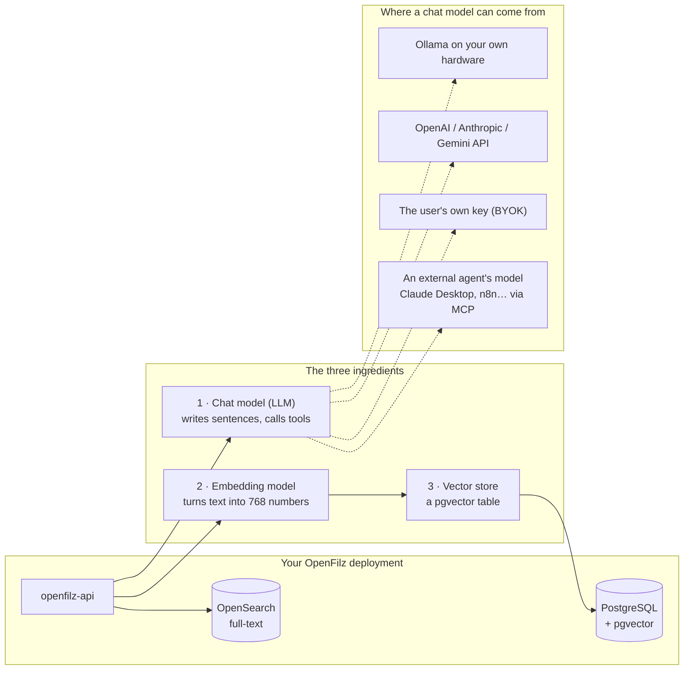
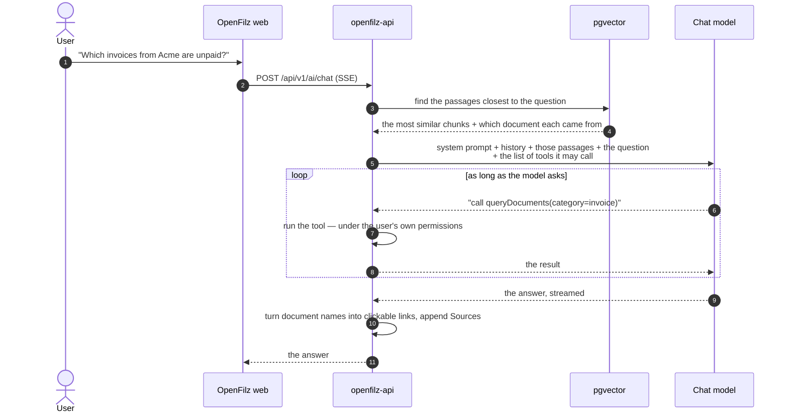
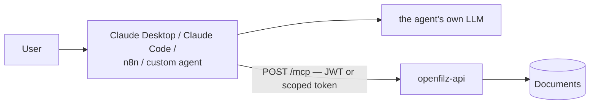
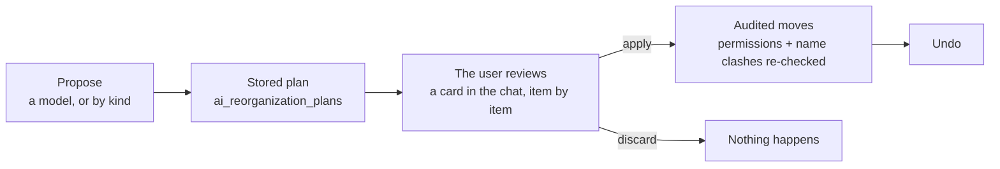
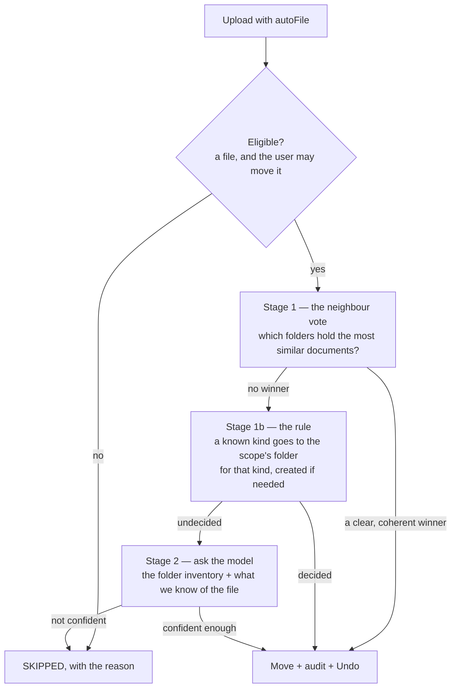

# AI in OpenFilz — what it does, and how to run it without an LLM

This page explains, in plain terms, **what the AI features of OpenFilz actually do, what each one
needs to run, and what happens when you don't give it a model.** It is the page to read before
deciding what to switch on for a given customer.

It deliberately stays at the level of "what is going on and what does it cost me". The mechanics
live elsewhere and are linked from each section:

| You want | Read |
|---|---|
| The concepts, the choices, the deployment profiles | **this page** |
| Every property, every environment variable | [Admin guide → AI Document Chat](admin-guide.md#ai-document-chat) |
| The internals: pipelines, seams, benchmarks, failover | [AI Architecture](ai.md) |
| Connecting Claude Code / Claude Desktop / n8n | [MCP Server](mcp.md) |
| The design of insights, filing and reorganisation | `openfilz-enterprise/docs/smart-reorganization.md` |
| What the Enterprise edition changes | `openfilz-enterprise/docs/ai-enterprise.md` |

---

## Table of contents

- [At a glance](#at-a-glance)
- [1. The three ingredients](#1-the-three-ingredients)
- [2. Chat](#2-chat)
  - [2.1 Chat inside OpenFilz](#21-chat-inside-openfilz)
  - [2.2 Chat from an external MCP client](#22-chat-from-an-external-mcp-client)
  - [2.3 Which one for which customer](#23-which-one-for-which-customer)
- [3. Folder reorganisation](#3-folder-reorganisation)
- [4. Auto-filing on upload](#4-auto-filing-on-upload)
- [5. Document insights — the layer features 3 and 4 stand on](#5-document-insights--the-layer-features-3-and-4-stand-on)
- [6. Running OpenFilz without an LLM](#6-running-openfilz-without-an-llm)
- [7. What the UI does in each profile](#7-what-the-ui-does-in-each-profile)
- [8. Picking a profile for a customer](#8-picking-a-profile-for-a-customer)

---

## At a glance

There are **four** AI capabilities, and they need very different things. The single most useful
fact on this page is that only two of the ten lines below actually require an LLM inside your
deployment:

| Capability | Who produces the answer | Chat LLM? | Embeddings + pgvector? |
|---|---|---|---|
| Chat inside OpenFilz | an LLM you configure (or the user's own key) | **yes** | **yes** |
| Chat from an external MCP client | the calling agent's LLM (Claude, ChatGPT, n8n…) | no | no |
| Reorganisation proposal, model-driven | an LLM — yours, or the external agent's | yes\* | no |
| Reorganisation "by kind" | plain code (`CategoryReorganizationPlanner`) | no | no\*\* |
| Auto-filing, stage 1 (neighbour vote) + the rule | the vector store's nearest documents | no | **yes** |
| Auto-filing, stage 2 (the fallback) | an LLM | yes | yes |
| Document insights, tier 1 (title, author, pages, language) | Apache Tika | no | no |
| Document category, `prototype` / `learned` classifier | embeddings | no | **yes** |
| Document insights, tier 2 full (summary, keywords, entities) | an LLM | yes | no |
| Full-text search | OpenSearch + Tika | no | no |

\* No **server-side** LLM if the proposal is driven by an external MCP agent — the reorganisation
tools are served over `/mcp` even on a deployment with no model at all.

\*\* It needs *categories* to exist, which come either from the classifier (embeddings), from a
model, or from users correcting them by hand.

---

## 1. The three ingredients

Everything above is built from three interchangeable pieces. Understanding which feature consumes
which piece is the whole game:



**1 · The chat model (the LLM).** Writes answers, and decides which tools to call. This is the
expensive, slow, optional-in-more-cases-than-you-think ingredient. It can live on your hardware
(Ollama), behind a cloud API (OpenAI, Anthropic, Gemini, or anything OpenAI-compatible), be brought
per user (BYOK), or live entirely **outside** OpenFilz in the agent that connects over MCP.

**2 · The embedding model.** Turns a chunk of text into a 768-number vector, so that "documents
that look like this one" becomes a database query. It is *not* an LLM: it generates nothing, it has
no prompt, it costs milliseconds. OpenFilz can run it three ways — **in-process** (ONNX Runtime
inside the API, nothing else to deploy), through **Ollama**, or through any **OpenAI-compatible**
embedding server. This is the ingredient that powers semantic retrieval, automatic classification
and auto-filing.

**3 · The vector store.** A `vector_store` table in PostgreSQL, which therefore must run a
**pgvector-enabled image**. No extra service.

> **The one-way door.** The embedding model is a *deployment-wide, one-time* decision: vectors from
> two different embedding models are not comparable, so changing it means re-embedding the library.
> `EmbeddingRegistryGuard` refuses to start on a mismatch. The chat model, by contrast, can be
> swapped, overridden per user, and failed over freely. See [ai.md §2](ai.md#2-configuration-resolution--startup).

---

## 2. Chat

There are two completely different ways a user talks to their documents, and they share **one
implementation**: the same tools (`queryDocuments`, `readDocumentContent`, `moveDocuments`, the PDF
tools, the e-Sign tools, the reorganisation tools…) are exposed to both. A capability added to the
tool layer is gained by both at once.

```
                      ┌── in-app chat ─────► an LLM *inside* OpenFilz
   the tool layer ────┤
   (DocumentAiTools)  └── POST /mcp ────────► an LLM *outside* OpenFilz
```

### 2.1 Chat inside OpenFilz

A panel in the web app. The user types a question; the answer streams back, with clickable links to
the documents it used.



Two things are happening at once, and both matter:

- **RAG (retrieval).** Before the model sees the question, OpenFilz finds the passages of the
  library that are semantically closest to it and puts them in the prompt. This is what makes the
  assistant able to answer *from the content of documents* — and it is why the in-app chat needs
  the embedding stack, not just an LLM.
- **Tools (actions).** The model can call the same operations the UI offers: search, read, move,
  rename, create a folder, merge PDFs, send for signature, propose a reorganisation. Every call
  runs under the **calling user's** identity and permissions, is audited exactly like a click in
  the UI, and — in the Enterprise edition — is restricted to the documents that user owns or has
  been shared.

What the user sees: a floating chat button, conversations they own (a foreign conversation answers
404, not 403 — the existence of other people's conversations does not leak), clickable document
links, and an interactive **reorganisation card** when the assistant proposes moves.

Extras worth knowing:

- **BYOK** (`openfilz.ai.user-settings.enabled`) lets each user plug in their own provider and API
  key from *Settings → AI Assistant*. Keys are stored AES-256-GCM encrypted and are write-only over
  the API. Only the *chat* model is user-selectable — never the embedding model.
- **Quota failover** (`openfilz.ai.fallback.*`) retries a question on the next model of a chain when
  the first is rate-limited, and benches the exhausted one so later requests skip it. It
  deliberately **never** applies when the model in use is a local Ollama one: the prompt contains
  document text, and silently shipping it to a cloud API would break exactly the guarantee a local
  model was deployed for.
- **Small models need a smaller tool surface.** A 1–3B local model stops calling tools once too
  many schemas travel with the request. `openfilz.ai.chat.excluded-contributors` /
  `.excluded-tools` trim the chat's tool list **without touching the MCP server**.

Details: [ai.md §4](ai.md#4-chat-workflow), [§5](ai.md#5-per-user-model-override-byok),
[§5b](ai.md#5b-quota-failover-between-chat-models).

### 2.2 Chat from an external MCP client

Instead of running a model, OpenFilz **is a tool provider** for a model that already exists
elsewhere: Claude Desktop, Claude Code, n8n, a custom Spring AI agent. The user chats in *their*
tool, and that tool reaches into OpenFilz.



The important consequences:

- **No LLM, no embeddings, no pgvector are required in the deployment.** The agent brings the
  model. `openfilz.ai.active` and `openfilz.mcp.active` are independent switches; MCP on its own is
  a complete, useful configuration. (`describeImage` is the one tool that wants a local vision
  model, and it says so plainly instead of failing.)
- **Read-only by default** (`openfilz.mcp.mode=READ_ONLY`). An autonomous agent gets mutating tools
  only when an operator deliberately raises the mode to `READ_WRITE`.
- **The agent is a user.** `/mcp` sits on the same OAuth2 chain as the rest of the API; every call
  resolves to a real OpenFilz identity, with that identity's roles, permissions and audit trail.
- **In Community Edition there are no per-document permissions**, so an agent sees the whole
  library. Run CE MCP single-user or for evaluation only; the Enterprise edition is what makes an
  agent see exactly what its user may see, and adds scoped, revocable agent tokens.

Full walkthrough, per-client configuration and the tool catalogue: [mcp.md](mcp.md).

### 2.3 Which one for which customer

| | In-app chat | External MCP client |
|---|---|---|
| Who pays for the model | the deployment (or the user, via BYOK) | the user's existing AI subscription |
| Infrastructure to add | an LLM + an embedding model + pgvector | **nothing** |
| Answers from document *content* | yes, via RAG | yes — the agent reads documents with `readDocumentContent` |
| Works for a non-technical user | yes, it is a button in the app | needs a configured desktop client |
| Content leaves the deployment | only if you configure a cloud model | yes — the agent's model sees what it reads |
| Good fit | everybody in the organisation, one consistent experience | power users, automation (n8n), evaluations, tiny infrastructures |

They are not exclusive: the common Enterprise setup is in-app chat for everyone, plus MCP for the
handful of people automating things.

---

## 3. Folder reorganisation

"This folder is a mess — propose a better structure." OpenFilz never reorganises anything on its
own: it always produces a **plan** that a human reviews, ticks and applies.



There are **two ways to get a plan**, and only one of them needs a model.

### 3.1 With a model — "Organise with AI"

From the folder toolbar or a folder's context menu (offered to CONTRIBUTORs when chat is on), or
simply by asking the assistant. OpenFilz hands the model an **inventory** of the scope — the files,
their kind, language, page count, a summary, and their audit activity ("last touched 14 months ago,
by whom") — and the model proposes moves and new folders. The answer comes back as an interactive
card in the chat: the user ticks the moves they want, and applies.

This is the flexible one: "group by client", "by project", "by year", "archive what nobody has
opened since 2024" are all reachable, because a language model is doing the grouping.

An external MCP agent gets exactly the same loop through `planReorganization`,
`proposeReorganizationPlan`, `getReorganizationPlan` and `applyReorganizationPlan` — which is why a
deployment with **no LLM at all** can still offer model-driven reorganisation to someone driving it
from Claude Desktop.

### 3.2 By kind — no model at all

`POST /api/v1/ai/reorganization/by-kind` (tool: `proposeReorganizationByKind`) walks the scope and,
for every folder that mixes several kinds of document, proposes one sub-folder per kind — an
existing child whose name already denotes that kind in any language (`Invoices`, `Factures`,
`Rechnungen`…), or a new one named in the language the library is already using. Loose files at the
root are grouped the same way; `other` and uncategorised files are left alone.

It is **deterministic and instant**: no model call, no tokens, no waiting. It produces the very
same kind of stored plan, reviewed and applied through the same screens. Its only requirement is
that documents *have* a kind — see [§5](#5-document-insights--the-layer-features-3-and-4-stand-on).

Use the model for anything that is not "by kind" (by client, by project, by period). Use by-kind
when the customer has no model, or simply wants the obvious tidy-up for free.

### 3.3 Safety properties (both paths)

- A plan is **stored**, so it survives the conversation and can be inspected, applied partially,
  and undone.
- Applying re-checks **permissions** and **name clashes** for every move, and writes ordinary audit
  entries — the same ones a manual move writes.
- Nothing is ever deleted by a reorganisation. Documents move; that is all.

---

## 4. Auto-filing on upload

"Drop a file anywhere, OpenFilz puts it where it belongs." Also called *smart filing*
(`openfilz.ai.auto-file.active`).

It is **never** silent or automatic-by-default: it runs on the user's explicit request — either the
remembered *"Let OpenFilz choose the folder"* switch in the upload area, or `autoFile=true` on the
upload call. The upload response returns immediately with a job id; the filing happens seconds
later, and the user gets a toast with **Undo**.



**Stage 1, the neighbour vote — no model.** The vector store answers "which documents are most like
this one?"; those documents are resolved to the folders they *currently* live in, and the leading
folder wins — but only if three guards agree: the neighbours must be of the same kind as the new
document, they must be close enough relative to the best match, and the winning folder must
actually be a *home* for that kind rather than a grab-bag. Those guards are the difference between
92 % correct filing and a folder that swallows everything because it happens to hold the most
files. Measured, not guessed — the numbers are in [ai.md §3b](ai.md#3b-document-insights--smart-filing).

**Stage 1b, the rule — no model.** A document of a known kind whose neighbours offer no home goes
to the scope's folder for that kind (`Invoices`, `Factures`…), created in the right language if it
does not exist. When the neighbours are split between two legitimate folders (two clients'
invoices), the rule stays out — that is a judgement call, and it goes to the model.

**Stage 2, the model.** Only reached when neither the vote nor the rule decided. The model sees the
folder inventory of the scope and what OpenFilz knows about the file, and may propose an existing
folder or — above a confidence threshold, within a depth limit, if the user allows it — a new one.

**Stage 3, apply.** The decision becomes a one-item reorganisation plan and goes through exactly the
same validation and audit as a chat proposal. Below the thresholds nothing moves, and the reason is
recorded.

What the user sees: the switch in the upload area, a *"Filed by OpenFilz"* chip on the document with
the reason, per-document and per-batch **Undo**, and the ability to file existing documents from a
selection (`POST /api/v1/ai/auto-file`).

> **Read that flow again with the "no model" question in mind:** on a well-embedded library, the
> vote and the rule between them decide the large majority of uploads. The model is the *fallback*,
> not the engine.

---

## 5. Document insights — the layer features 3 and 4 stand on

Both reorganisation and filing lean on knowing **what kind of document** a file is. That knowledge
lives in `ai_document_insights`, separate from the user-owned metadata (it is derived, recomputable,
and never merged into what a user typed).

**Tier 1 — the file's own metadata.** Title, author, creation/modification dates, page count,
language, captured from the Tika parse that indexing already performs. Free, deterministic, no
model, and it happens whenever full-text or embedding runs. (Note: the rows are written even on a
deployment with AI off, but the details panel only *displays* them when tier 2 is enabled — the UI
has a single Insights switch.)

**Tier 2 — the enrichment** (`openfilz.ai.insights.active`): a **category** from a closed list
(invoice, contract, report, cv, …), a one-sentence summary, keywords, the language and a few
entities. Who produces the *category* is configurable, and this is the knob that decides whether the
whole feature needs an LLM:

| `openfilz.ai.insights.classifier` | Who decides the kind | Cost per document | Also produces |
|---|---|---|---|
| `llm` *(default)* | the chat model | one generation — seconds; on a small CPU model, many seconds | summary, keywords, language, entities |
| `prototype` | one embedded description per category, nearest wins | **one embedding — tens of ms** | the category only |
| `learned` | the library's own already-labelled documents vote (k-NN), descriptions as cold start | **one vector query — tens of ms** | the category only |
| `auto` | `learned` when it is confident, the model otherwise | mostly local | model rows are complete |

On a *real* library (not a clean synthetic corpus), the measured result is blunt and useful:
descriptions alone reach ~47 % accuracy, a small local model ~53 % at fifty times the latency, and
**the library teaching its own classifier reaches 84–88 %** — because your documents describe your
categories better than any prose could. Full numbers, and the benchmark to run on the customer's own
documents: [ai.md §3c](ai.md#3c-the-category-without-a-model-the-prototype-classifier).

**Users teach it.** The category chip in the details panel is an editor: a correction is recorded as
the user's, never overwritten by a backfill, and from then on it votes for its neighbours in
`learned` / `auto` mode and counts for by-kind reorganisation and the filing rule. A person icon
marks a kind a human set.

The category is also mirrored into the search index and filterable through the API and the AI/MCP
tools (`queryDocuments(category=…)`); the web app does not yet expose it as a search facet.

---

## 6. Running OpenFilz without an LLM

**Yes — and there are three different ways to do it,** which is why this question needs a table
rather than a yes/no. Everything else in OpenFilz (upload, versioning, sharing, search, e-Sign, PDF
tools, audit, retention) is untouched by all of this: **no AI switch is ever required for the DMS
itself.**

### 6.1 The five profiles

| | **A · No AI** | **B · Bring your own agent** | **C · Light AI (no LLM)** | **D · Full AI, local** | **E · Full AI, cloud** |
|---|---|---|---|---|---|
| Switches | `AI_ACTIVE=false` | `AI_ACTIVE=false`<br/>`MCP_ACTIVE=true` | `AI_ACTIVE=true`<br/>`AI_CHAT_ACTIVE=false`<br/>`TRANSFORMERS_EMBEDDING_ENABLED=true`<br/>`INSIGHTS_CLASSIFIER=learned` | `AI_ACTIVE=true`<br/>`OLLAMA_CHAT_ENABLED=true`<br/>`OLLAMA_EMBEDDING_ENABLED=true` | `AI_ACTIVE=true`<br/>`ANTHROPIC/OPENAI/GOOGLE_CHAT_ENABLED=true`<br/>+ an embedding provider |
| Extra services to run | — | — | — (embeddings run **inside** the API) | **Ollama** — and a GPU to be usable | — |
| pgvector image required | no | no | **yes** | **yes** | **yes** |
| Document text leaves the premises | never | yes — the agent's model reads it | **never** | never | yes |
| Fits a 2 vCPU / 4 GB VPS | yes | yes | yes — see the memory note below | no | yes |

### 6.2 What each profile can actually do

| Capability | A | B | C | D / E |
|---|---|---|---|---|
| Full-text search and every DMS feature | ✅ | ✅ | ✅ | ✅ |
| Tier-1 insights recorded (title, author, pages, language) | ✅¹ | ✅¹ | ✅ | ✅ |
| Chat in the OpenFilz web app | ❌ | ❌ | ❌ *(switched off — §6.3)* | ✅ |
| Chat from Claude Desktop / Claude Code / n8n | ❌ | ✅ | ✅ | ✅ |
| Semantic search ("documents like this one") | ❌ | ❌ | ✅ | ✅ |
| Automatic document category | ❌ | ❌ | ✅ (`learned` / `prototype`) | ✅ — plus summary, keywords, entities |
| Summary / keywords / entities | ❌ | ❌ | ❌ | ✅ |
| Auto-filing on upload | ❌ | ❌ | ✅ stages 1 + 1b, no model fallback | ✅ all stages |
| Reorganisation "by kind" | ❌ | ⚠️² | ✅ | ✅ |
| Reorganisation, model-driven | ❌ | ✅ *the agent's model* | ❌ *unless driven over MCP* | ✅ |
| PDF tools, e-Sign, sharing, comments over MCP | ❌ | ✅ | ✅ | ✅ |

¹ Tier-1 rows are written by the Tika pass that indexing performs, so they need full-text
search (or embeddings) to be on; and the details panel only *displays* them when tier 2 is
enabled — the UI has a single Insights switch.

² The by-kind tool is served over `/mcp` even with AI off, but it groups by *category*, and
nothing has a category on a deployment with no classifier — unless categories were set through
`PATCH /api/v1/documents/{id}/insights`.

> **Profile C is the interesting one.** It is the only configuration that gives automatic
> classification, semantic neighbours and auto-filing **with no LLM, no extra container, no GPU and
> no document text ever leaving the machine** — the embedding model (~140 MB of ONNX, ~170 ms per
> document on a plain CPU) runs inside the API process, so it scales with the API replicas and there
> is nothing extra to size, place or keep alive. For a customer with a small VPS and a
> data-residency requirement, this is the answer.

**Memory note for profile C.** The embedding model is ~140 MB on disk (cache it on a volume:
it is downloaded once). ONNX Runtime loads it into the API process, so budget a few hundred MB
of additional memory per API replica on top of your usual heap — measure on the target machine
before sizing a 4 GB VPS tightly. Nothing else is added: no container, no GPU, no daemon.

### 6.3 The chat kill switch

`openfilz.ai.active` turns the AI feature on as a whole. **`openfilz.ai.chat.active`
(`OPENFILZ_AI_CHAT_ACTIVE`, default `true`) turns the in-app chat assistant off on its own** — which
is what makes profile C expressible rather than merely almost-expressible:

| | with the chat on | `OPENFILZ_AI_CHAT_ACTIVE=false` |
|---|---|---|
| `POST /api/v1/ai/chat**`, `GET /ai/conversations**` | serve | **404**, as if never deployed |
| `GET/PUT/DELETE /api/v1/settings/ai` (BYOK) | serve | **404** — BYOK only ever overrides the chat model |
| Chat button, chat panel, *Organise with AI* | shown | **hidden** (`Settings.aiChatActive`) |
| Embeddings, semantic retrieval, insights, smart filing, by-kind reorganisation | work | **work** |
| `POST /mcp` and every tool on it | works | **works** |
| `Settings.aiActive` | true | **still true** |

With the `prototype` or `learned` classifier, nothing in that bottom half ever calls a chat model.
So the two switches together give a deployment with **no LLM at all**:

```bash
OPENFILZ_AI_ACTIVE=true
OPENFILZ_AI_CHAT_ACTIVE=false
OPENFILZ_AI_INSIGHTS_CLASSIFIER=learned
SPRING_AI_MODEL_CHAT=none          # no chat model is built at all
```

`SPRING_AI_MODEL_CHAT=none` is the last step, and it is supported: the chat-model resolver holds
its model through a provider, so the insight and smart-filing services — which depend on it only
for the model stages they may never reach — exist without one. Anything that genuinely needs a
model then fails **per call**, with a message naming what needs one and what does not: the `llm`
classifier and smart-filing stage 2 do, the prototype/learned classifier, the neighbour vote, the
rule stage, the by-kind reorganisation and the MCP server do not. `AiChatDisabledIT` pins the whole
shape end to end — chat and BYOK 404, `aiActive` true with `aiChatActive` false, and the by-kind
reorganisation still answering with no `ChatModel` bean in the context.

Turning the chat off is not the only way to keep a light deployment sane: **profile C + E** (local
embeddings for everything automatic, a cheap cloud model for the chat a user explicitly opens) is
often the better product. The switch is there for when a chat model is genuinely unavailable or
unwanted — no budget, no egress, no GPU.

### 6.4 Recipes

```bash
# A — No AI. This is the default; nothing to set.
OPENFILZ_AI_ACTIVE=false

# B — Bring your own agent. No model, no pgvector, no Ollama anywhere.
OPENFILZ_AI_ACTIVE=false
OPENFILZ_MCP_ACTIVE=true
OPENFILZ_MCP_MODE=READ_ONLY                         # raise to READ_WRITE deliberately

# C — Light AI: classification + auto-filing, no LLM, nothing extra to deploy.
#     PostgreSQL must run a pgvector-enabled image.
OPENFILZ_AI_ACTIVE=true
OPENFILZ_AI_CHAT_ACTIVE=false                       # no chat assistant, no BYOK page (§6.3)
SPRING_AI_MODEL_CHAT=none                           # and no chat model is built at all
TRANSFORMERS_EMBEDDING_ENABLED=true                 # embeddings inside the API, through ONNX
TRANSFORMERS_EMBEDDING_CACHE_DIR=/data/onnx         # mount it: ~140 MB, downloaded once
OPENFILZ_AI_INSIGHTS_ACTIVE=true
OPENFILZ_AI_INSIGHTS_CLASSIFIER=learned             # the library teaches its own classifier
OPENFILZ_AI_AUTO_FILE_ACTIVE=true                   # stages 1 + 1b decide; no model fallback

# D — Full AI on your own hardware (add the ollama service; a GPU makes it usable).
OPENFILZ_AI_ACTIVE=true
OLLAMA_CHAT_ENABLED=true
OLLAMA_EMBEDDING_ENABLED=true

# E — Full AI with a cloud model and local embeddings (a good default for a small VPS).
OPENFILZ_AI_ACTIVE=true
ANTHROPIC_CHAT_ENABLED=true
ANTHROPIC_API_KEY=sk-ant-…
TRANSFORMERS_EMBEDDING_ENABLED=true
OPENFILZ_AI_INSIGHTS_ACTIVE=true
OPENFILZ_AI_INSIGHTS_CLASSIFIER=auto                # local when confident, the model otherwise
```

Every variable, with its defaults: [admin guide → AI Document Chat](admin-guide.md#ai-document-chat).

### 6.5 Moving between profiles

- **A → B**: flip one switch. Nothing to migrate.
- **A/B → C/D/E**: PostgreSQL must be a pgvector image (**never** swap `postgres:*-alpine` for the
  Debian-based pgvector image on an existing volume — dump and restore), then run the embedding
  backfill (`POST /api/v1/ai/embeddings/backfill`, or the *AI maintenance* button in Settings) to
  index the documents uploaded before.
- **Changing the embedding provider** (C ↔ D, or ONNX ↔ Ollama ↔ a TEI server) means **re-embedding
  the library**: the two vector spaces are close but not identical (mean cosine 0.94), and
  `EmbeddingRegistryGuard` refuses to start rather than let them mix silently.
- **Changing the chat model** costs nothing at all.
- **Turning tier 2 on later**: `POST /api/v1/ai/insights/backfill` labels the existing library.

---

## 7. What the UI does in each profile

The web app takes no guesses: it reads `GET /api/v1/settings` at start-up and shows only what the
backend says exists. The backend also answers **404** on every `/api/v1/ai/**` endpoint that is off,
so an out-of-date frontend cannot call a feature into existence.

| Element in the app | Shown when | A | B | C | D / E |
|---|---|---|---|---|---|
| Chat button (floating, bottom right) | `aiChatActive` | hidden | hidden | hidden | shown |
| *Organise with AI* — folder toolbar + folder context menu | `aiChatActive` **and** the CONTRIBUTOR role | hidden | hidden | hidden | shown |
| *Insights* section of the details panel (kind, summary, keywords) | `aiInsightsActive` | hidden | hidden | shown — kind only | shown |
| The **kind** chip and its editor | `aiInsightsActive` + the deployment's category list | hidden | hidden | shown | shown |
| *"Let OpenFilz choose the folder"* switch in the upload area | `aiAutoFileActive` | hidden | hidden | shown | shown |
| *Filed by OpenFilz* chip + Undo | `aiAutoFileActive` | hidden | hidden | shown | shown |
| Settings → **AI Assistant** (bring your own key) | `aiUserSettingsEnabled` (implies `aiChatActive`) | hidden | hidden | hidden | shown if enabled |
| Settings → **AI maintenance** (re-embed / re-enrich) | `aiActive` + CONTRIBUTOR | hidden | hidden | shown | shown |
| Settings → **Connect your AI tool** (MCP) | `mcpActive` — *independent of every AI flag* | hidden | **shown** | if enabled | if enabled |

The chat rows follow `aiChatActive`, everything else follows its own flag — which is exactly what
lets profile C keep insights, filing and maintenance while dropping the assistant ([§6.3](#63-the-chat-kill-switch)).

Two consequences worth remembering when demoing:

- **Nothing is ever greyed out with a "buy AI" nag.** A feature that is off is simply absent — the
  app looks like a DMS that never had it.
- **The MCP panel is deliberately independent.** A deployment can offer "connect your own AI tool"
  while running no model of its own, and the Settings page says so, with the URL, the mode and the
  client id to paste.

---

## 8. Picking a profile for a customer

| The customer… | Profile | Why |
|---|---|---|
| has a 2 vCPU / 4 GB VPS and wants "just a DMS" | **A** | AI adds nothing they asked for; keep the footprint |
| has a small VPS but power users with Claude / ChatGPT subscriptions | **B** | zero infrastructure; the users already pay for the model |
| wants documents classified and filed automatically, and nothing may leave the premises | **C** | the only no-LLM profile that classifies and files — no GPU, no extra container |
| wants the full assistant and cannot send data to a third party | **D** | Ollama on their hardware — budget a GPU, or accept slow answers |
| wants the full assistant and accepts a cloud model | **E** | best quality per euro; add BYOK so power users bring their own key |
| is regulated but wants summaries too | **C + E** | local embeddings for everything automatic, a cloud model only where a human asked for it |

Rules of thumb:

1. **Embeddings before an LLM.** Almost everything users find magical (classification, filing,
   "documents like this one") is embedding work, not LLM work — and embeddings are cheap, local and
   fast. Sell the LLM as the conversation layer on top, not as the entry ticket.
2. **A small local LLM is usually the worst of both worlds.** Measured on a real library, a 1.5B
   local model classified *worse* than the library's own k-NN classifier, and took fifty times
   longer. If the LLM cannot be a good one, prefer no LLM (profile C) or a cloud one (E).
3. **MCP costs nothing and demos brilliantly.** It is the cheapest AI story to switch on for any
   customer with a technical user, at any size of infrastructure.
4. **The embedding model is a one-way door; the chat model is not.** Choose the embedding provider
   deliberately at install time, and stop worrying about the chat model — it can change any day,
   and `OPENFILZ_AI_CHAT_ACTIVE=false` removes it from the product entirely without touching
   anything else.

---

## Where to go next

- [AI Architecture](ai.md) — the internals: selector derivation, ingestion, RAG, insights,
  classifiers, filing, BYOK, failover, benchmarks.
- [MCP Server](mcp.md) — enabling it, the security model, the tool catalogue, and a per-client
  connection walkthrough.
- [Admin guide → AI Document Chat](admin-guide.md#ai-document-chat) — every property and variable.
- [Developer guide → AI Chat](developer-guide.md#ai-chat) — the REST endpoints.
- `openfilz-enterprise/docs/ai-enterprise.md` — per-user document scoping, agent tokens and seats,
  webhook events, governance.
