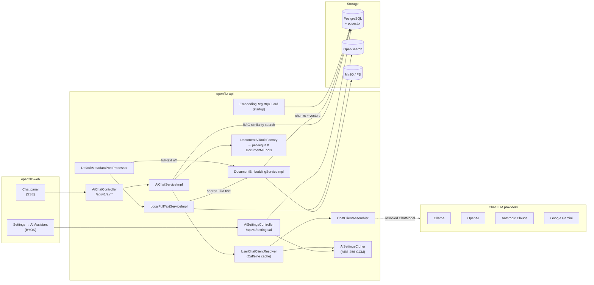
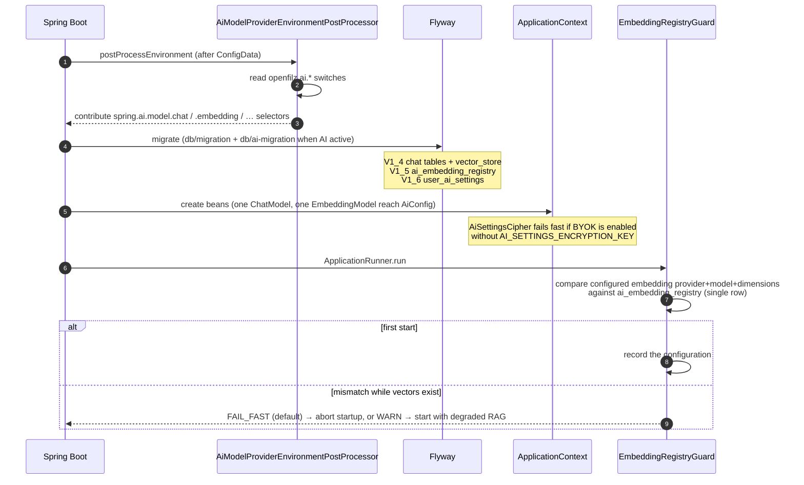
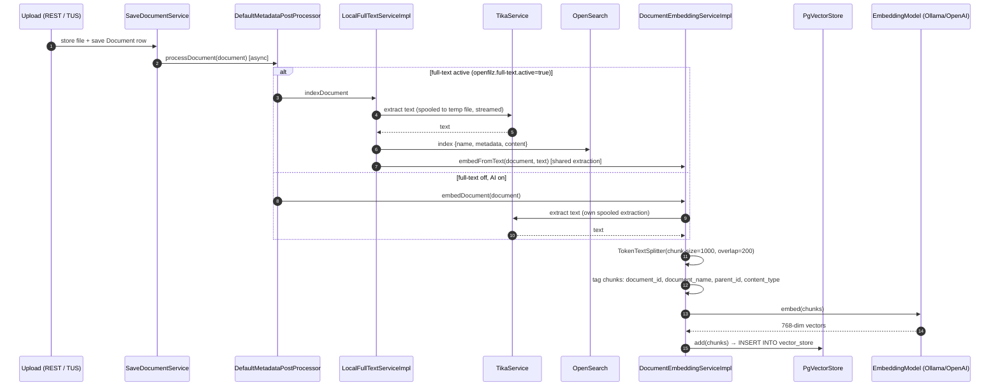
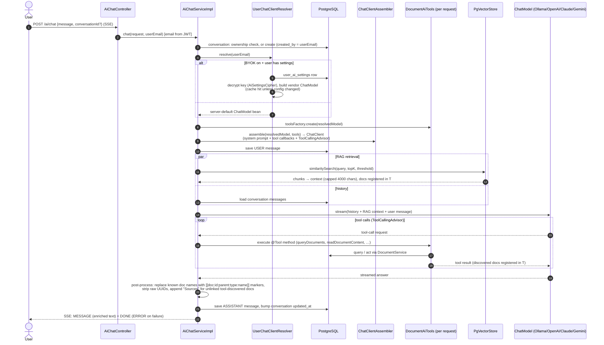
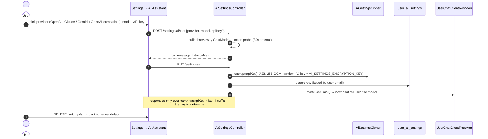

# AI Architecture — Developer Guide

How the OpenFilz AI feature works end to end: configuration resolution, document ingestion &
indexing (full-text + vectors), the chat pipeline, and per-user model overrides (BYOK).
For the full property tables and API-key creation walkthroughs, see the
[admin guide → AI Document Chat](admin-guide.md#ai-document-chat); for the REST endpoints, see the
[developer guide → AI Chat](developer-guide.md#ai-chat).

Everything below lives in `openfilz-api` and is inert unless `openfilz.ai.active=true` — every AI
bean is conditional on that flag, and the AI Flyway migrations (`db/ai-migration/`) only run when
it is set.

---

## 1. Component overview



Key design points:

| Decision | Why |
|---|---|
| **No `ChatClient` bean** — assembled per request by `ChatClientAssembler` | Each request gets a fresh `DocumentAiTools` (its doc-link registry is per-turn state; a singleton cross-contaminated concurrent users) and the *user's* model (BYOK) |
| **Chat model is per-user, embedding model is per-deployment** | Vectors from different embedding models live in incomparable spaces — swapping the embedding model silently breaks similarity search. `EmbeddingRegistryGuard` enforces this at startup; the chat model can be swapped freely |
| **Provider clients built programmatically for BYOK** | No Spring auto-configuration involved → the `spring.ai.model.*` selectors and GraalVM build-time conditions are untouched (native-image-safe); BYOK flags are read at runtime |
| **404 (not 403) on foreign conversations** | Doesn't leak the existence of other users' conversations |

---

## 2. Configuration resolution & startup

Spring AI 2.0 gates each provider's auto-configuration on the selectors `spring.ai.model.chat`
and `spring.ai.model.embedding` (value = provider name or `none`), whose conditions match when
the property is *missing* — with four starters on the classpath, all four providers would be
built. `AiModelProviderEnvironmentPostProcessor` derives the selectors so **`openfilz.ai.active`
is the single switch**:

```
openfilz.ai.active=false   →  every selector = none            (nothing is built)
openfilz.ai.active=true    →  chat      = first enabled of: ollama > anthropic > google-genai > openai
                              embedding = first enabled of: ollama > openai      (768-dim pin)
                              (no switch set → ollama: its defaults target a stock local install)
```

The per-provider switches are `openfilz.ai.<provider>.<kind>.enabled`
(`OLLAMA_CHAT_ENABLED`, `ANTHROPIC_CHAT_ENABLED`, `GOOGLE_CHAT_ENABLED`, `OPENAI_CHAT_ENABLED`,
`OLLAMA_EMBEDDING_ENABLED`, `OPENAI_EMBEDDING_ENABLED`). An explicitly set `spring.ai.model.*`
always wins. Anthropic/Gemini have no embedding switch: Anthropic has no embeddings API, and the
`vector_store` schema is pinned to `vector(768)`.



Where each knob lives:

| Concern | Property (env var) |
|---|---|
| Master switch | `openfilz.ai.active` (`OPENFILZ_AI_ACTIVE`) |
| Provider selection | `openfilz.ai.<provider>.<kind>.enabled` (`*_CHAT_ENABLED`, `*_EMBEDDING_ENABLED`) |
| Provider connection | `spring.ai.<provider>.api-key` / `.chat.model` / `.embedding.model` (`*_API_KEY`, `*_CHAT_MODEL`, …) |
| Chunking / RAG | `openfilz.ai.embedding.chunk-size`, `.chunk-overlap`, `.top-k`, `.similarity-threshold` |
| Embedding-change policy | `openfilz.ai.embedding.validation` = `fail-fast` (default) \| `warn` |
| System prompt | `openfilz.ai.system-prompt` |
| BYOK | `openfilz.ai.user-settings.enabled` (`AI_USER_SETTINGS_ENABLED`) + `.encryption-key` (`AI_SETTINGS_ENCRYPTION_KEY`, `openssl rand -base64 32`) |

---

## 3. Ingestion & indexing pipeline

Every document write (REST upload, TUS finalize, version replace, copy) ends in
`DefaultMetadataPostProcessor.processDocument`, which fans out to the three optional indexers —
all fire-and-forget, so uploads never block on indexing:



- **One Tika extraction, two indexes.** When full-text is on, OpenSearch and the vector store
  share the same extracted text; the standalone `embedDocument` path only exists for AI-without-
  full-text deployments.
- **Chunk metadata is the RAG join key**: `document_id`/`document_name`/`parent_id` on each chunk
  let the chat pipeline turn similarity hits back into clickable document links.
- **Deletion**: document delete → `removeEmbeddings(documentId)` → `vector_store` rows deleted by
  `document_id` filter (OpenSearch delete goes through `FullTextService.deleteDocument`).
- **Search vs RAG**: OpenSearch powers the app's search bar (full-text + metadata + suggestions);
  `vector_store` powers *only* the chat's semantic retrieval. They are independent — either can
  be enabled without the other.

---

## 4. Chat workflow

`POST /api/v1/ai/chat` streams Server-Sent Events. Per request, the pipeline resolves *which
model answers* (server default or the user's BYOK override), builds a fresh tool set wired to
that model, then runs RAG + tool-calling:



- **Tools** (8 `@Tool` methods on `DocumentAiTools`): `queryDocuments`, `readDocumentContent`,
  `describeImage` (vision — runs on the *resolved* model, so BYOK users get their own model),
  `writeFile`, `createFolder`, `moveDocuments`, `renameDocument`, `getDocumentPath`.
- **Doc-link enrichment**: every tool call and RAG hit registers `{id, parentId, type, name}` in
  the request's `DocumentAiTools` registry; after streaming, document names in the answer are
  replaced with `[[doc:…]]` markers the frontend renders as clickable links.
- **Conversation scoping**: `created_by` is stamped on creation; list returns own + legacy
  (`created_by IS NULL`) rows; reading/continuing/deleting a foreign conversation → 404.

---

## 5. Per-user model override (BYOK)

Gated by `openfilz.ai.user-settings.enabled` — read at **runtime** (plain `@Value`), so it stays
a deployment toggle in native images. Only the *chat* model is user-selectable (see §2 for why
embeddings are fixed).



Security properties:

- Keys at rest: `base64(iv[12] ‖ ciphertext+GCM-tag)`; startup **fails fast** if BYOK is enabled
  without a valid 32-byte key; rotating `AI_SETTINGS_ENCRYPTION_KEY` invalidates all stored keys
  (users re-enter them — a broken decrypt surfaces as an error in chat, never a silent fallback
  to a model the user didn't choose).
- `UserChatClientResolver` caches built models per user (Caffeine, 30 min idle / 500 entries),
  invalidated on save/delete and by a config-hash comparison — the per-request cost is a cache
  lookup; the pooled HTTP clients live in the cached `ChatModel`.
- Vendor clients are built via Spring AI's `AnthropicSetup` / `OpenAiSetup` helpers (Gemini:
  `com.google.genai.Client`); **both sync and async clients must be supplied** or the model
  builder self-builds the missing one from environment variables and fails.

---

## 5b. Quota failover between chat models

Free provider tiers (Google's especially) allow only a small number of requests per minute and
per day, so a busy afternoon can exhaust the configured model. With
`openfilz.ai.fallback.enabled=true` the chat pipeline retries the same question on the next model
in `openfilz.ai.fallback.chain` instead of failing the user.

```
AI_FALLBACK_ENABLED=true
AI_FALLBACK_CHAIN=google:gemini-3.6-flash,anthropic:claude-haiku-4-5,openai:gpt-4o-mini
AI_FALLBACK_KEYS_GOOGLE=AIza-first-project,AIza-second-project
```

Two mechanisms, and both matter:

| Mechanism | What it does | Where |
|---|---|---|
| **Failover** | The request that hit the quota is retried on the next candidate, so the user still gets an answer. | `AiChatServiceImpl#streamWithFailover` |
| **Cooldown** | The failed model is benched, so *subsequent* requests skip it instead of each paying a failing round-trip first. Cooldowns expire on their own, returning the model to rotation with no operator action. | `AiFallbackChain` |

Without the cooldown, a spent **daily** quota would add a failing call to every request for the
rest of the day; with it, the deployment pays that cost once.

### Key pools and rotation

Quota is charged **per API key**, per model — so a second key is a second allowance, and
`openfilz.ai.fallback.keys.<provider>` gives each provider an ordered pool. A provider with no
pool keeps using its single `spring.ai.*.api-key`, so existing deployments are unaffected.

Candidates are laid out so that a provider is exhausted completely — every chain model on every
key — before the next provider is touched:

```
google:     m1/keyA   m2/keyA   m1/keyB   m2/keyB
anthropic:  c1/keyX   c1/keyY
```

The key therefore rotates as soon as the provider has nothing left on the current one, and a
different provider is only reached once the previous one is spent outright. Chain order decides
*provider* priority (by first appearance) and model priority within a provider; an interleaved
chain like `google:m1,anthropic:c1,google:m2` is grouped as `google:m1,google:m2` then
`anthropic:c1`, because key rotation is inherently a per-provider decision.

Which key is "current" is **derived** from the cooldown registry rather than held in a pointer: a
provider's usable keys are those with at least one chain model still healthy. A key spent an hour
ago drops out of the list and rejoins it when its cooldowns lapse — no stored index to get stuck.
A single spent *model* does not cost you the key: the other models keep using it, and only that
model moves on.

Keys are never held in cooldown maps, cache keys or logs. `AiKeyRef` reduces each to an 8-hex-char
SHA-256 fingerprint, which is enough to tell keys apart and useless to anyone reading a log — and
it is what keeps two BYOK users on the same provider and model from sharing a cooldown bucket.

### What counts as a failover

`AiFailoverPolicy.classify` walks the cause chain — Spring AI wraps every provider failure in a
generic `RuntimeException("Failed to generate content")`, so the actionable signal is always
further down — and matches on HTTP status, exception type name, and message keywords. No provider
SDK types are referenced: OpenFilz must not compile against (nor reflect over, which GraalVM
dislikes) `com.google.genai.errors.*` and friends.

| Classification | Trigger | Cooldown |
|---|---|---|
| `QUOTA_EXHAUSTED` | 429 / `RESOURCE_EXHAUSTED` / rate-limit wording / typed `RateLimitException` | `quota-cooldown` (5m) |
| `MODEL_UNAVAILABLE` | 404 — model retired, renamed, or not enabled for the key | `unavailable-cooldown` (6h) |
| `PROVIDER_OVERLOADED` | 5xx, connection refused, unknown host, timeouts | `quota-cooldown` (5m) |
| `NOT_FAILOVER` | **bad credentials**, malformed requests, OpenFilz bugs | none |

Credential failures deliberately do *not* fail over. Answering from a different model when an API
key is wrong or revoked would hide a misconfiguration an operator has to fix; those still surface
as errors. A retired model gets the long cooldown because — unlike a quota — it is never coming
back on its own.

### When a retry is refused

Failover is abandoned mid-request, and the error propagates, when either guard trips:

- **Tokens already streamed.** Restarting on another model would splice two different answers
  together in the user's browser.
- **A tool already mutated something.** Read-only tools are safe to repeat; retrying after a
  move/rename/delete would run it twice. `DocumentAiTools#getModifiedFolders` is empty exactly
  when no mutating tool has fired this turn.

In practice quota and 404 failures arrive before the first token, so both guards hold.

### Scope

Chain entries are limited to the API-key providers OpenFilz already builds programmatically
(`google`, `anthropic`, `openai`, `openai-compatible`) — the same `buildChatModel` path BYOK uses.
Ollama is deliberately absent: it is local, has no quota to exhaust, and its model comes from
Spring AI auto-configuration rather than being built by hand. Entries whose provider has no
server API key configured are skipped with a warning rather than failing the request.

Cooldown state is per-instance and in-memory — a latency optimisation, not a correctness
mechanism. A restart (or a second replica) simply costs one failed call per model before it
re-learns.

---

## 6. Where to look in the code

| Area | Entry point |
|---|---|
| Selector derivation | `config/AiModelProviderEnvironmentPostProcessor` |
| Quota failover / cooldowns | `service/ai/AiFallbackChain`, `service/ai/AiFailoverPolicy` |
| API-key fingerprints | `service/ai/AiKeyRef` |
| Beans (DataSource, PgVectorStore) | `config/AiConfig` |
| Embedding-change guard | `config/EmbeddingRegistryGuard` |
| Ingestion fan-out | `service/impl/DefaultMetadataPostProcessor` |
| Text extraction / OpenSearch | `service/impl/TikaService`, `service/impl/LocalFullTextServiceImpl` |
| Chunking + vectors | `service/impl/DocumentEmbeddingServiceImpl` |
| Chat pipeline | `service/impl/AiChatServiceImpl` |
| Model resolution (BYOK) | `service/ai/UserChatClientResolver` |
| Client assembly + tools | `service/ai/ChatClientAssembler`, `service/ai/DocumentAiTools(+Factory)` |
| BYOK settings API + crypto | `controller/rest/AiSettingsController`, `service/impl/AiSettingsCipher` |
| Migrations | `resources/db/ai-migration/V1_4..V1_6` |
| Native hints (Anthropic SDK) | `config/AnthropicSdkRuntimeHints` |

## 7. Deploying the local Ollama (Docker / Dokploy / Kubernetes)

`openfilz.ai.active` is a **runtime** toggle (no bean conditions — native-image safe), but a
deployment that uses the Ollama provider also needs an Ollama server and its models. The
provider switches drive the infrastructure everywhere:

| Channel | How Ollama is deployed |
|---------|------------------------|
| Dev compose | `docker-compose.ai.yml` overlay (`make up-ai`) — always includes `ollama` + `ollama-init` (model pull) and swaps Postgres to `pgvector/pgvector` |
| Dokploy compose (CE `deploy/docker-compose/dokploy/compose.yaml`, EE `docker/dokploy-compose-ee.yml`) | `ollama` + `ollama-init` are **profile-gated on the provider switches**: `profiles: ["${OLLAMA_CHAT_ENABLED:-false}", "${OLLAMA_EMBEDDING_ENABLED:-false}"]` with the fixed activator `COMPOSE_PROFILES=true` — the services exist iff at least one Ollama provider is enabled. No `depends_on` from the API (profile-gated); it reaches Ollama lazily. |
| Kubernetes (`deploy/helm/openfilz-api`) | Optional in-cluster Ollama: `ai.ollama.deploy.enabled=true` (with `ai.active=true`) renders a Deployment + fixed-name `ollama` Service + PVC, and a post-install/post-upgrade Job pulls the enabled models. Point `ai.ollama.baseUrl` at an external/GPU Ollama instead and leave `deploy.enabled=false`. |

Requirements that go with it:

- **pgvector**: the AI migration runs `CREATE EXTENSION vector` — Postgres must run a
  pgvector-enabled image (`pgvector/pgvector:pgXX`). Never swap `postgres:*-alpine` to the
  debian-based pgvector image on an **existing** volume (musl→glibc collation change);
  dump/restore instead.
- **Model pulls are idempotent** (`ollama-init` / the Helm Job re-pull on every deploy; an
  already-present model is a no-op).
- **The ollama image has no curl** — container healthchecks use `ollama list`, not curl.
- **Embedding model = one-time decision** (`EmbeddingRegistryGuard`): enable
  `OLLAMA_EMBEDDING_ENABLED` with the model you intend to keep.
