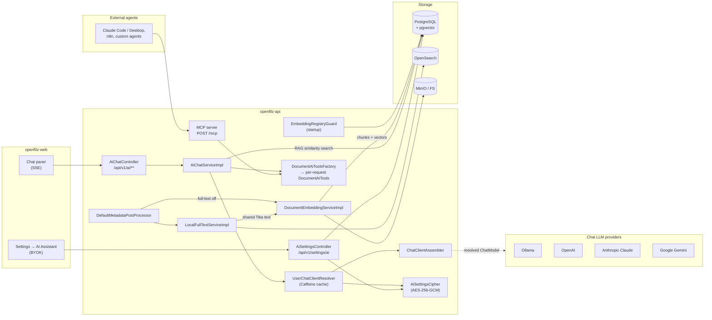
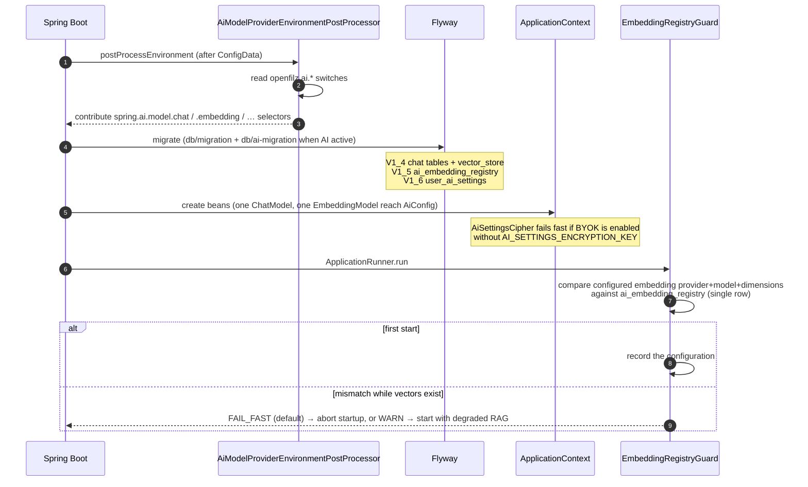
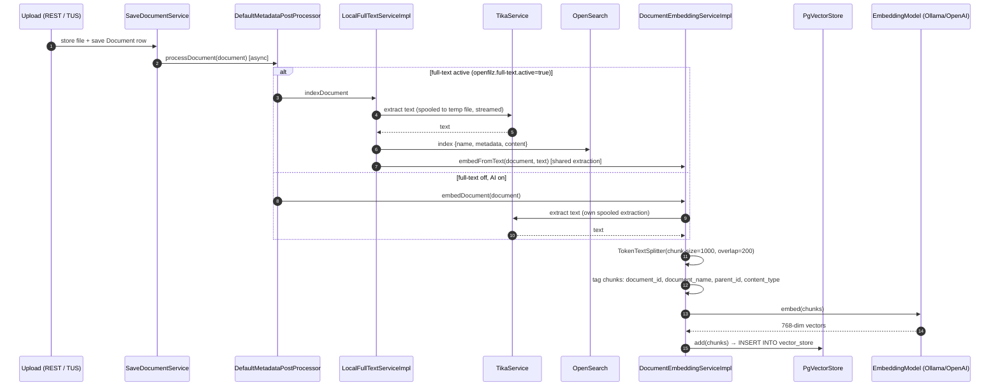
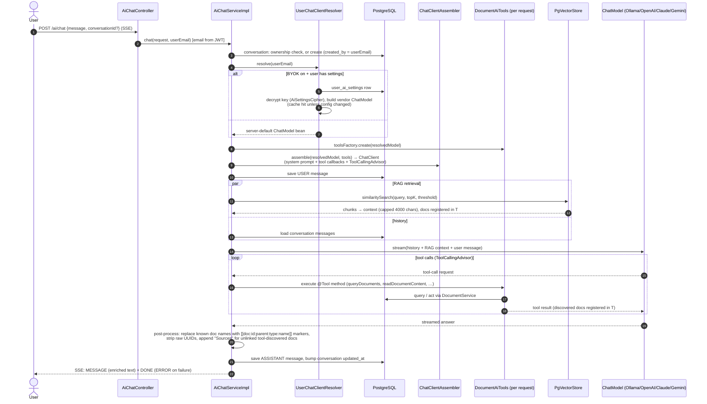
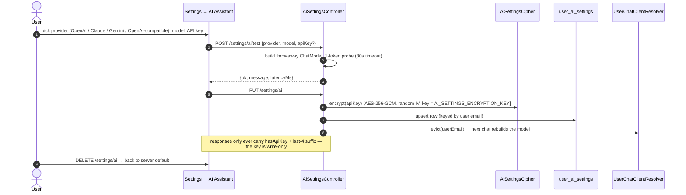

# AI Architecture — Developer Guide

> **Looking for the plain-language version?** [AI Overview](ai-overview.md) explains what the four
> AI capabilities do (chat in-app and over MCP, folder reorganisation, auto-filing, insights), which
> of them need an LLM at all, and how to run OpenFilz with a light setup — including **entirely
> without a language model** (`openfilz.ai.chat.active=false` + `spring.ai.model.chat=none`, see
> [§6.3 there](ai-overview.md#63-the-chat-kill-switch)). Read that first if you are choosing a
> configuration; this page is the implementation.

How the OpenFilz AI feature works end to end: configuration resolution, document ingestion &
indexing (full-text + vectors), the chat pipeline, and per-user model overrides (BYOK).
For the full property tables and API-key creation walkthroughs, see the
[admin guide → AI Document Chat](admin-guide.md#ai-document-chat); for the REST endpoints, see the
[developer guide → AI Chat](developer-guide.md#ai-chat).

Everything below lives in `openfilz-api` and is inert unless `openfilz.ai.active=true` — every AI
bean is conditional on that flag, and the AI Flyway migrations (`db/ai-migration/`) only run when
it is set.

> **One exception, since the MCP server shipped.** `DocumentAiTools` and its access policy are no
> longer reached only by the chat pipeline: they are also the tool surface served to external
> agents over `POST /mcp`, which is gated on its own switch, `openfilz.mcp.active`. So the *tool
> layer* can be live while AI chat is off — a deployment may run the MCP server with no chat model,
> no embeddings and no pgvector, because the calling agent brings its own model. Everything else on
> this page (ingestion, indexing, RAG, BYOK) really is inert without `openfilz.ai.active`.
> See [MCP Server](mcp.md).

---

## 1. Component overview



Key design points:

| Decision | Why |
|---|---|
| **No `ChatClient` bean** — assembled per request by `ChatClientAssembler` | Each request gets a fresh `DocumentAiTools` (its doc-link registry is per-turn state; a singleton cross-contaminated concurrent users) and the *user's* model (BYOK) |
| **Chat model is per-user, embedding model is per-deployment** | Vectors from different embedding models live in incomparable spaces — swapping the embedding model silently breaks similarity search. `EmbeddingRegistryGuard` enforces this at startup; the chat model can be swapped freely |
| **Provider clients built programmatically for BYOK** | No Spring auto-configuration involved → the `spring.ai.model.*` selectors and GraalVM build-time conditions are untouched (native-image-safe); BYOK flags are read at runtime |
| **404 (not 403) on foreign conversations** | Doesn't leak the existence of other users' conversations |
| **`DocumentAiTools` has two front-ends, one implementation** | The MCP server ([mcp.md](mcp.md)) only *adapts* the same `ToolCallback`s the chat pipeline uses. A capability added to `DocumentAiTools` is gained by the assistant and every external agent at once — never add an MCP-only tool class |
| **`chatModel` is nullable** | An MCP deployment need not run an LLM of its own. Only `describeImage` consumes one, and it degrades with a message instead of throwing |

---

## 2. Configuration resolution & startup

Spring AI 2.0 gates each provider's auto-configuration on the selectors `spring.ai.model.chat`
and `spring.ai.model.embedding` (value = provider name or `none`), whose conditions match when
the property is *missing* — with four starters on the classpath, all four providers would be
built. `AiModelProviderEnvironmentPostProcessor` derives the selectors so **`openfilz.ai.active`
is the single switch**:

```
openfilz.ai.active=false   →  every selector = none            (nothing is built)
openfilz.ai.active=true    →  chat      = first enabled of: ollama > anthropic > google-genai > openai
                              embedding = first enabled of: transformers > ollama > openai   (768-dim pin)
                              (no switch set → ollama: its defaults target a stock local install)
```

The per-provider switches are `openfilz.ai.<provider>.<kind>.enabled`
(`OLLAMA_CHAT_ENABLED`, `ANTHROPIC_CHAT_ENABLED`, `GOOGLE_CHAT_ENABLED`, `OPENAI_CHAT_ENABLED`,
`TRANSFORMERS_EMBEDDING_ENABLED`, `OLLAMA_EMBEDDING_ENABLED`, `OPENAI_EMBEDDING_ENABLED`). An
explicitly set `spring.ai.model.*` always wins. Anthropic/Gemini have no embedding switch:
Anthropic has no embeddings API, and the `vector_store` schema is pinned to `vector(768)`.

**Embedding providers.** Three ways to get a 768-dim vector, one seam — `EmbeddingModels`, which
every consumer (the vector store, `EmbeddingRegistryGuard`, the category classifiers) goes through:

| Provider | Switch | What runs | Scales with |
|---|---|---|---|
| **In-process** (`transformers`) | `TRANSFORMERS_EMBEDDING_ENABLED` | nomic-embed-text-v1.5 (or any ONNX model, `TRANSFORMERS_EMBEDDING_MODEL_URI` / `_TOKENIZER_URI`) inside the API through ONNX Runtime, fetched once into `TRANSFORMERS_EMBEDDING_CACHE_DIR` (~140 MB, mount it) | the API replicas — nothing else to deploy |
| Ollama | `OLLAMA_EMBEDDING_ENABLED` | the Ollama daemon, `nomic-embed-text` | the Ollama container |
| OpenAI-compatible | `OPENAI_EMBEDDING_ENABLED` + `OPENAI_BASE_URL` | OpenAI, or any server speaking `/v1/embeddings` — Hugging Face TEI, vLLM… | that server (GPU, batching) |

The in-process one is built at runtime by `EmbeddingModels` from the flag alone — never a bean,
never a condition — so the enterprise native image, whose provider selector is fixed at build
time, switches to it like the JVM image does; `TransformersRuntimeHints` registers ONNX Runtime
and the tokenizers (JNI, reflection, their Linux libraries as resources) and the enterprise
`native-image.properties` initialises `ai.onnxruntime` / `ai.djl` at run time. Only
`spring-ai-transformers` is on the classpath, never its auto-configuration, which would build the
model whenever no selector is set. Proven end to end by `TransformersEmbeddingIT` (JVM, core) and
`EmbeddingOnnxNativeE2EIT` (the enterprise container: the same upload, embedding and
classification against the image the e2e suite runs — the native one in the release flow).

Measured with `EmbeddingProviderBenchmark` (test sources, `-Dbench.dir=<documents>
-Dbench.providers=onnx,ollama[,openai]`; latency, batch throughput on one and several threads,
memory, and the cosine between two providers' vectors of the same text) on 51 real documents, one
CPU machine, 2026-09-06:

| | in-process (quantised nomic) | Ollama (nomic-embed-text) |
|---|---|---|
| one document at a time | 173 ms (p95 205) | 309 ms (p95 423) |
| batches of 16, one thread | 3.6 documents/s | 3.8 documents/s |
| batches of 16, four threads | 3.2 documents/s | 3.9 documents/s |
| ready | 11 s first time (download), 0.6 s from the cache | 3.6 s |

So: per-document latency is 1.8× better in-process and batch throughput is the same — ONNX
Runtime already uses every core, more threads do not add up, and on one machine Ollama does the
same. The gain of the in-process provider is architectural: **each API replica embeds for
itself**, so throughput grows with the replicas and there is no embedding service to size, place
or keep alive. The point at which a dedicated embedding server wins is a big backfill or a GPU:
TEI batches hundreds of documents per second on a GPU, which no CPU replica matches — run the
benchmark with `-Dbench.providers=onnx,openai -Dbench.openai.url=http://<tei>` on your own
documents to see where your library falls.

**The vector space changes with the provider.** The in-process quantised nomic and Ollama's
nomic are the same model family but not the same numbers: mean cosine 0.94 between their vectors
of the same text, minimum 0.91 — close enough that a document still finds its neighbours, not
close enough to mix in one store. `EmbeddingRegistryGuard` therefore treats the switch as a change
of embedding model: re-embed the library (or start with `OPENFILZ_AI_EMBEDDING_VALIDATION=warn`
knowing the two spaces are mixed until then).

**Re-embedding a library** is one job, not a re-upload of every file. Stop the API, wipe the
store (`TRUNCATE TABLE vector_store; DELETE FROM ai_embedding_registry;`), start it on the new
provider (the guard records the model on an empty store), then call
`POST /api/v1/ai/embeddings/backfill` as a CONTRIBUTOR — `{"folderId": …, "force": …}` optional
— and follow `GET /api/v1/ai/embeddings/backfill/{jobId}` (`total` / `done` / `failed` /
`skipped`). Without `force` the job takes every active file that tags no chunk in the store, so
it also repairs an upload whose embedding failed; with `force` it re-embeds everything in scope,
replacing the previous chunks. The text comes from the search index when full-text keeps it
(no file is parsed again), else from a Tika pass on the stored file; the insights are not re-run.
`OPENFILZ_AI_EMBEDDING_BACKFILL_CONCURRENCY` (2) bounds the parallel documents. On a CPU with the
in-process model that is about 170 ms per document plus extraction; through Ollama, about twice.
The same job is a tool of the assistant and of MCP agents (`backfillEmbeddings` /
`getEmbeddingBackfillStatus`, `EmbeddingAiToolsContributor`, CONTRIBUTOR), see `mcp.md`, and a
button of the web app's settings page ("AI maintenance", shown to contributors when AI is on,
next to "Re-enrich the documents" for the insights backfill), which follows the job's counters.
In CE a contributor's job covers the whole library (the core has no owners); the candidate
queries carry two seams (`candidateJoins` / `bindUserContext`, and the store's
`backfillCandidateJoins` / `bindBackfillUserContext`) through which the enterprise edition
restricts both jobs to the documents the caller owns.



Where each knob lives:

| Concern | Property (env var) |
|---|---|
| Master switch | `openfilz.ai.active` (`OPENFILZ_AI_ACTIVE`) |
| Provider selection | `openfilz.ai.<provider>.<kind>.enabled` (`*_CHAT_ENABLED`, `*_EMBEDDING_ENABLED`) |
| Provider connection | `spring.ai.<provider>.api-key` / `.chat.model` / `.embedding.model` (`*_API_KEY`, `*_CHAT_MODEL`, …) |
| Chunking / RAG | `openfilz.ai.embedding.chunk-size`, `.chunk-overlap`, `.top-k`, `.similarity-threshold` |
| Embedding-change policy | `openfilz.ai.embedding.validation` = `fail-fast` (default) \| `warn` |
| System prompt | `openfilz.ai.system-prompt` |
| BYOK | `openfilz.ai.user-settings.enabled` (`AI_USER_SETTINGS_ENABLED`) + `.encryption-key` (`AI_SETTINGS_ENCRYPTION_KEY`, `openssl rand -base64 32`) |

---

## 3. Ingestion & indexing pipeline

Every document write (REST upload, TUS finalize, version replace, copy) ends in
`DefaultMetadataPostProcessor.processDocument`, which fans out to the three optional indexers —
all fire-and-forget, so uploads never block on indexing:



- **One Tika extraction, two indexes.** When full-text is on, OpenSearch and the vector store
  share the same extracted text; the standalone `embedDocument` path only exists for AI-without-
  full-text deployments.
- **Chunk metadata is the RAG join key**: `document_id`/`document_name`/`parent_id` on each chunk
  let the chat pipeline turn similarity hits back into clickable document links.
- **Deletion**: a *soft* delete keeps everything (row, OpenSearch document with `active=false`,
  chunks, insight row) so a restore has nothing to recompute; a *hard* delete (soft delete off,
  recycle-bin purge, retention) goes through `MetadataPostProcessor.deleteDocument`, which drops the
  OpenSearch document, the thumbnail and — `removeEmbeddings(documentId)` — the `vector_store` rows
  by a `document_id` metadata filter (chunk ids are random, the tag is the only handle). The insight
  row goes with the `documents` row (FK cascade). A re-index of the same document (new version)
  replaces its chunks instead of adding to them.
- **Search vs RAG**: OpenSearch powers the app's search bar (full-text + metadata + suggestions);
  `vector_store` powers *only* the chat's semantic retrieval. They are independent — either can
  be enabled without the other.

---

## 3b. Document insights & smart filing

Design: `openfilz-enterprise/docs/smart-reorganization.md` (§4 insights, §5 inventory, §13 smart filing).

**Document insights** (`ai_document_insights`, Flyway `V1_9`) are what OpenFilz derives from a
file's content, kept apart from the user-owned metadata JSON (recomputable, never PATCH-merged,
no metadata audit):

- **Tier 1 — the file's own metadata**, captured from the Tika pass that indexing / embedding
  already run (`TikaService.processResource(path, resource, onMetadata)` hands back Tika's
  `Metadata`; `TikaFileMetadata` maps title, author, created/modified dates, page count, language;
  `DocumentInsightStore.saveFileMetadata` upserts). Free, deterministic, on whenever Tika runs.
- **Tier 2 — AI enrichment** (`openfilz.ai.insights.active`): `AiDocumentInsightService` sends the
  head of the text (`max-chars`) to a model on a bounded queue (`concurrency`, never on the upload
  path) and stores a category from the closed list (`categories`, unknown → `other`), a summary,
  keywords, the language and a few entities; FAILED on a non-contract answer, SKIPPED above
  `max-file-size` / without text / past `daily-limit`. The model is the chat model or
  `openfilz.ai.insights.model` (`provider:model`, server key). Results are mirrored to OpenSearch
  (`category`, `summary`, `language` — fixed fields, added to existing indexes at startup).
  `NoOpDocumentInsightService` + `DocumentInsightConfig` select the implementation at runtime
  (native-safe). Backfill: `POST /api/v1/ai/insights/backfill {folderId, force}` (CONTRIBUTOR),
  `GET …/backfill/{jobId}`.
- Read: `GET /api/v1/documents/{id}/insights`; the `getMetadata` tool appends an *Insights* block;
  `queryDocuments(category=…)` filters through the insights; `Settings.aiInsightsActive`.
- Every stored tier-2 row publishes a Spring `DocumentInsightsReadyEvent` (the enterprise webhook
  producer relays it as `document.insights.ready`).

**The reorganisation inventory** (`planReorganization`) carries, per file, the insights (category,
language, pages, summary in `detail=full`, keywords in `compact`) and the audit activity (last
action, actions, users — `AuditDAO.activitySummary`, one grouped query), plus header aggregates
(categories present, files untouched > 12 months). Inventories are cached per user + request
shape (`ReorganizationInventoryCache`, `openfilz.ai.reorganization.*`) and dropped after any
mutating tool call of that user.

**Smart filing** (`openfilz.ai.auto-file.active`): on the user's explicit request — the remembered
switch (`GET/PUT /api/v1/settings/ai/preferences`) or `autoFile=true` on `POST /upload`,
`/upload-multiple`, the TUS finalize body, or `writeFile` — `DefaultAutoFileService` files the
uploaded document seconds after the upload response (which carries `autoFile.jobId`):

1. *eligibility*: an active FILE the caller may move, with a live session;
2. *stage 1, the neighbour vote*: the vector store's nearest documents, resolved to their **live**
   folders (never the chunk metadata's `parent_id`), inside the scope (the folder it was dropped in;
   root = whole library) and writable — neighbours lying at the root never vote, a file at the root
   being unfiled by definition — the leading folder wins at `neighbour-min-share` /
   `neighbour-min-similarity`, with three guards for a mixed library (a folder used to win on
   headcount alone: whatever held the most embedded files attracted everything): when the
   document's tier-2 category is known, only neighbours of the same category (or of an unknown
   one) vote; only neighbours at least `neighbour-min-relative-similarity` (0.85) as similar as
   the best hit count; and the winning folder must be a home for that kind — its dominant
   category is the document's and holds `neighbour-min-folder-purity` (0.7) of its categorised
   files (`auto-file.coherence: category`, the default) and/or, with no category at all
   (`similarity` / `both`), the share of its files of the document's kind by similarity: one
   vector query filtered on the folder's files gives each file's similarity to the document,
   and when the sorted values split by more than `folder-similarity-gap` the share above the gap
   is the purity (`AutoFileDecision.similarityPurity`; a folder younger than `folder-min-members`
   is not judged) — else the vote is discarded; `auto-file.stage1: fit` instead re-ranks the
   voted folders by purity × the mean similarity of their members of the document's kind
   (`AutoFileDecision.fit`). Measured on the reference corpus (§3c, `FilingStrategyBenchmark`),
   the category guards with the prototype category file 92 % of the documents right, 2 % wrong,
   none into a grab-bag, and hand 6 % over; the similarity judgement abstains on 75–88 % — same-kind
   documents in two languages or templates are two clusters by similarity, one kind by category —
   and the fit files 75 % wrong (the tightest voted folder is not the right kind). Hence the
   defaults: `category` and `vote`; the others stay for libraries without insight rows and for
   the next measurement. One vector query plus small reads, no model call;
2b. *stage 1b, the rule* (`auto-file.rule-folders`, on by default): a document of a known kind
   (tier-2 category, from the model or the prototype classifier, §3c) whose neighbours offer no
   home — none close enough, or a grab-bag — goes to the scope's folder for that kind: an existing
   child of the scope root whose name denotes the kind in any language (`Invoices`, `Factures`,
   `Rechnungen`, singulars and common aliases — `CategoryFolderNames`), or a new one named in the
   language most of the scope's folder names are in, else the document's language, else
   `auto-file.default-language` (deployments extend the table with `auto-file.folder-names.<lang>.<kind>`).
   Stage `RULE`, confidence 1. When the neighbours are split between coherent folders (two
   clients' invoices) the rule stays out — that choice is the model's;
3. *stage 2, the model*: only when neither the vote nor the rule decided — the scope's folder inventory
   (`ReorganizationPlanService.folderInventory`) plus the insight row; a new folder only above
   `new-folder-min-confidence`, at most `new-folder-max-depth` levels, and when the user allows it;
   the scope root is never offered as a target (the document already lies there, unfiled, and a
   root answer is a skip, "the model found no folder for it"), and the prompt names the unfiled
   siblings found by the vector store so a batch of one kind gets one folder;
   the call goes through the fallback chain (`AiFallbackChain.callWithFailover`, the chat's
   verdicts) and so does the tier-2 insight call, so a 429 on the first model is retried on the
   next one; a model that cannot be reached at all yields FAILED with the provider's own message,
   to be filed again from the selection later. Before asking, the filing waits (at most
   `wait-for-insights`) for the tier-2 row: the insight worker completes an in-process
   `InsightCompletionSignal` at every terminal write (DONE / FAILED / SKIPPED), so the wait wakes the
   moment the row lands, with a 5 s fallback re-read for a row finished by another node;
4. *stage 3*: a one-item reorganisation plan (`origin = AUTO_FILE`, `document_id`, `details`,
   Flyway `V1_10`) validated and applied through `ReorganizationPlanService.fileDocument`: same
   permission / name-clash / no-op checks as a chat proposal, same audited move. Below the
   thresholds the document stays (SKIPPED with the reason).

`GET /api/v1/ai/auto-file/{jobId}` follows a batch, `POST …/{jobId}/undo` moves it back,
`GET …/document/{id}` is the "Filed by OpenFilz" record, `POST …/filing/{planId}/undo` reverts one,
`POST /api/v1/ai/auto-file {documentIds}` files existing documents; the `fileDocuments` tool does
the same inline for agents. `AutoFileConfig` selects the real / no-op service at runtime;
`Settings.aiAutoFileActive` drives the upload-area switch. Every filed document publishes a Spring
`DocumentFiledEvent` (relayed as `document.filed` by the enterprise webhook producer).

**Reorganisation by kind, without a model** (`POST /api/v1/ai/reorganization/by-kind {rootFolderId}`,
tool `proposeReorganizationByKind`): `CategoryReorganizationPlanner` walks the scope and, for every
folder holding documents of several kinds (at least `reorganization.split-min-files` categorised
files, the dominant kind below `split-min-purity` of them), proposes one sub-folder per kind of at
least `split-min-group` files — an existing child that denotes the kind, else a new one named in
the library's language from the same folder-name table — and the moves into them; loose files at
the scope root are grouped the same way, `other` and uncategorised files stay. The answer is an
ordinary stored `ReorganizationPlanView` (proposed, reviewed, applied, undone like a model's plan;
a view without an id means nothing needs splitting). Deterministic and instant; the model remains
the tool for anything that is not "by kind" (by client, by project, by period).

## 3c. The category without a model: the prototype classifier

The tier-2 category is the one model-produced signal the neighbour vote and the reorganisation
plans lean on, and the model call that produces it is the slow, expensive part of ingestion (one
generation per upload; prohibitive on a CPU-only Ollama). `openfilz.ai.insights.classifier.mode`
puts a `CategoryClassifier` seam in front of it:

- `llm` (default) — the chat model answers the whole insight, as before;
- `prototype` — `PrototypeCategoryClassifier`: one short multilingual description per category
  (`DEFAULT_PROTOTYPES`, overridable per key by `classifier.prototypes.<category>`) is embedded
  once with the deployment's embedding model, the document's head (`classifier.max-chars`, file
  name first, optional task `prefix` — nomic models expect `classification: `) is embedded with
  the same model, and the nearest description wins. One embedding call, tens of milliseconds, no
  chat model needed. The row is category-only (no summary, keywords, language or entities), its
  `model` column reads `prototype:<embedding model>`, the daily cap does not apply. The confidence
  is the softmax share of the best similarity at `classifier.temperature`; below
  `classifier.min-similarity` (off by default) the answer is `other`;
- `learned` — `LearnedCategoryClassifier`: the library teaches its own classifier. The document's
  nearest labelled neighbours (the vector store's closest chunks, `learned.k` documents at least
  `learned.min-similarity` similar, resolved to their stored tier-2 category) vote, weighted by
  similarity; every label the model or the user ever wrote is an example, `other` included. Which
  labels teach is `learned.learn-from` (`model,user` by default — the classifier's own verdicts and
  the descriptions' are left out so a wrong guess does not breed). With fewer than
  `learned.min-neighbours` labelled neighbours (a young library, an unusual document) or a winning
  share below `learned.min-confidence`, the prototype descriptions answer as the cold start. Rows
  read `learned:knn`. One vector query plus one read, no model;
- `auto` — the learned classifier (descriptions as cold start) when its confidence reaches
  `classifier.min-confidence` (0.5), the model for the rest (and the local verdict again once the
  daily model cap is spent).

**The user teaches it** with `PATCH /api/v1/documents/{id}/insights {"category": "…"}` (one of the
deployment's categories or `other`; modify access required): the row becomes a tier-2 `DONE` row
written by `user`, never overwritten by a non-forced backfill, mirrored to the index, and from then
on it votes for its neighbours in `learned` / `auto` mode and counts for the by-kind reorganisation
and the filing rule like a model's label. In the web app the category chip of the details panel's
Insights section is the editor: it opens a select of the deployment's categories (served as
`Settings.aiInsightsCategories`, translated in the eight locales), and a person icon marks a kind a
user set.

Coarse kinds (invoice / report / contract / cv) separate well by prototype; fine ones (supplier
vs customer invoice) do not — that distinction is the neighbour vote's job, not the category's.
Whether the trade is worth it for a given library is measured, not guessed: the benchmark
`CategoryClassifierBenchmark` (test sources, skipped unless `bench.dir` is set) reads a corpus laid
out as `<category>/<files>` (anything Tika parses), runs every prototype variant (prefix ×
temperature) and any chat model named, and writes accuracy, per-label recall, confusions, latency
and the auto-mode curve (share decided locally at each `min-confidence`, and its accuracy) to
`target/bench/category-benchmark-<time>.md`; `FilingStrategyBenchmark` does the same for stage 1,
holding each document of the corpus out in turn and asking every strategy (headcount vote,
relative floor, category guards with the true or the prototype category, similarity coherence,
fit) where it would file it, in a pure library and in one where two kinds share a "Mixed" folder —
correct / wrong / into the grab-bag / abstain, and the extra vector queries each costs.
Reference run (2026-09-05, 48 synthetic documents of 8 kinds in English and French, `nomic-embed-text`
on a CPU, local `qwen2.5` through Ollama; a real library will differ — run it on yours):

| classifier | accuracy | latency / document |
|---|---|---|
| prototype, `nomic-embed-text`, no prefix, T = 0.02 | 91.7 % (auto mode at 0.5: 83 % decided locally, all right) | 73 ms |
| prototype with the `classification: ` prefix | 75.0 % | 71 ms |
| `qwen2.5:1.5b` (the tier-2 prompt, answer capped at 512 tokens) | 83.3 % | 7.2 s |
| `qwen2.5:0.5b` | 22.9 % | 5.2 s |

| stage-1 strategy | pure library: right / wrong / abstain | grab-bag library: right / into the grab-bag / abstain |
|---|---|---|
| headcount vote (before this work) | 0 / 0 / 100 % | 25 / 0 / 75 % |
| vote + relative floor | 98 / 0 / 2 % | 73 / **25** / 2 % |
| vote + category guards, true category | 100 / 0 / 0 % | 100 / 0 / 0 % |
| vote + category guards, prototype category (**default**) | 92 / 2 / 6 % | 92 / 0 / 6 % |
| vote + similarity coherence, no category | 13 / 0 / 88 % | 25 / 0 / 75 % |
| fit (purity × closeness), no category | 13 / 75 / 13 % | 0 / 15 / 2 % (83 % wrong) |

A second run on a **real library** (a name-labelled subset of personal administrative documents,
51 readable files of 7 kinds, French, 12 of them of a kind the closed list does not know —
bank statements, payslips, tax notices — labelled `other`) tells a different story, and the one
that matters:

| classifier | accuracy | latency / document |
|---|---|---|
| prototype descriptions, `nomic-embed-text` | 47.1 % (`other` 0/12, contracts 0/3; `form` and `receipt` attract every administrative page) | 0.3 s |
| `qwen2.5:1.5b` | 52.9 % (10 unparseable or timed-out answers) | 17 s |
| **learned from the library itself**, nearest centroid over the other documents' embeddings, leave-one-out | 84.3 % (`other` 12/12, reports 14/14, CVs 15/15; misses on kinds with 2–3 examples) | 0.3 s |
| learned, 1-NN | 88.2 % | 0.3 s |

Descriptions are enough for a clean corpus and not for real documents; a small local model is
no better and fifty times slower. What works is the library's own labelled documents as the
prototypes — the model's or the user's labels, which also make `other` learnable. The benchmark
scores that variant with `bench.learned` (on by default), and it is what the `learned` mode
above ships: the k-NN over the library's labelled documents, with the descriptions as the cold
start and the user's corrections as the teacher. The filing benchmark on
the same library, organised by subject (Courtier, Djibi, CHR…) rather than by kind, showed the
category guards sending 36 % of the documents to the rule or the model and filing 11 % into the
wrong subject folder (the relative floor alone: 32 % and 6 %), while being the only strategy that
never files into a grab-bag — a by-subject library is legitimately mixed by kind, which the
similarity judgement (67 % abstain) does not see either.

The uncapped small model was the "Ollama is too slow" of the early trials: at temperature 0 it
looped on the JSON contract until its context shifted (22 000 tokens on one document); every
model call now passes `maxTokens(openfilz.ai.max-answer-tokens)` (`OPENFILZ_AI_MAX_ANSWER_TOKENS`,
default 4096; the benchmarks use 512). The cap cannot be tight: a thinking model counts its
thoughts against `maxOutputTokens`, and at 512 Gemini had a few dozen tokens of visible text left —
every answer was cut and rejected as "no JSON object in the answer". The finish reason now names
it in the log (`the model stopped at the N-token answer cap`); raise the cap or lower the model's
thinking budget. Gemini 3 also answers in several parts, which Spring AI maps to several
generations: the answer is read from all of them (`ModelAnswers`), never through `content()`,
which keeps the first part only. Run both benchmarks:

```bash
mvn -pl openfilz-api test -Dtest=CategoryClassifierBenchmark -Dsurefire.failIfNoSpecifiedTests=false \
    -Dbench.dir=/path/to/corpus -Dbench.chat=qwen2.5:1.5b,qwen2.5 [-Dbench.google=gemini-2.5-flash-lite]
```

`bench.ollama.url`, `bench.embedding`, `bench.prefixes` (`|`-separated), `bench.temperatures`,
`bench.categories`, `bench.max-chars`, `bench.limit` tune it (system properties or the same names
as upper-snake environment variables); the Google key comes from `GOOGLE_API_KEY` and is never
printed. Read the auto-mode curve to pick `min-confidence`: the threshold where the kept share is
high and its accuracy matches the model's is the one to configure.

---

## 4. Chat workflow

`POST /api/v1/ai/chat` streams Server-Sent Events. Per request, the pipeline resolves *which
model answers* (server default or the user's BYOK override), builds a fresh tool set wired to
that model, then runs RAG + tool-calling:



- **Tools**: the 19 document tools of `DocumentAiTools` (`queryDocuments`, `readDocumentContent` —
  served from the OpenSearch `content` field when full-text is active, Tika on the file otherwise —,
  `getDocumentActivity` — the audit trail, AUDITOR role —,
  `describeImage` — vision, runs on the *resolved* model, so BYOK users get their own model —,
  `writeFile`, `createBlankDocument`, `createFolder`, `moveDocuments`, `renameDocument`,
  `getDocumentPath`, metadata get/search/update/delete, delete, versions, `downloadDocument`,
  `whoami`), plus every `McpToolContributor` that opts into the chat with `exposeInChat()`: the
  seven PDF tools, the four reorganisation tools and the four e-Sign tools. The same tool
  objects serve the MCP server — see [mcp.md §3](mcp.md#3-the-tool-surface) for the catalogue.
- **Reorganisation proposal cards**: when the assistant calls `proposeReorganizationPlan`, the
  pipeline appends a `[[reorg-plan:id]]` marker to the answer (persisted with the message, stripped
  from the history the model sees). The frontend renders it as an interactive card — the user ticks
  the moves and applies or discards the plan through `/api/v1/ai/reorganization/{id}`. Contributed
  tool objects report their side effects (modified folders, actions, proposed plans) through
  `AiToolTurnEffects`, which is also how the file explorer learns to refresh and how the
  failover logic knows a mutation already committed.
- **Switching the assistant off**: `openfilz.ai.chat.active` (default true, read per request) makes
  `AiChatController` and `AiSettingsController` answer 404 and drops `Settings.aiChatActive`, so the
  frontend hides the chat button, the panel and "Organise with AI". Nothing else moves: ingestion,
  embeddings, insights, smart filing, the by-kind reorganisation and the MCP server are untouched.
  It exists so a deployment whose classifier is `prototype`/`learned` can also set
  `spring.ai.model.chat=none` and run with no LLM — `UserChatClientResolver` holds the default model
  through an `ObjectProvider`, so the insight and filing services (which depend on it only for the
  model stages they may never reach) still build, and only an actual model request fails, naming
  what needs one. Pinned by `AiChatDisabledIT`.
- **Trimming the tool surface for small models**: the schema of every bound tool travels with
  each request, and small local models (1–3B) stop calling tools once it grows too large — they
  refuse, or emit the call as text. The e-Sign tools are bound only while
  `openfilz.signature.active` is on, and `openfilz.ai.chat.excluded-contributors` (simple class
  names, e.g. `OrganizeAiToolsContributor,SignatureAiToolsContributor,PdfAiToolsContributor`)
  drops whole contributors from the chat without touching the MCP server, and
  `openfilz.ai.chat.excluded-tools` (tool names, e.g. `getDocumentActivity`) drops single tools of
  `DocumentAiTools` the same way. Read per request.
- **Doc-link enrichment**: every tool call and RAG hit registers `{id, parentId, type, name}` in
  the request's `DocumentAiTools` registry; after streaming, document names in the answer are
  replaced with `[[doc:…]]` markers the frontend renders as clickable links.
- **Conversation scoping**: `created_by` is stamped on creation; list returns own + legacy
  (`created_by IS NULL`) rows; reading/continuing/deleting a foreign conversation → 404.

---

## 5. Per-user model override (BYOK)

Gated by `openfilz.ai.user-settings.enabled` — read at **runtime** (plain `@Value`), so it stays
a deployment toggle in native images. Only the *chat* model is user-selectable (see §2 for why
embeddings are fixed).



Security properties:

- Keys at rest: `base64(iv[12] ‖ ciphertext+GCM-tag)`; startup **fails fast** if BYOK is enabled
  without a valid 32-byte key; rotating `AI_SETTINGS_ENCRYPTION_KEY` invalidates all stored keys
  (users re-enter them — a broken decrypt surfaces as an error in chat, never a silent fallback
  to a model the user didn't choose).
- `UserChatClientResolver` caches built models per user (Caffeine, 30 min idle / 500 entries),
  invalidated on save/delete and by a config-hash comparison — the per-request cost is a cache
  lookup; the pooled HTTP clients live in the cached `ChatModel`.
- Vendor clients are built via Spring AI's `AnthropicSetup` / `OpenAiSetup` helpers (Gemini:
  `com.google.genai.Client`); **both sync and async clients must be supplied** or the model
  builder self-builds the missing one from environment variables and fails.

---

## 5b. Quota failover between chat models

Free provider tiers (Google's especially) allow only a small number of requests per minute and
per day, so a busy afternoon can exhaust the configured model. With
`openfilz.ai.fallback.enabled=true` the chat pipeline retries the same question on the next model
in `openfilz.ai.fallback.chain` instead of failing the user.

```
AI_FALLBACK_ENABLED=true
AI_FALLBACK_CHAIN=google:gemini-3.6-flash,anthropic:claude-haiku-4-5,openai:gpt-4o-mini
AI_FALLBACK_KEYS_GOOGLE=AIza-first-project,AIza-second-project
```

Two mechanisms, and both matter:

| Mechanism | What it does | Where |
|---|---|---|
| **Failover** | The request that hit the quota is retried on the next candidate, so the user still gets an answer. | `AiChatServiceImpl#streamWithFailover` |
| **Cooldown** | The failed model is benched, so *subsequent* requests skip it instead of each paying a failing round-trip first. Cooldowns expire on their own, returning the model to rotation with no operator action. | `AiFallbackChain` |

Without the cooldown, a spent **daily** quota would add a failing call to every request for the
rest of the day; with it, the deployment pays that cost once.

### Enabling a provider

A provider named in the chain needs **no `<PROVIDER>_CHAT_ENABLED` switch**. The chain builds its
clients programmatically through the same `buildChatModel` path BYOK uses, bypassing Spring AI's
auto-configuration, so it never consulted those switches in the first place.

What the switches actually decide is which single provider gets **auto-configured as the primary**
— Spring AI 2.0 gates that on one `spring.ai.model.chat` selector, and exactly one `ChatModel`
bean must exist. So the chain now names it too:

| Precedence | Source |
|---|---|
| 1 | an explicit `spring.ai.model.chat` |
| 2 | `<PROVIDER>_CHAT_ENABLED` (Ollama > Anthropic > Google > OpenAI) |
| 3 | **the fallback chain's first entry** |
| 4 | Ollama (stock local install) |

`AI_FALLBACK_CHAIN=google:gemini-3.6-flash,anthropic:claude-haiku-4-5` is therefore a complete
chat configuration on its own. Existing deployments that set switches are unaffected — they keep
precedence.

The chain's first entry supplies the primary's **model** as well as its provider, so
`AI_FALLBACK_CHAIN` is the single source of truth and reordering it does what it looks like it
does. Overriding `spring.ai.<provider>.chat.model` from the post-processor would not work — its
property source is added last, so `application.yml` shadows it — so the derived value is offered
as a nested placeholder default instead:

```yaml
model: ${GOOGLE_CHAT_MODEL:${openfilz-internal.ai.chat-model.google-genai:gemini-3.6-flash}}
```

Spring's own precedence resolves it: an explicit `<PROVIDER>_CHAT_MODEL` wins, the chain supplies
the value when that is unset, and the hard-coded default applies when there is no chain either.
The `openfilz-internal.*` namespace sits outside the `@ConfigurationProperties` prefixes on
purpose, so it can never be mistaken for user-facing configuration.

Since chain[0] then *is* the primary, the two are the same candidate and get de-duplicated.

### Startup validation

`AiFallbackValidator` checks the chain once at boot: every provider it names must have a key
(pool or single), entries must parse, and `openai-compatible` must have a base URL. A chain entry
that can never be built is a typo, not a decision — and left unchecked it stays invisible until
the day the primary runs out of quota, which is exactly when the fallback was supposed to save the
request.

`openfilz.ai.fallback.validation` is `FAIL_FAST` (default) or `WARN`, mirroring
`openfilz.ai.embedding.validation`. Fail-fast is safe as a default because failover is opt-in.

The validator deliberately depends on configuration only — never on `AiFallbackChain`, whose
`ChatModel` dependency does not exist when the AI feature is off, and whose eager instantiation
would defeat the runtime toggle.

### Ollama is never failed over

When the model answering a request is a local Ollama one, the chain is **ignored outright**.

This is a data-residency rule, not a performance one. An operator running a local LLM is doing it
so document content never leaves the deployment — and the RAG context sent with every question
*is* document text. Failing over on a transient blip would ship that text to a third-party API and
break the guarantee they deployed Ollama for. A local model going down is an outage to fix, not
something to silently route around.

The test is on the model **in use**, not on the server-wide selector, so a BYOK user who
deliberately picked a cloud provider still gets failover on an Ollama deployment: their content is
already leaving the building by their own choice. Configuring both logs a startup warning rather
than failing — contradictory configuration, not broken.

### Key pools and rotation

Quota is charged **per API key**, per model — so a second key is a second allowance, and
`openfilz.ai.fallback.keys.<provider>` gives each provider an ordered pool. A provider with no
pool keeps using its single `spring.ai.*.api-key`, so existing deployments are unaffected.

Candidates are laid out so that a provider is exhausted completely — every chain model on every
key — before the next provider is touched:

```
google:     m1/keyA   m2/keyA   m1/keyB   m2/keyB
anthropic:  c1/keyX   c1/keyY
```

The key therefore rotates as soon as the provider has nothing left on the current one, and a
different provider is only reached once the previous one is spent outright. Chain order decides
*provider* priority (by first appearance) and model priority within a provider; an interleaved
chain like `google:m1,anthropic:c1,google:m2` is grouped as `google:m1,google:m2` then
`anthropic:c1`, because key rotation is inherently a per-provider decision.

Which key is "current" is **derived** from the cooldown registry rather than held in a pointer: a
provider's usable keys are those with at least one chain model still healthy. A key spent an hour
ago drops out of the list and rejoins it when its cooldowns lapse — no stored index to get stuck.
A single spent *model* does not cost you the key: the other models keep using it, and only that
model moves on.

Keys are never held in cooldown maps, cache keys or logs. `AiKeyRef` reduces each to an 8-hex-char
SHA-256 fingerprint, which is enough to tell keys apart and useless to anyone reading a log — and
it is what keeps two BYOK users on the same provider and model from sharing a cooldown bucket.

### What counts as a failover

`AiFailoverPolicy.classify` walks the cause chain — Spring AI wraps every provider failure in a
generic `RuntimeException("Failed to generate content")`, so the actionable signal is always
further down — and matches on HTTP status, exception type name, and message keywords. No provider
SDK types are referenced: OpenFilz must not compile against (nor reflect over, which GraalVM
dislikes) `com.google.genai.errors.*` and friends.

| Classification | Trigger | Cooldown |
|---|---|---|
| `QUOTA_EXHAUSTED` | 429 / `RESOURCE_EXHAUSTED` / rate-limit wording / typed `RateLimitException` | `quota-cooldown` (5m) |
| `MODEL_UNAVAILABLE` | 404 — model retired, renamed, or not enabled for the key | `unavailable-cooldown` (6h) |
| `PROVIDER_OVERLOADED` | 5xx, connection refused, unknown host, timeouts | `quota-cooldown` (5m) |
| `NOT_FAILOVER` | **bad credentials**, malformed requests, OpenFilz bugs | none |

Credential failures deliberately do *not* fail over. Answering from a different model when an API
key is wrong or revoked would hide a misconfiguration an operator has to fix; those still surface
as errors. A retired model gets the long cooldown because — unlike a quota — it is never coming
back on its own.

### When a retry is refused

Failover is abandoned mid-request, and the error propagates, when either guard trips:

- **Tokens already streamed.** Restarting on another model would splice two different answers
  together in the user's browser.
- **A tool already mutated something.** Read-only tools are safe to repeat; retrying after a
  move/rename/delete would run it twice. `DocumentAiTools#getModifiedFolders` is empty exactly
  when no mutating tool has fired this turn.

In practice quota and 404 failures arrive before the first token, so both guards hold.

### Scope

Chain entries are limited to the API-key providers OpenFilz already builds programmatically
(`google`, `anthropic`, `openai`, `openai-compatible`) — the same `buildChatModel` path BYOK uses.
Ollama is deliberately absent: it is local, has no quota to exhaust, and its model comes from
Spring AI auto-configuration rather than being built by hand. Entries whose provider has no
server API key configured are skipped with a warning rather than failing the request.

Cooldown state is per-instance and in-memory — a latency optimisation, not a correctness
mechanism. A restart (or a second replica) simply costs one failed call per model before it
re-learns.

**The chain is the only retry.** The vendor SDKs retry on their own before OpenFilz sees a
failure, and a spent key is the case where waiting on the same model is exactly wrong. The Google
GenAI SDK retries a 429 five times with 1 s, 2 s, 4 s, 8 s backoff plus jitter — 19 s against a
server that answers at once, 30 to 50 s against the real API — so every insight and smart-filing
call used to stall that long on each exhausted model of the chain. `UserChatClientResolver`
therefore builds the Google client with `HttpRetryOptions.attempts(1)` (no SDK retry), the
Anthropic and OpenAI clients with `maxRetries` 1, and keeps Spring AI's own template at two quick
attempts on transient errors only. Pinned by `UserChatClientResolverGoogleRetryTest` (one HTTP
request, well under the SDK cycle, classified `QUOTA_EXHAUSTED`).

---

## 6. Where to look in the code

| Area | Entry point |
|---|---|
| Selector derivation | `config/AiModelProviderEnvironmentPostProcessor` |
| Quota failover / cooldowns | `service/ai/AiFallbackChain`, `service/ai/AiFailoverPolicy` |
| Fallback startup validation | `service/ai/AiFallbackValidator` |
| API-key fingerprints | `service/ai/AiKeyRef` |
| Beans (DataSource, PgVectorStore) | `config/AiConfig` |
| Embedding-change guard | `config/EmbeddingRegistryGuard` |
| Ingestion fan-out | `service/impl/DefaultMetadataPostProcessor` |
| Text extraction / OpenSearch | `service/impl/TikaService`, `service/impl/LocalFullTextServiceImpl` |
| Chunking + vectors | `service/impl/DocumentEmbeddingServiceImpl` |
| Chat pipeline | `service/impl/AiChatServiceImpl` |
| Model resolution (BYOK) | `service/ai/UserChatClientResolver` |
| Client assembly + tools | `service/ai/ChatClientAssembler`, `service/ai/DocumentAiTools(+Factory)` |
| BYOK settings API + crypto | `controller/rest/AiSettingsController`, `service/impl/AiSettingsCipher` |
| Migrations | `resources/db/ai-migration/V1_4..V1_6` |
| Native hints (Anthropic SDK) | `config/AnthropicSdkRuntimeHints` |
| MCP front-end onto the same tools | `config/McpProperties`, `config/McpConfig`, `service/mcp/**` — see [mcp.md](mcp.md) |

## 7. Deploying the local Ollama (Docker / Dokploy / Kubernetes)

`openfilz.ai.active` is a **runtime** toggle (no bean conditions — native-image safe), but a
deployment that uses the Ollama provider also needs an Ollama server and its models. The
provider switches drive the infrastructure everywhere:

| Channel | How Ollama is deployed |
|---------|------------------------|
| Dev compose | `docker-compose.ai.yml` overlay (`make up-ai`) — always includes `ollama` + `ollama-init` (model pull) and swaps Postgres to `pgvector/pgvector` |
| Dokploy compose (CE `deploy/docker-compose/dokploy/compose.yaml`, EE `docker/dokploy-compose-ee.yml`) | `ollama` + `ollama-init` are **profile-gated on the provider switches**: `profiles: ["${OLLAMA_CHAT_ENABLED:-false}", "${OLLAMA_EMBEDDING_ENABLED:-false}"]` with the fixed activator `COMPOSE_PROFILES=true` — the services exist iff at least one Ollama provider is enabled. No `depends_on` from the API (profile-gated); it reaches Ollama lazily. |
| Kubernetes (`deploy/helm/openfilz-api`) | Optional in-cluster Ollama: `ai.ollama.deploy.enabled=true` (with `ai.active=true`) renders a Deployment + fixed-name `ollama` Service + PVC, and a post-install/post-upgrade Job pulls the enabled models. Point `ai.ollama.baseUrl` at an external/GPU Ollama instead and leave `deploy.enabled=false`. |

Requirements that go with it:

- **pgvector**: the AI migration runs `CREATE EXTENSION vector` — Postgres must run a
  pgvector-enabled image (`pgvector/pgvector:pgXX`). Never swap `postgres:*-alpine` to the
  debian-based pgvector image on an **existing** volume (musl→glibc collation change);
  dump/restore instead.
- **Model pulls are idempotent** (`ollama-init` / the Helm Job re-pull on every deploy; an
  already-present model is a no-op).
- **The ollama image has no curl** — container healthchecks use `ollama list`, not curl.
- **Embedding model = one-time decision** (`EmbeddingRegistryGuard`): enable
  `OLLAMA_EMBEDDING_ENABLED` with the model you intend to keep.
