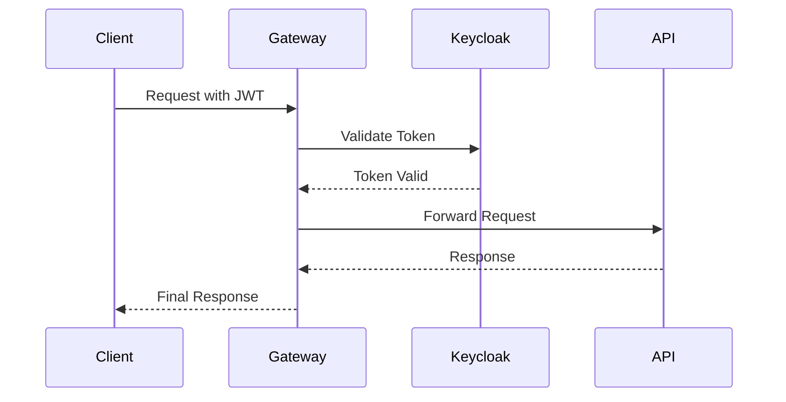

# Document Management Gateway

The Document Management Gateway serves as a critical security and routing layer for the Document Management System. Built with Spring Cloud Gateway, it acts as a centralized entry point that handles authentication, request routing, and security enforcement.

## 🔑 Key Features

- **Centralized Authentication**: Integrates with Keycloak to provide robust authentication and authorization
- **Security Enforcement**: Validates JWT tokens for every incoming request
- **Request Routing**: Routes authenticated requests to the Document Management API
- **Single Entry Point**: Ensures all client interactions go through a secured gateway

## 🚀 Getting Started

### Configuration

The gateway configuration is managed through `application.yml`. Key settings include:

- Server port
- Route configurations
- Keycloak integration settings

## 📚 API Documentation

The Swagger UI for the API can be accessed at:
```
http://localhost:8888/swagger-ui/index.html
```

The OpenAPI specification is available at:
```
http://localhost:8888/v3/api-docs
```

## 🔒 Keycloak Configuration

### Client Configuration Template

Below is a template for configuring a new client in Keycloak for the Document Management Gateway:

```json
{
   "clientId": "gateway-client",
   "name": "gateway-client",
   "description": "",
   "rootUrl": "http://localhost:8888",
   "adminUrl": "http://localhost:8888",
   "baseUrl": "http://localhost:8888",
   "surrogateAuthRequired": false,
   "enabled": true,
   "alwaysDisplayInConsole": false,
   "clientAuthenticatorType": "client-secret",
   "secret": "d4IMT6QrccNDzMysquGbJlwR5Km7YW9D",
   "redirectUris": [
      "*"
   ],
   "webOrigins": [
      "http://localhost:8888"
   ],
   "notBefore": 0,
   "bearerOnly": false,
   "consentRequired": false,
   "standardFlowEnabled": true,
   "implicitFlowEnabled": false,
   "directAccessGrantsEnabled": true,
   "serviceAccountsEnabled": false,
   "publicClient": false,
   "frontchannelLogout": true,
   "protocol": "openid-connect",
   "attributes": {
      "realm_client": "false",
      "oidc.ciba.grant.enabled": "false",
      "client.secret.creation.time": "1752069681",
      "backchannel.logout.session.required": "true",
      "oauth2.device.authorization.grant.enabled": "false",
      "display.on.consent.screen": "false",
      "use.jwks.url": "false",
      "backchannel.logout.revoke.offline.tokens": "false"
   },
   "authenticationFlowBindingOverrides": {},
   "fullScopeAllowed": true,
   "nodeReRegistrationTimeout": -1,
   "defaultClientScopes": [
      "web-origins",
      "acr",
      "profile",
      "roles",
      "basic",
      "email"
   ],
   "optionalClientScopes": [
      "address",
      "phone",
      "offline_access",
      "organization",
      "microprofile-jwt"
   ],
   "access": {
      "view": true,
      "configure": true,
      "manage": true
   }
}
```

Replace the placeholder values with your actual Keycloak configuration settings.

## 🔄 Request Flow



## 💡 Security Considerations

- All requests must include a valid JWT token in the Authorization header
- Tokens are validated against Keycloak on every request
- Invalid or expired tokens result in 401 Unauthorized responses
- The gateway enforces HTTPS for all production traffic

## 🛠️ Development Setup

1. Configure your `application.yml` with the appropriate Keycloak settings
2. Start your Keycloak server
3. Start the Document Management API
4. Run the gateway:
   ```bash
   mvn spring-boot:run
   ```

## 🤝 Contributing

1. Create a feature branch
2. Make your changes
3. Submit a pull request

## 📝 License

This project is licensed under the MIT License - see the LICENSE file for details.
